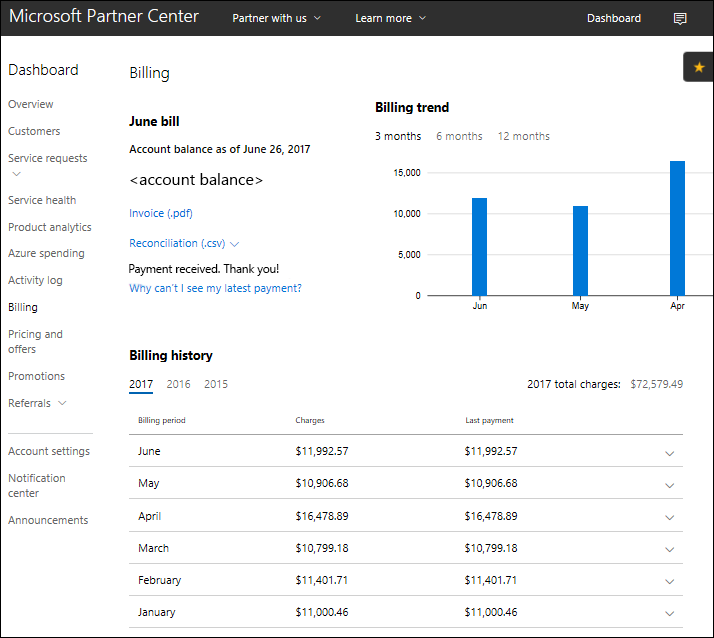
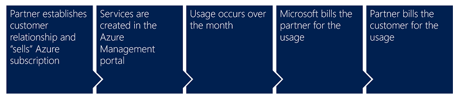
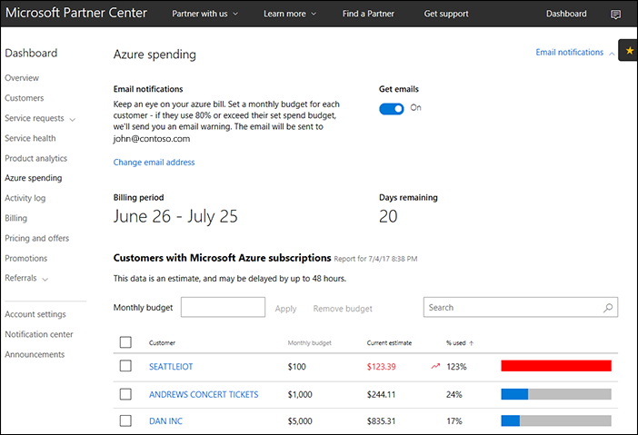
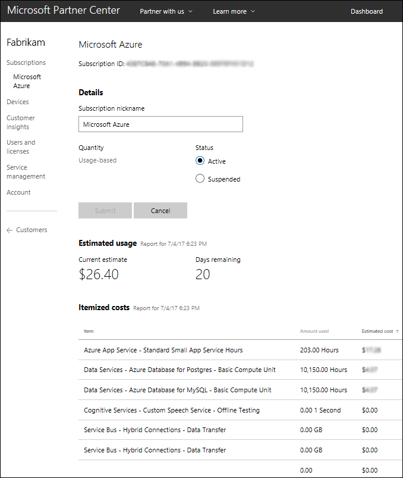
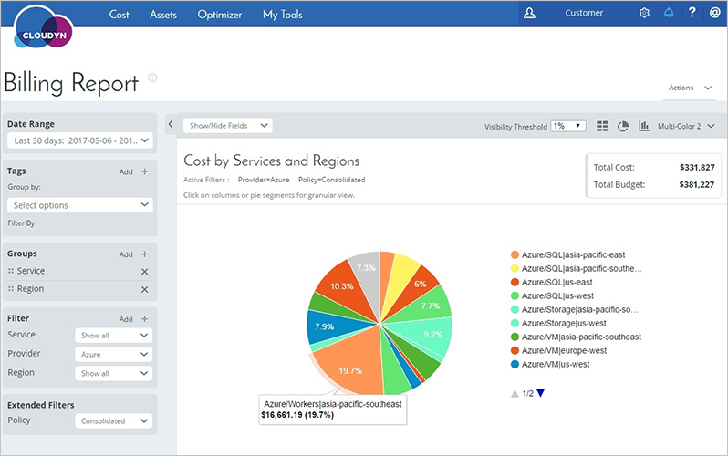
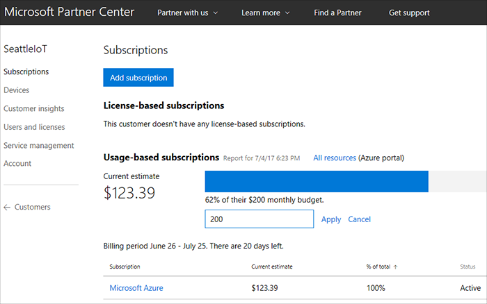
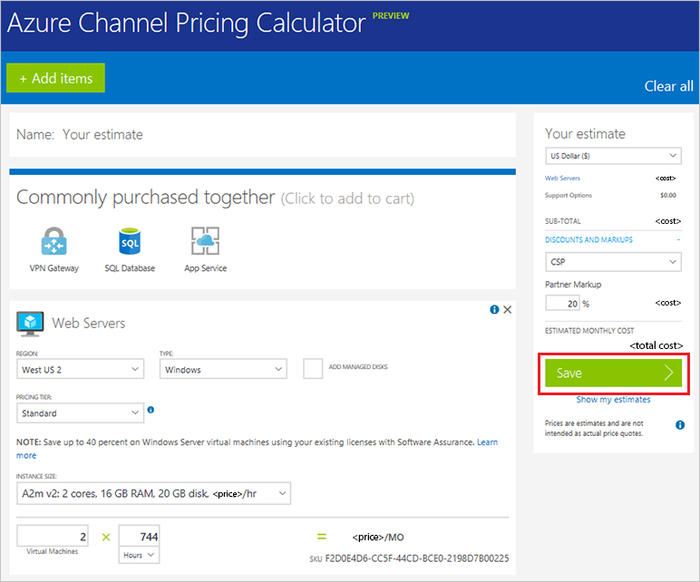
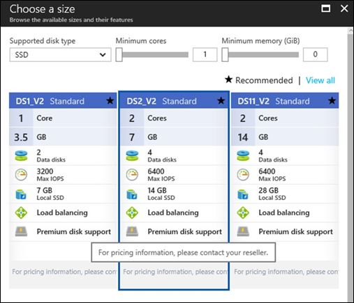

# Azure CSP billing overview

This guide covers the basics of how billing works in the Azure Cloud Solution Provider (Azure CSP) program, including the billing cycle, pricing, and usage.

> [!IMPORTANT]
> This article covers the billing model for Azure CSP direct partners. If you are an Azure CSP indirect reseller, ask your Azure CSP indirect provider for details.

## Billing cycle

When you enroll in the Azure CSP program, you select the first day of the billing cycle (usually partners select the first day of the month). This choice determines your monthly billing cycle.

General billing rules:
- Pay to Microsoft within 60 days after the invoice is generated.
- The invoice is based on the total consumption of all your customers during the last billing cycle.
- Microsoft doesn't have any requirements or conditions about how you handle your own invoicing. You define the rules for your customers.
- To determine the Azure usage of a specific customer, use the customer ID/name and other relevant fields within the single reconciliation file. This file is generated every month on Partner Center.
- Add your own fees and charges for services that you provide. Microsoft is not aware of this information.
- Microsoft generates a single invoice and a single reconciliation file, containing information for all your Azure CSP customers. You are responsible for splitting this information and providing separate bills to your customers.

The billing, pricing, and usage structure of Azure CSP follows a simple sequence of events:

- **Step 1**: The Azure CSP partner (you) establishes a relationship with a customer ([new](../customer-management/create-new-customer.md) or [existing](../customer-management/add-existing-customer.md) Microsoft customer). In securing this relationship, you agree to "sell" them an Azure subscription. You now own this relationship from end to end, including handling all billing and collections.

- **Step 2**: You go to the Azure portal and create the services that you are selling to the customer. Essentially, you are purchasing the service from Microsoft and then giving it to your customer.

- **Step 3**: Usage occurs throughout the month. Because Azure services are usage-based, it is impossible to know what the monthly bill will be up front. The bill changes from month to month based on how much of the Azure services your customer uses.

- **Step 4**: At the end of the billing cycle, Microsoft sends you an invoice for your customer's usage. You are responsible for paying your bill to Microsoft. That invoice is not necessarily restricted to Azure services. You may see other Microsoft products (for example, Office 365 or Enterprise Mobility + Security) if you've provided them through this Partner Center account to your customers.

- **Step 5**: After you receive the itemized bill from Microsoft, it is your responsibility to create invoices and collect payment from your customer.

Typically you will have more than one customer. Therefore, when you receive one large bill from Microsoft, you will break it up into many smaller bills in order to collect from each of your customers.

For more information on reading and understanding your bill, see [Azure CSP invoice](azure-csp-invoice.md).

## Azure usage information

Because Azure subscriptions are usage-based, it is hard to predict the exact price of a given month. However, with previous usage data, you can get an estimate of how much Azure usage to expect from a particular customer. This information can also be useful for determining the source of charges if your bill from Microsoft is larger than expected.

> [!NOTE]
> Microsoft doesn't provide any usage reports or consumption data to Azure CSP customers. Partner Center usage data is partner-facing.

You can retrieve this information either through the Partner Center portal, or by using Partner Center usage APIs. You can get Azure usage information for all your customers.

You can also drill down to usage details inside a specific Azure CSP subscription of a particular customer:

If you'd like to provide Azure usage details and rich cost analysis capabilities to your customers, you can use [Azure Cost Management by Cloudyn](https://docs.microsoft.com/azure/cost-management/quick-register-csp), integrated with Partner Center.

Azure Cost Management by Cloudyn allows you to track cloud usage and expenditures for Azure and other cloud providers including AWS and Google for all your customers. Easy-to-understand dashboard reports help with cost allocation and showbacks/chargebacks as well. Cost Management helps optimize your cloud spending by identifying underutilized resources that you can then manage and adjust.

## Set usage limits

Partners sometimes want protection from the possibility of customers' overspending. But the challenge is that Microsoft never knows what to do with customers' Azure resources when some spending threshold is reached, so there is no way to set hard limits for Azure usage in the Partner Center portal.

To completely stop Azure usage for the customer, the Azure subscription should be suspended. As a result of this suspension, all of a customer's VMs are shut down, all storage accounts become inaccessible, and all other Azure resources that the customer used stop functioning. Suspension leads to a complete interruption of workloads that were deployed in the customer's subscription. This level of response may be unnecessary. For example, maybe the customer simply had an expensive marketing campaign, supported by several Azure VMs, and usage was slightly higher then expected.

To avoid excessive Azure usage in Azure CSP, you can set **budgets** on the Partner level (for all Azure subscriptions of all customers), and also on the customer's Azure subscription level. 

The budget is a soft threshold. When you reach the threshold, you receive a notification. You can then do one of the following:

- **Leave it as it is.** Excessive usage was planned, and the customer will pay for it.
- **Notify the customer about the excessive Azure usage.** Get the customer's approval that he or she will pay for it.
- **Revoke the customer's access to the Azure portal until the issue is resolved.** All Azure resources will be functional, but customer won't be able to create new or modify existing resources.
- **Stop the customer's VMs.** Data is still accessible, but the customer won't be charged for additional compute hours.
- **Suspend the Azure CSP subscription.** This completely stops Azure usage meters for that subscription. All of the customer's VMs are shut down, all storage accounts are inaccessible, and all other Azure resources that the customer used stop functioning.

For more information, see [Set an Azure budget for your customers](../integration/manage-billing/set-customer-budget.md).

There is no single rule for every excessive usage situation. Budgeting capabilities allow you to set per-partner or per-customer soft thresholds, and react in a required way after receiving the notification.

## Azure pricing information

In addition to being usage-based, Azure services are **dynamically priced**. This means that the prices for different Azure services may change from month to month, and sometimes even within a month.

All of this can make estimating the price of an Azure service very difficult, but there are tools in place to make it easier. For example, try the [Azure channel pricing calculator](https://azure.microsoft.com/pricing/calculator/channel) (requires authorization with Azure CSP partner credentials).

You may also want to try this [Open source pricing calculator on GitHub](https://github.com/Microsoft/CSPARMPricingCalculator). It can be used to estimate the cost of hosting a solution in an Azure CSP subscription. It takes the Azure Resource Manager template as an input, and gives the estimated costs as an output.

> [!NOTE]
> Customers don't see any prices on the Azure portal. This is because Microsoft doesn't know the final customer price for Azure services and billing rules. These are set by the Azure CSP partner for their customers.

## Next steps
- [Learn](azure-csp-pricelist.md) how to work with the Azure CSP price list.
- [Learn](azure-csp-invoice.md) how to analyze a Microsoft CSP invoice.
- [Read](https://msdn.microsoft.com/partner-center/billing) more to better understand how Azure CSP billing works.
