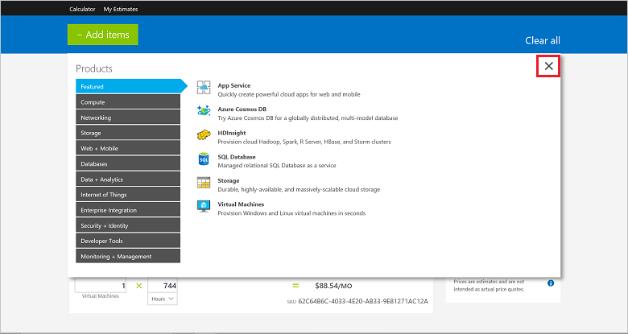
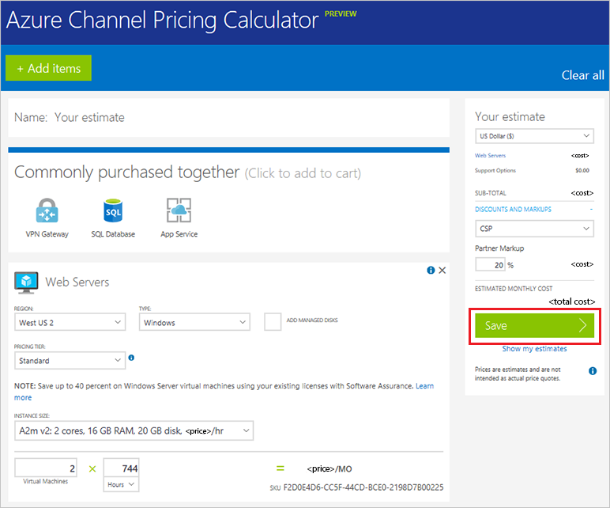

# Azure Cloud Solution Provider price list

Azure prices are dynamic, so it's impossible to have a standard usage rate for Azure services. Microsoft offers tools to help you get the most up-to-date Azure prices. One of these tools is the Azure Cloud Solution Provider (Azure CSP) price list. You can download the Azure CSP price list from Microsoft Partner Center. 

The Azure CSP price list is an Excel file that has the most current pricing information for all Azure services. It's a long list, with more than 11,000 rows. It lists all available Azure services, regions, and plans; all VM sizes; and so on. Prices for all available currencies are included.


## Download the Azure CSP price list

1. On the Partner Center **Dashboard** menu, select **Pricing and offers**.

   

2. On the **Pricing and offers** page, under **Usage-based services**, select the monthly price list marked **Current**.

   

   Selecting the **Current** monthly price list downloads a .zip file. The .zip file includes an Excel file that lists all current Azure prices. The first worksheet tab of the Excel file describes how to work with the price list.

## CSP Pricing Calculator
Another tool that's available is an automated tool that can help you estimate the monthly cost of your Azure services, based on the most up-to-date price list. 

1. On the **Pricing and offers** page, under **Usage-based services**, select the **Azure Services in CSP Pricing Calculator** link.

   

   You also can access the pricing calculator by using a direct URL for the [Azure Channel Pricing Calculator](https://azure.microsoft.com/pricing/calculator/channel) (requires sign-in by using Azure CSP partner credentials).

2. To use the pricing calculator, select the **+Add items** button.

   

3. On the **Products** menu, select the services that you want a price estimate for. Then,  select the **X** in the upper-right corner.

   

4. On the next page, you can select options to fine-tune the estimate for your Azure services usage. You can select quantity of resources, region, time of use, and any discounts or markups you might be eligible for. Under **Estimated Monthly Cost**, you can see your total estimated monthly cost. 

   To retain the estimate for later use, select **Save**.

   

## Get prices by using the Azure Rate Card

You also can use Azure Rate Card to get Azure service rates, without going through Partner Center portal. Azure pricing is quite dynamic and changes frequently. Azure CSP price list is published on Partner Center portal (go to the Dashboard, then select Sales), but this REST API provides the fastest way for Cloud Solution Provider partners to get current prices.

> [!IMPORTANT]
> You can't use native [Azure Resource RateCard API](https://docs.microsoft.com/azure/billing/billing-usage-rate-card-overview) to get prices for Azure CSP Subscription. Azure Rate Card should be accessed through [Partner Center API](https://msdn.microsoft.com/library/partnercenter/mt774619.aspx) instead.

**Request syntax**

|Method|Request URI|
|---|---|
|GET|{baseURL}/v1/ratecards/azure&currency={currency}&region={region}|

**URI parameters**

|Name|Type|Description|
|---|---|---|
|currency|string|Optional three letter ISO code for the currency in which the resource rates will be provided (e.g. "EUR"). The default is the currency associated with the market in the partner profile.| 
|region|string|Optional two-letter ISO country/region code that indicates the market where the offer is purchased (e.g. "FR"). The default is the country/region code set in the partner profile.| 

No request body is required. If this is successful, it returns an Azure Rate Card resource.

**Request example** 
```http 
GET https://api.partnercenter.microsoft.com/v1/ratecards/azure HTTP/1.1 
Authorization: Bearer <token> 
Accept: application/json 
MS-RequestId: 07ced227-3f32-4eeb-8062-f0bef849a9bc 
MS-CorrelationId: a687bc47-8d08-4b78-aff6-5a59aa2055c2 
X-Locale: en-US 
Host: api.partnercenter.microsoft.com 
Connection: Keep-Alive 
``` 

**Response example**

```json
HTTP/1.1 200 OK
Content-Length: 1545508
Content-Type: application/json; charset=utf-8
MS-CorrelationId: 57b25659-fc00-4215-87e7-2b09bac6845d
MS-RequestId: 870118d0-adbb-41a3-82d2-a3d45ade3c73
MS-CV: CYBB8PXMsEukJBIn.0
MS-ServerId: 201021413
Date: Wed, 01 Feb 2017 00:13:45 GMT

{
    "locale": "en-US",
    "currency": "USD",
    "isTaxIncluded": false,
    "meters": [{
            "id": "4b836326-7e19-46e6-8bce-1b19bb6cd91e",
            "name": "Unlimited Data - 1 Gbps",
            "rates": {
                "0": 7395.0
            },
            "tags": [],
            "category": "Networking",
            "subcategory": "ExpressRoute",
            "region": "Zone 2",
            "unit": "Connections",
            "includedQuantity": 0.0,
            "effectiveDate": "2015-09-01T00:00:00Z"
        }, {
            "id": "1e8f6d9f-8b40-4c97-80cc-cff87a290a93",
            "name": "Compute Hours",
            "rates": {
                "0": 3.9729
            },
            "tags": [],
            "category": "Cloud Services",
            "subcategory": "Standard_L16 Cloud Services",
            "region": "AU East",
            "unit": "1 Hour",
            "includedQuantity": 0.0,
            "effectiveDate": "2016-09-01T00:00:00Z"
        }, {
            "id": "7a2639ce-ae47-4413-9837-6b4f4b78be3d",
            "name": "Compute Hours",
            "rates": {
                "0": 0.1122
            },
            "tags": [],
            "category": "Virtual Machines",
            "subcategory": "Standard_D1_v2 VM (Windows)",
            "region": "BR South",
            "unit": "Hours",
            "includedQuantity": 0.0,
            "effectiveDate": "2017-01-01T00:00:00Z"
        }
    ],
    "offerTerms": [{
            "name": "Overage discount",
            "discount": 0.15,
            "excludedMeterIds": ["53cc0061-0fe2-4249-bf62-e1008c811f5c", "c82dbd27-c978-43a7-ad41-525a90d8962b"],
            "effectiveDate": "2014-01-01T00:00:00"
        }
    ],
    "attributes": {
        "objectType": "AzureRateCard"
    }
}
```

## Next steps

- Learn [how Azure CSP billing works](azure-csp-billing-overview.md).
- Learn [how to analyze an Azure CSP invoice](azure-csp-invoice.md).
- Learn [how to access Azure Rate Card through Partner Center API](https://msdn.microsoft.com/library/partnercenter/mt774619.aspx).
