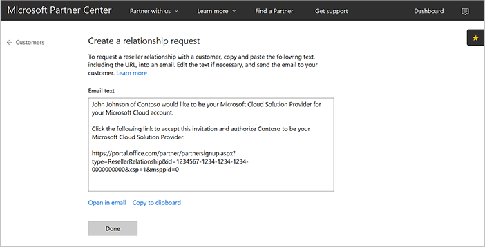

# Add an existing customer to Azure Cloud Solution Provider

Learn how to add an existing Microsoft Partner Center customer account, and then associate it with an active Azure subscription. You can do this in Partner Center and the Azure portal, or use one of the Partner Center APIs. To add an existing Partner Center customer account, you must have an existing Partner Center account and an active Azure subscription.

In this article, we describe how to add an existing Partner Center account for Azure Cloud Solution Provider (Azure CSP) integration by using one of the following options:

- Partner Center web UI
- PowerShell
- C#
- REST API

## Partner Center web UI

1. In Partner Center, on the **Dashboard** menu, select **Customers** > **Request a reseller relationship**.

    

2. On the **Create a relationship request** page, copy the email text that appears. You can edit or delete the first two paragraphs of the email text, but keep the link intact. The link in the email text applies specifically to your reseller account. The link doesn't include any customer information. You can reuse the same link each time you request a reseller relationship.

    

3. Send the relationship request email to your customer. To accept the relationship request, the customer's global admin selects the invitation link, and then signs in.

    

4. On the **Partner Relationships** page, the customer can review their partners for their Azure services. This includes which partners who have delegated admin rights for each service.

    > [!NOTE] 
    > In the multi-channel model, for each service, a customer can have only one partner who has delegated admin rights for Azure CSP transactions. The customer might also have granted rights to other partners who don't participate in the Azure CSP program.

5. The invited customer appears in the partner’s customer list in Partner Center. The partner can then provision and manage the Azure CSP subscriptions for the customer.

Customers have the option to remove delegated admin rights from any or all partners (including those in the Azure CSP program). Customers can do this in their own admin portal. The customer account and commercial relationship with the partner still applies, unless it is renegotiated by the customer and the partner. The partner is still responsible for providing support to the customer. A partner also must still adhere to the terms of the Microsoft Cloud Reseller Agreement, even if a customer removes delegated admin rights from the partner. In this scenario, if the customer requires support, the partner must contact Microsoft Support to submit a service request on behalf of the customer.

To re-establish delegated admin rights that the customer has revoked or removed, repeat the process of requesting a relationship.

## PowerShell

To request a relationship by using PowerShell, get the invitation URL as described in steps 1 and 2 in the [Partner Center web UI](#partner-center-web-ui) section. Then, in PowerShell, run the following command:

`$inviteURL = (New-PCRelationshipRequest).url`

## C#

1. Use your **IAggregatePartner.Customers** collection.
2. Call the **RelationshipRequest** property.
3. Call the **Get()** or the **GetAsync()** method.

```csharp
// IAggregatePartner partnerOperations;

var customerRelationshipRequest = partnerOperations.Customers.RelationshipRequest.Get();
```

## REST API

### Request

**Request syntax**

|Method|Request URI|
|---|---|
|GET|{baseURL}/v1/customers/relationshiprequests HTTP/1.1|

**Request example**

```json
GET https://api.partnercenter.microsoft.com/v1/customers/relationshiprequests HTTP/1.1
Authorization: Bearer <token>
Accept: application/json
MS-RequestId: f281903b-7b57-4883-8bc1-5caca1b22a37
MS-CorrelationId: dd048ef2-d737-4b11-a885-e1eab8fc94ba
Connection: Keep-Alive
```

### Response

If the request is successful, this method returns a **CustomerRelationshipRequest** object in the response.

**Response example**

```json
HTTP/1.1 200 OK
Content-Length: 204
Content-Type: application/json; charset=utf-8
MS-CorrelationId: dd048ef2-d737-4b11-a885-e1eab8fc94ba
MS-RequestId: f281903b-7b57-4883-8bc1-5caca1b22a37
Date: Mon, 21 Mar 2016 05:39:51 GMT

{
    "url":"https://portal.office.com/partner/partnersignup.aspx?type=ResellerRelationship&id=3b33e682-00c3-41ee-9dd2-a548adf56438&csp=1&msppid=0",
    "attributes":{
        "objectType":"CustomerRelationshipRequest"
    }
}
```

## How to add Microsoft Account based tenant to Partner Center

By default, PAYG (Azure Direct) subscriptions use Azure Active Directories and tenants, attached to personal Microsoft Accounts (formerly known as LiveIDs). Here is the guide how to add Microsoft Account based tenant to Partner Center portal.

1.	Login to [Azure Management Portal](https://portal.azure.com) with personal Microsoft Account credentials (LiveID).

2.	Go to *Azure Active Directory* menu, and then go to *Properties*. 

3. Change the directory Name from **Default Directory** to company name. This name will be used as a Customer name on Partner Center portal later.
 
4.	Go to *Users* and create new Azure Active Directory user with **Global administrator** role. Save username and temporary password.
 
Then you as a CSP partner should do the following steps on Partner Center side:
1.	Login to [Partner Center portal](https://partnercenter.microsoft.com) with CSP partner credentials.

2.	Open [this page](https://partnercenter.microsoft.com/pcv/customers/acquire) to get the link to establish a reseller relationship with an existing tenant

4.	Open a new browser session and open [Azure Management Portal](https://portal.azure.com).

5.	Log in using global administrator credentials of Microsoft Account directory. You will be asked to change password at the first logon.

6.	Then open the link, that you’ve copied on a stage #2. Select *Authorize CSP* to add customer’s tenant to list of customers on Partner Center portal.
 
7.	Switch to the previous browser session with Partner Center and go to *Customers* menu. Find the customer account that you’ve just added and go to *Account* page. Click *Update* to update bill-to information.
 
8.	Complete the form by specifying customer organization information and click *Submit*.

## Next steps

- Learn how to [assign Azure CSP subscription permissions to the customer](assign-permissions-to-azure-csp-subscription.md).
- Learn how to [create a new Azure CSP customer in Partner Center](create-new-customer.md). 
