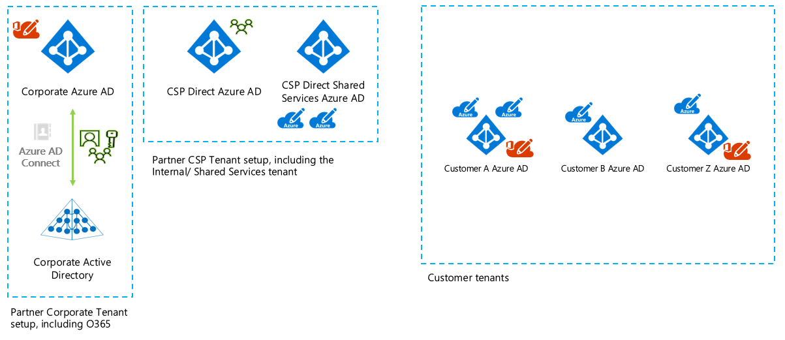
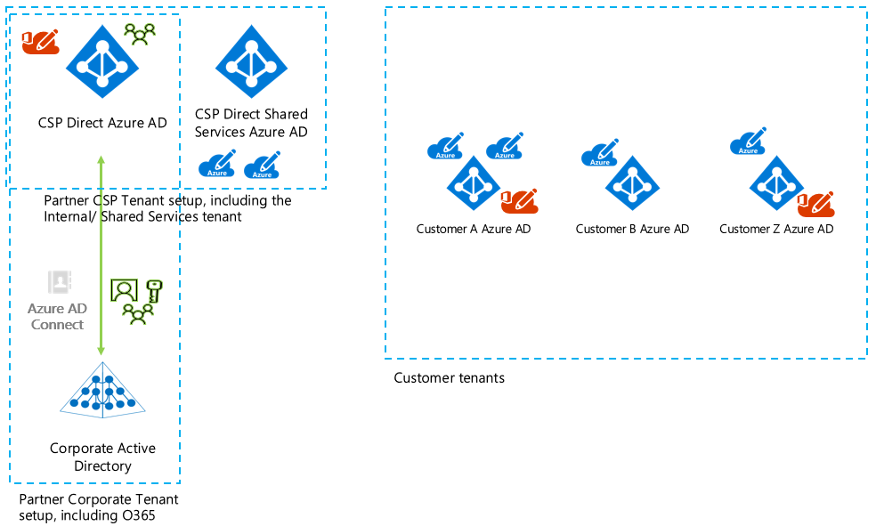

# Delegate administration for Azure CSP partners

This article describes how an Azure Cloud Solution Provider (Azure CSP) partner can delegate administration for staff members across its customers. 

First, we provide an overview of the relevant Azure Active Directory (Azure AD) tenants. Two setups for Azure AD are common:

* The Azure CSP partner has separate Azure AD tenants for corporate and Azure CSP use:

    

* The Azure CSP partner shares an Azure AD tenant for corporate and Azure CSP use:

    

The preceding figures include the following Azure AD tenants:

* **Corporate Azure AD**: The Azure CSP partner uses this Azure AD tenant to access Office 365 for its own employees (for example).
* **Azure CSP Azure AD**: The Azure CSP partner uses this Azure AD tenant to manage its customers in Partner Center.
* **Azure CSP shared services Azure AD**: The Azure CSP partner uses this Azure AD tenant for [Azure partner shared services](../overview/partner-shared-services.md).
* **Customer Azure AD**: The customer uses this Azure AD tenant to access Office 365 and Azure subscriptions.

The only difference between the two setups is that some Azure CSP partners have only one Azure AD tenant that they use both for corporate use and to manage Azure CSP customers. The remainder of the article applies to both setups but focuses on the Azure AD tenant that's used for Azure CSP customer management.

The shared services Azure AD tenant and the Azure subscriptions linked to that Azure AD tenant aren't covered in this article. The purpose of this article is to clearly describe the options an Azure CSP partner has to delegate staff access to its customer's Office 365 and Azure subscriptions.

## Delegation of administration

*Delegation of administration* allows a specific group of people, for example, an Azure CSP partner team, to manage the partner's customers' Azure and Office 365 services. 

For smaller organizations, it might not be important whether the staff employee is an administrator. This is especially true if the number of customers to manage is relatively small. 

Larger Azure CSP partners might require a granular way to assign permissions. Here are some example scenarios a larger Azure CSP partner might require:

* A dedicated group to manage Office 365 services.
* A dedicated group to manage the Azure services for a large customer.
* Non-admin permissions for staff who are on standby and who are required only to complete an initial evaluation of potential issues.

Administration can be delegated for tasks in Partner Center. For example, you can create new customers or delegate administration of customer Office 365 or Azure subscriptions, including create a new mailbox or create a resource in Azure.

## Partner Center delegation capabilities

The following sections discuss key aspects of administration delegation in Partner Center.

### Roles

You can work with various roles in Partner Center. The roles exist in the Azure CSP Azure AD tenant and can be assigned to users. For more information, see [Partners: Offer delegated administration](https://support.office.com/article/Partners-Offer-delegated-administration-26530dc0-ebba-415b-86b1-b55bc06b073e). 

The two most relevant roles for this article are the helpdesk and admin agent roles:

* **Helpdesk agent role**: 
    * *Limited administration*.
    * Has the same privileges as the password admin role for the customers that the partner supports.
    * The user can't manage customer subscriptions. The user has Office 365 Limited Administration delegated admin rights (equal to the password admin role).

* **Admin agent role**: 
    * *Full administration*.
    * Has the same privileges as the global admin role for the customers that the partner supports.
    * The user can manage customer subscriptions. The user has Office 365 Full Administration delegated admin rights (equal to the global admin role) and owner rights for customer Azure subscriptions (super user).

The following articles provide a good introduction to the built-in capabilities of Partner Center:

* [Create user and assign permissions](/partner-center/create-user-accounts-and-set-permissions)
* [Permissions overview](/partner-center/permissions-overview)
* [From the customer point of view](/partner-center/customers_revoke_admin_privileges)

### Manage Office 365 tenants

Granular control isn't available for different customers who use the helpdesk or admin agent roles. The privileges that come with these roles are applied to all customers that the Azure CSP partner manages. In other words, the partner employee who is granted the role can help every customer that the Azure CSP partner manages.

Partner engineers can choose from several options to manage Office 365 for a customer:

* Go to the customer's page in Partner Center, and then select **Service Management** > **Office 365**. The Office 365 Admin portal for this tenant opens.
* Go directly to the [Office 365 Partner Admin portal](https://portal.office.com/Partner/ModernShell.aspx).
* Use the URL `https://portal.office.com/Partner/BeginClientSession.aspx?CTID=<TENANTGUID>&CSDEST=o365admincenter` to open the Office 365 Admin portal for that tenant (replace \<TENANTGUID\> with the tenant GUID).
* Use [Office 365 PowerShell with delegated access permissions](https://technet.microsoft.com/library/dn705745.aspx). For **Tenant ID**, use the tenant GUID.

### Manage Azure subscriptions

Similar to Azure subscriptions, a user that has been assigned the admin agent role has owner rights for all Azure subscriptions and for all customers that the Azure CSP partner manages. These rights are embedded in the Azure CSP model.

Each Azure subscription in the Azure CSP model has only one owner by default. The owner is a group named **Foreign Principal for 'CSPPartnerName' in role 'TenantAdmins' (CSPcustomer Directory)**. The group isn't visible in the customer's Azure AD tenant. You won't see the group if you get a list of all groups in the customer's directory. However, you can see the group if you go to **Access Control** in the Azure portal for the Azure subscription.

To manage the Azure subscription of a customer, use one of the following options:

* Go to the customer's page in Partner Center, select **Service Management** > **Microsoft Azure Management Portal**. The [Azure portal](https://portal.azure.com) opens.
* Use the URL https://portal.azure.com/<TENANTNAME>.onmicrosoft.com to open the [Azure portal](https://portal.azure.com) in the context of this tenant.
* Use Azure PowerShell. Fill in your values for *Tenant Name* and *Azure Subscription ID* in the following code:

    ```azurepowershell-interactive
    $TenantID="Tenant Name.onmicrosoft.com"
    $SubscriptionID="Azure Subscription ID"
    Select-AzureRmSubscription -SubscriptionID $SubscriptionID -TenantId $TenantID
    ```

If you want to provide access to a customer employee, [Azure RBAC](/azure/role-based-access-control/overview) principles apply.

## Granular delegation of administration

As explained earlier in the article, the admin agent role doesn't offer any granularity. When you grant the agent role to a user, the user has full access to all the Azure CSP partner's customers. 

The following table outlines the admin agent role solution and some alternatives that offer increased granularity:

||Advantages|Challenges|Conclusion|
|---|---|---|---|
|**Add staff** to the Partner Center helpdesk and admin agent roles.|- Good customer admin UI switch experience for Office 365 and Azure.<br/>- Staff has a single identity.<br/>- Built-in, no automation required.|- No granularity between customers.<br/>- No granularity in Azure (subscriptions/roles).|Works fine, but granularity isn't available.|
|**Invite staff** users in customer Azure AD by using a B2B invitation (via Azure Active Directory B2B).|- Staff has a single identity.<br/>- Switching between Azure customers is possible.<br/>- Allows per-customer, per-user, per-subscription role assignment.|- Doesn't work for Office 365! No customer tenant switching is possible in the Office 365 Admin portal.<br/>- Requires some kind of automation.|Not feasible for Office 365.|
|**Create new staff** users in customer's Azure AD tenant.|- Works with both Azure and Office 365.<br/>- Allows per-customer, per-user, per-subscription role assignment.|- Staff has multiple identities.<br/>- Customer tenant switching is possible but tedious (different sign-in sessions).<br/>- If MFA is required, multiple licenses for the same staff member must be foreseen.<br/>- Requires some kind of automation.|Substantial overhead and challenges.|
|(**Hybrid solution**) Invite staff users in the customer Azure AD tenant by using a B2B invitation for Azure, but use admin agent roles for Office 365.|- Staff has a single identity.<br/>- Allows per-customer, per-user, per-subscription role assignment (for Azure only).<br/>- Good customer admin UI switch experience for Office 365 and Azure.<br/>- Partner can configure MFA on a single identity.|- Different approaches for Office 365 and Azure.<br/>- Requires some kind of automation.<br/>- Office 365 services still can't be delegated on a granular (per-customer) basis.|Preferred solution if helpdesk or admin agent roles are too restricted.|

### About the hybrid solution

When you choose the hybrid approach, it's important to understand the following information:

* Staff employees who are assigned the admin agent role so they can manage Office 365 can also manage all Azure subscriptions that belong to Azure CSP customers.
* Users who are assigned the admin agent role shouldn't be invited as B2B guests in customer tenants. Undocumented side effects might occur.
* Only users who are assigned the admin agent role can create a reserved instance. Even a subscription owner can't create a reserved instance in an Azure CSP-based subscription.
* Ending the relationship between the partner and the customer is part of the Azure CSP Partner Center experience. This is explained in [Remove a reseller relationship with a customer](/partner-center/remove-a-relationship). 

    > [!NOTE]
    > Ending the relationship between the partner and the customer revokes all admin agent-related permissions. However, users who were invited as B2B guests and who were assigned one or more roles still have those permissions.

Azure AD comes with [Privileged Identity Management (PIM)](/azure/active-directory/privileged-identity-management/pim-configure). PIM allows you to assign admin permissions for Office 365 or Azure on an on-demand or just-in-time basis. A requirement of PIM is valid Azure AD Premium P2 licenses for the users who use this feature. Because you invite staff members in the B2B invite model, you would need to apply PIM in each customer tenant. From the Azure CSP partner viewpoint, we don't recommend this approach.

### Automation requirements for the hybrid solution

The hybrid solution addresses the majority of challenges in the Azure CSP identity model. However, the hybrid solution also requires the partner to automate several tasks to make this approach manageable. You can build this automation by using the REST API or PowerShell.

The following table outlines the hybrid solution process and shows the steps that must be automated:

|Task|Automated or manual|
|---|---|
|The agent role signs in to Partner Center and creates a new customer.|Manual|
|A new principal that has the guest inviter role is created in the customer Azure AD tenant.|Automated|
|The agent creates a new Azure subscription in Partner Center.|Manual|
|The agent assigns the subscription owner role to the guest inviter principal.|Automated|

When these tasks are finished, the basic infrastructure is in place that allows you to invite B2B users to the customer subscription. It's the partner's responsibility to select the approach that best adapts to the partner's needs. 

We describe two hybrid solution implementation options. Many other options are possible.

#### Implementation option #1: Just-in-time invitation

In this approach, each individual user requests just-in-time access to the customer subscription. Access is granted for a limited number of hours, after which the invitation is removed. Here's the process:

1. When the user needs access, the user opens the application, and then selects their user name and the number of hours they require access.
1. Automation takes care of inviting the user and adding the required permissions.
1. When the time expires, the guest user is removed from the customer Azure AD tenant.

#### Implementation option #2: Group sync

The partner defines Azure AD groups inside its own tenant by selecting the users that need access to the customer subscriptions. 

By using groups, the partner can separate users by function or by customer. For example, a partner might create the following groups in the partner's tenant for its customer Contoso: **Contoso_Readers**, **Contoso_Contributors**, **Contoso_BackupOperators**, and so on. The groups are replicated to Contoso's tenant so the required role can be applied.

Because groups are separately maintained for each tenant (partner and customer), some automation must be in place to periodically check group membership. The automation determines whether to keep or remove users in the customer tenants. For more information about the group and role sync mechanism, see the section **Implementation granular role-based access control** in [Identity and Rights Management in the Azure CSP model, Part 2](https://blogs.technet.microsoft.com/hybridcloudbp/2017/06/05/identity-and-rights-management-in-csp-model-part2/).

 
## Next steps

- Learn how to [manage user accounts in Azure CSP](../integration/manage-customers/manage-user-accounts.md).
- Learn how to [manage user permissions in Azure CSP](../integration/manage-customers/manage-user-permissions.md).
- Review [Identity and rights management in the Azure CSP model](https://blogs.technet.microsoft.com/hybridcloudbp/2016/06/08/identity-and-rights-management-in-csp-model/) and  [Identity and Rights Management in the Azure CSP model, Part 2](https://blogs.technet.microsoft.com/hybridcloudbp/2017/06/05/identity-and-rights-management-in-csp-model-part2/).
