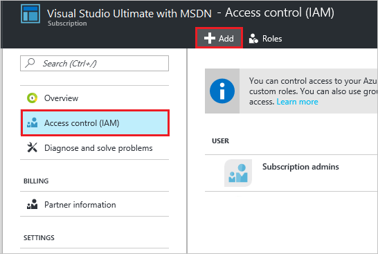
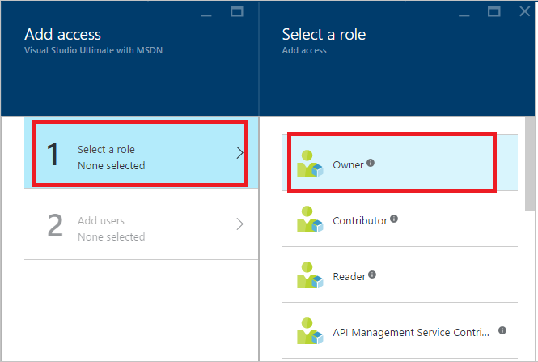
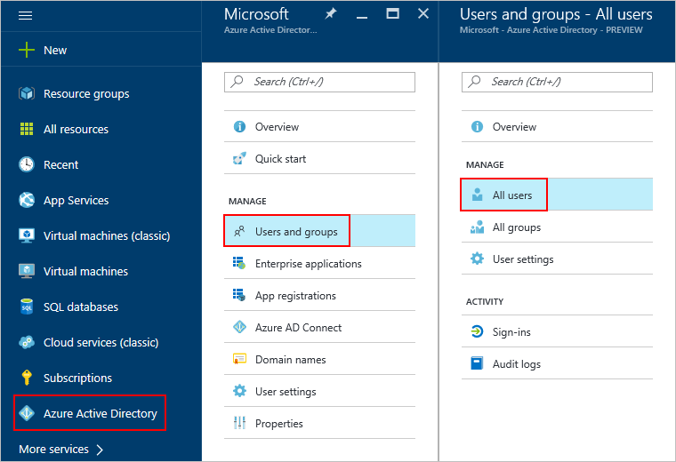
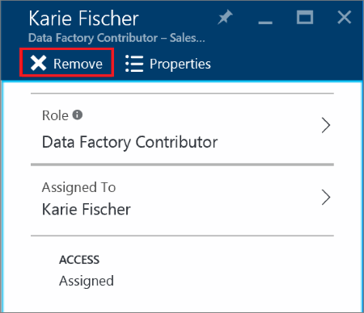

# Assign and manage permissions within an Azure subscription

When customers are first created in Partner Center, they do not have access to the Azure subscription by default. The Azure Cloud Solution Provider (CSP) model was designed for various scenarios, and in some of them (for example, managed cloud services), customers don't need to access the Azure portal. The CSP partner manages customer resources instead.

If you want to grant a customer access to an Azure CSP subscription, an additional step is required. Over time, you might also want to add users with varying levels of permissions to an Azure subscription.

>[!TIP]
>If you grant a customer access to the Azure portal, learn about [Azure Resource Manager Policies](https://blogs.technet.microsoft.com/hybridcloudbp/2016/05/25/manage-the-list-of-services-in-azure-csp-subscriptions/). You can use the policies to limit which Azure services and regions are available to CSP customers in the Azure portal.

This guide covers how to grant customer access from the Azure portal, PowerShell, and the REST API.

## Web UI

1. Open the [Azure portal](https://portal.azure.com) in either of the following ways:

   * Go to `https://portal.azure.<customer tenant name>.com/`.
   * From the Partner Center dashboard, go to **Customers** > **\<customer name>** > **Service Management** > **Microsoft Azure Management Portal**.

2. Sign in.

### Add access permissions

1. In the left pane, select **Subscriptions**, and then select the subscription you want the admin to access.

    >[!NOTE]  
    >To access the **Subscriptions** button, you might need to select **More services** at the bottom of the pane.

    

2. On the **Subscription** blade, select **Access control (IAM)**, and then select the **Add** button.

    

3. On the **Add access** blade, select **Select a role**, and then select the role that you want to assign.

   * **Owner**: Can manage all aspects of a subscription, including giving access to other users via this process. If this is a newly created customer, you probably want to give the customer admin *Owner* permissions.
    
   * **Contributor**: Can manage all aspects of a subscription *except* giving access to other users.
    
   * **Reader**: Can view all aspects of a subscription, but cannot make any changes.
    
     The roles listed here are the most basic that you can assign to users in the Azure portal. For a more detailed list, see [Built-in roles for Azure role-based access control](https://docs.microsoft.com/azure/active-directory/role-based-access-built-in-roles).

     

4. In the **User** field, type the email address of the user you want to add. The user appears below the search box. Select the user, and then select **Submit**. The user now has access to the subscription.

### View access permissions

You can also check a user's access permissions through the Azure portal.

1. In the left pane, select **Azure Active Directory** > **Users and groups** > **All users**.

    >[!NOTE]  
    >To access the **Azure Active Directory** button, you might need to select **More services** at the bottom of the pane.

    

2. In the search box, search for the user by name or username and then, in the results list, select the user.

      
    A new user blade opens.

3.  In the left pane, select **Azure resources**. 

      
    The user's access permissions are displayed.

### Delete access permissions

You can easily remove a user's subscription access in either of two ways:

* In the **Access control** window:

    1. To get to the **Access control (IAM)** window, follow steps 1 and 2 in the Add access permissions section.

    2. Select the check box next to the user's name, and then select **Remove**.

        

* On the user's page:

    1. To view the list of a user's access permissions, follow the steps in the View access permissions section.
    
    2. Select the subscription that you want to remove, and then select **Remove**.
    
        

## PowerShell

### Grant access permissions

To grant a user access to a subscription by using PowerShell, run the following commands:

```powershell
# Get subscription ID (if necessary)
C:\PS>Get-AzureSubscription -SubscriptionName "MyProdSubscription"

# Assign role to subscription
New-AzureRmRoleAssignment -ObjectId <application id> -RoleDefinitionName <role name> -Scope <subscription id>
```

### View access permissions

To view the access assignments for a specific subscription, run the following commands:

```powershell
Get-AzureRmRoleAssignment -SubscriptionName "MyProdSubscription" | FL DisplayName, RoleDefinitionName, Scope
```

### Remove access permissions

To remove a user's subscription access, run the following commands:

```powershell
Remove-AzureRmRoleAssignment -ObjectId <object id> -RoleDefinitionName <role name> -Scope <scope such as subscription id>
```

## REST API

### Grant access permissions

To create a role assignment, you must have access to the `Microsoft.Authorization/roleAssignments/write` operation. Of the built-in roles, only *Owner* and *User Access Administrator* are granted access to this operation.

**Request syntax**

|Method|Request URI|
|---|---|
|PUT|https://management.azure.com/subscriptions/{subscription-id}/providers/Microsoft.Authorization/roleAssignments/{role-assignment-id}?api-version={api-version}|

**Request parameters**

These are the required parameters for the request:

|Name|Type|Description|
|---|---|---|
|subscription-id|string|The ID number for the subscription.|
|role-assignment-id|string|The ID number for the new role assignment.|
|api-version|string|The current API version that you are using.|

**Request body**

The request body should look like this:

```json
{
  "properties": {
    "roleDefinitionId": "/subscriptions/c276fc76-9cd4-44c9-99a7-4fd71546436e/resourceGroups/Network/providers/Microsoft.Network/virtualNetworks/EASTUS-VNET-01/subnets/Devices-Engineering-ProjectRND/providers/Microsoft.Authorization/roleDefinitions/9980e02c-c2be-4d73-94e8-173b1dc7cf3c",
    "principalId": "5ac84765-1c8c-4994-94b2-629461bd191b"
  }
}
```

|Name|Type|Description|
|---|---|---|
|roleDefinitionId|String|The identifier of the role. The format is `{scope}/providers/Microsoft.Authorization/roleDefinitions/{role-definition-id-guid}`.|
|principalId|String|The objectId of the Azure Active Directory (Azure AD) principal (user, group, or service to which the role is assigned).|

**Response example**

```json
{
  "properties": {
    "roleDefinitionId": "/subscriptions/c276fc76-9cd4-44c9-99a7-4fd71546436e/providers/Microsoft.Authorization/roleDefinitions/9980e02c-c2be-4d73-94e8-173b1dc7cf3c",
    "principalId": "5ac84765-1c8c-4994-94b2-629461bd191b",
    "scope": "/subscriptions/c276fc76-9cd4-44c9-99a7-4fd71546436e/resourceGroups/Network/providers/Microsoft.Network/virtualNetworks/EASTUS-VNET-01/subnets/Devices-Engineering-ProjectRND",
    "createdOn": "2015-12-16T00:27:19.6447515Z",
    "updatedOn": "2015-12-16T00:27:19.6447515Z",
    "createdBy": null,
    "updatedBy": "877f0ab8-9c5f-420b-bf88-a1c6c7e2643e"
  },
  "id": "/subscriptions/c276fc76-9cd4-44c9-99a7-4fd71546436e/resourceGroups/Network/providers/Microsoft.Network/virtualNetworks/EASTUS-VNET-01/subnets/Devices-Engineering-ProjectRND/providers/Microsoft.Authorization/roleAssignments/2e9e86c8-0e91-4958-b21f-20f51f27bab2",
  "type": "Microsoft.Authorization/roleAssignments",
  "name": "2e9e86c8-0e91-4958-b21f-20f51f27bab2"
}
```

### View access permissions

To list roles, you must have access to the `Microsoft.Authorization/roleDefinitions/read` operation at the scope. All the built-in roles are granted access to this operation. 

**Request syntax**

|Method|Request URI|
|---|---|
|GET|https://management.azure.com/subscriptions/{subscription-id}/providers/Microsoft.Authorization/roleAssignments/{role-assignment-id}?api-version={api-version}-&$filter={filter}|

**Request parameters**

These are the required parameters for the request:

|Name|Type|Description|
|---|---|---|
|subscription-id|string|The ID number for the subscription.|
|role-assignment-id|string|The ID number for the new role assignment.|
|api-version|string|The current API version that you are using.|
|filter|string|The specific conditions, such as viewing permissions for any child resources in that subscription with `atScopeAndBelow()`, or searching for a role for a specific user or group, such as `principalId%20eq%20'{objectId of user, group, or service principal}`.|

**Response example**

```json
{
  "value": [
    {
      "properties": {
        "roleDefinitionId": "/subscriptions/c276fc76-9cd4-44c9-99a7-4fd71546436e/providers/Microsoft.Authorization/roleDefinitions/acdd72a7-3385-48ef-bd42-f606fba81ae7",
        "principalId": "2f9d4375-cbf1-48e8-83c9-2a0be4cb33fb",
        "scope": "/subscriptions/c276fc76-9cd4-44c9-99a7-4fd71546436e",
        "createdOn": "2015-10-08T07:28:24.3905077Z",
        "updatedOn": "2015-10-08T07:28:24.3905077Z",
        "createdBy": "877f0ab8-9c5f-420b-bf88-a1c6c7e2643e",
        "updatedBy": "877f0ab8-9c5f-420b-bf88-a1c6c7e2643e"
      },
      "id": "/subscriptions/c276fc76-9cd4-44c9-99a7-4fd71546436e/providers/Microsoft.Authorization/roleAssignments/baa6e199-ad19-4667-b768-623fde31aedd",
      "type": "Microsoft.Authorization/roleAssignments",
      "name": "baa6e199-ad19-4667-b768-623fde31aedd"
    }
  ],
  "nextLink": null
}
```

### Remove access permissions

To delete a role assignment, you must have access to the `Microsoft.Authorization/roleAssignments/delete` operation. Of the built-in roles, only *Owner* and *User Access Administrator* are granted access to this operation. 

**Request syntax**

|Method|Request URI|
|---|---|
|DELETE|https://management.azure.com/subscriptions/{subscription-id}/providers/Microsoft.Authorization/roleAssignments/{role-assignment-id}?api-version={api-version}|

**Request parameters**

These are the required parameters for the request:

|Name|Type|Description|
|---|---|---|
|subscription-id|string|The ID number for the subscription.|
|role-assignment-id|string|The ID number for the new role assignment.|
|api-version|string|The current API version that you are using.|

**Response example**

```json
{
  "properties": {
    "roleDefinitionId": "/subscriptions/c276fc76-9cd4-44c9-99a7-4fd71546436e/providers/Microsoft.Authorization/roleDefinitions/9980e02c-c2be-4d73-94e8-173b1dc7cf3c",
    "principalId": "5ac84765-1c8c-4994-94b2-629461bd191b",
    "scope": "/subscriptions/c276fc76-9cd4-44c9-99a7-4fd71546436e/resourceGroups/Network/providers/Microsoft.Network/virtualNetworks/EASTUS-VNET-01/subnets/Devices-Engineering-ProjectRND",
    "createdOn": "2015-12-17T23:21:40.8921564Z",
    "updatedOn": "2015-12-17T23:21:40.8921564Z",
    "createdBy": "877f0ab8-9c5f-420b-bf88-a1c6c7e2643e",
    "updatedBy": "877f0ab8-9c5f-420b-bf88-a1c6c7e2643e"
  },
  "id": "/subscriptions/c276fc76-9cd4-44c9-99a7-4fd71546436e/resourceGroups/Network/providers/Microsoft.Network/virtualNetworks/EASTUS-VNET-01/subnets/Devices-Engineering-ProjectRND/providers/Microsoft.Authorization/roleAssignments/5eec22ee-ea5c-431e-8f41-82c560706fd2",
  "type": "Microsoft.Authorization/roleAssignments",
  "name": "5eec22ee-ea5c-431e-8f41-82c560706fd2"
}
```

## Next steps
- [Add an existing Azure customer to your Partner Center account](add-existing-customer.md)
