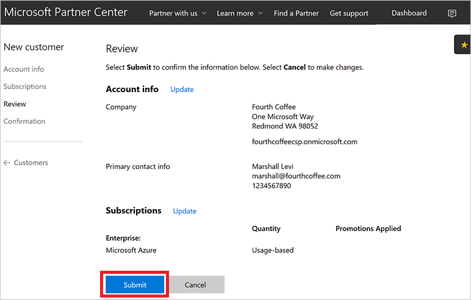

# Create an Azure CSP customer

Before you can access a customer's support or billing information or place orders for a customer, you must create the customer in the system. When you create a customer, you also create:

- An Azure Active Directory (Azure AD) tenant object for the customer.
- A relationship between the reseller and customer, which is used for delegated administrator privileges.
- A username and password for signing in as an administrator for the customer.

## Web UI

1. On the Microsoft Partner Center dashboard, in the left pane, select **Customers**, and then select **Add customer**.

    

2. On the **Account info** form, enter the customer's account information. 

    

    > [!IMPORTANT]
    > You can choose *Country/region* only among the list of countries that are available for the market where you've enrolled as a CSP Partner. If you are authorized in a single country or region (for example, US, Canada, or Brazil), you can't change the country or region during new customer creation process. For more information, see [CSP regional authorization](https://msdn.microsoft.com/partner-center/regional-authorization-overview).

3. Select **Next: Subscriptions**.

4. Select the check boxes next to **Microsoft Azure** and any other offers you want, and then select the number of licenses for each offer, where applicable.

    > [!NOTE]
    > There are separate tabs for enterprise, small business, and government offers. Make sure you're using the **Enterprise** offers tab.
  
    

5. Select **Next: Review**.

6. Review the customer and offer details. To make changes, select the corresponding **Update** link. Otherwise, select **Submit**.

    

7. In the confirmation window, note the **Admin user account** and **Password** information. The information will not be viewable after you leave this page, so copy and store it to send to the customer.

    

    > [!IMPORTANT]
    > By default, the customer administrator does *not* have access to this Azure subscription and cannot manage it by using the [Azure portal](https://portal.azure.com). The CSP model was designed for a variety of scenarios, and in some of them (for example, Managed Cloud Services) the customer doesn't need to access the Azure portal. The CSP partner manages the customer's resources instead. If you want to grant the customer access to the Azure CSP subscription, an [additional step](assign-permissions-to-azure-csp-subscription.md) is required.

8. Select **Done**.

9. On the Partner Center dashboard, select **Customers**, select the customer that you just created, select **Service management**, and then select **Microsoft Azure Management Portal**.

      
    The Azure portal opens.

10. To add the customer as an owner of the Azure subscription, see [Assign permissions to an Azure CSP subscription](assign-permissions-to-azure-csp-subscription.md).

    

>[!NOTE] 
>One CSP customer account can have multiple Azure CSP subscriptions. By default, all subscriptions are named *Microsoft Azure*. To better distinguish them, rename them in Partner Center to something more descriptive (for example, *Production environment* or *HR System*).

## PowerShell

Use the following command to create a new customer with PowerShell. To learn how to configure the PowerShell environment for Azure CSP, see [Azure CSP management options](../overview/azure-csp-management-options.md).

```powershell
$newDefaultAddress = New-PCCustomerDefaultAddress -Country '<country code>' -Region '<region>' -City '<city>' -State '<state>' -AddressLine1 '<address1>' -PostalCode <postal code> -FirstName '<first name>' -LastName '<last name>' -PhoneNumber <phone number>

$newBillingProfile = New-PCCustomerBillingProfile -Email '<email>' -Culture '<ex: en.us>' -Language '<ex: en>' -CompanyName '<company name>' -DefaultAddress $newDefaultAddress

$newCompanyProfile = New-PCCustomerCompanyProfile -Domain '<company name>.onmicrosoft.com'

$newCustomer = New-PCCustomer -BillingProfile $newBillingProfile -CompanyProfile $newCompanyProfile
```

## C#

To add a customer, do the following:
1. Instantiate a new **Customer** object. 
2. Fill in the **BillingProfile** and **CompanyProfile** information. 
3. Add the object to your **IAggregatePartners.Customers** collection by calling **Create()** or **CreateAsync()**.

```csharp
// IAggregatePartner partnerOperations;
var partnerOperations = this.Context.UserPartnerOperations;

var customerToCreate = new Customer()
{
    CompanyProfile = new CustomerCompanyProfile()
    {
        Domain = string.Format(CultureInfo.InvariantCulture, 
            "SampleApplication{0}.{1}", 
            new Random().Next(), 
            this.Context.Configuration.Scenario.CustomerDomainSuffix)
    },
    BillingProfile = new CustomerBillingProfile()
    {
        Culture = "en-us",
        Email = "marshall@fourthcoffee.com",
        Language = "en",
        CompanyName = "Fourth Coffee" + new Random().Next(),
        DefaultAddress = new Address()
        {
            FirstName = "Marshall",
            LastName = "Levi",
            AddressLine1 = "One Microsoft Way",
            City = "Redmond",
            State = "WA",

Country = "US",
            PostalCode = "98052",
            PhoneNumber = "1234567890"
        }
    }
};

var newCustomer = partnerOperations.Customers.Create(customerToCreate);
```

## REST API

The following is a guide to formatting a request to add a customer by using the REST API.

### Request 

**Request syntax**

| Method | Request URI |
|----|----|
|**POST**|{baseURI}/v1/customers HTTP/1.1|

**Request headers**

- This API will not produce different results if it is called multiple times.
- Request ID and correlation ID are required.

**Request body**

The request body has the following *required* properties:

| Name | Type | Description
| --- | --- | --- |
| BillingProfile | object | The customer's billing profile information.|
| CompanyProfile | object | The customer's company profile information.|

**Billing profile**

The CustomerBillingProfile resources needed to create a new customer have the following minimum *required* fields:

| Name | Type | Description
|---|---|---|
|email|string|The customer's email address.|
|culture|string|The customer's preferred culture for communication and currency, such as "en-US."|
|language|string|The default language. Two-character language codes (en, fr, and so on) are supported.|
|company_name|string|The registered company or organization name.|
|default_address|address|The registered address of the customer's company or organization.|

**Company profile**

The CustomerCompanyProfile resource needed to create a new customer has the following minimum *required* field:

|Name|Type|Description|
|---|---|---|
|domain|string|The customer's domain name, such as *contoso.onmicrosoft.com.*|

**Request example**

```json
POST https://api.partnercenter.microsoft.com/v1/customers HTTP/1.1
Authorization: Bearer <token> 
Accept: application/json
MS-RequestId: 94e4e214-6b06-4fb7-96d1-94d559f9b47f
MS-CorrelationId: ab993325-1605-4cf4-bac4-fb584142a31b
X-Locale: en-US
Content-Type: application/json
Host: api.partnercenter.microsoft.com
Content-Length: 789
Expect: 100-continue
Connection: Keep-Alive

{
    "Id": null,
    "CommerceId": null,
    "CompanyProfile": {
        "TenantId": null,
        "Domain": "SampleApplication1047419322.onmicrosoft.com",
        "CompanyName": null,
        "Attributes": {
            "ObjectType": "CustomerCompanyProfile"
        }
    },
    "BillingProfile": {
        "Id": null,
        "FirstName": null,
        "LastName": null,
        "Email": "marshall@fourthcoffee.com",
        "Culture": "en-us",
        "Language": "en",
        "CompanyName": "Fourth Coffee",
        "DefaultAddress": {
            "Country": "US",
            "Region": null,
            "City": "Redmond",
            "State": "WA",
            "AddressLine1": "One Microsoft Way",
            "AddressLine2": null,
            "PostalCode": "98052",
            "FirstName": "Marshall",
            "LastName": "Levi",
            "PhoneNumber": "1234567890"
        },
        "Attributes": {
            "ObjectType": "CustomerBillingProfile"
        }
    },
    "RelationshipToPartner": "none",
    "AllowDelegatedAccess": null,
    "UserCredentials": null,
    "CustomDomains": null,
    "AssociatedPartnerId": null,
    "Attributes": {
        "ObjectType": "Customer"
    }
}
```

### Response

If the request is successful, this API returns a customer resource for the new customer. Save the customer ID and Azure AD details for future use, such as account management.

**Response example**

```json
HTTP/1.1 201 Created
Content-Length: 834
Content-Type: application/json; charset=utf-8
MS-CorrelationId: ab993325-1605-4cf4-bac4-fb584142a31b
MS-RequestId: 94e4e214-6b06-4fb7-96d1-94d559f9b47f
MS-CV: ObwhuhD2tUKJoM+Z.0
MS-ServerId: 202010223
Date: Tue, 14 Feb 2017 20:06:02 GMT

 {
    "id": "dfd8cc0a-c592-468c-8461-869a38d24738",
    "commerceId": "0a4ce58a-6f96-4273-8035-d9c7d31b9ba4",
    "companyProfile": {
        "tenantId": "dfd8cc0a-c572-468c-8461-869a38d24734",
        "domain": "SampleApplication1047419322.onmicrosoft.com",
        "attributes": {
            "objectType": "CustomerCompanyProfile"
        }
    },
    "billingProfile": {
        "id": "d17c0275-da92-5c33-9032-782ef1d0b69b",
        "email": "marshall@fourthcoffee.com",
        "culture": "en-us",
        "language": "en",
        "companyName": "Fourth Coffee",
        "defaultAddress": {
            "country": "US",
            "city": "Redmond",
            "state": "WA",
            "addressLine1": "One Microsoft Way",
            "postalCode": "98052",
            "firstName": "Marshall",
            "lastName": "Levi",
            "phoneNumber": "1234567890"
        },
        "attributes": {
            "etag": "1234567890",
            "objectType": "CustomerBillingProfile"
        }
    },
    "relationshipToPartner": "none",
    "userCredentials": {
        "userName": "admin",
        "password": "P@ssword12345"
    },
    "attributes": {
        "objectType": "Customer"
    }
}
```

## Next steps
- [Learn how to add an existing Azure customer to your Partner Center account](add-existing-customer.md)
- [Learn how to assign Azure CSP subscription permissions to the customer](assign-permissions-to-azure-csp-subscription.md)
