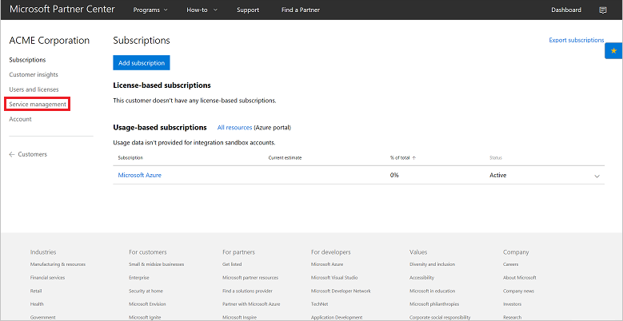
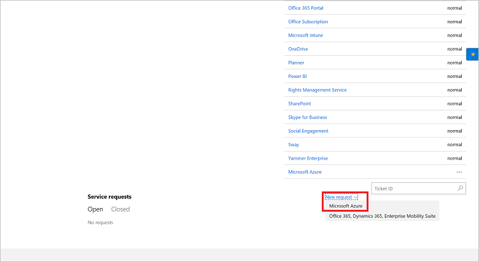
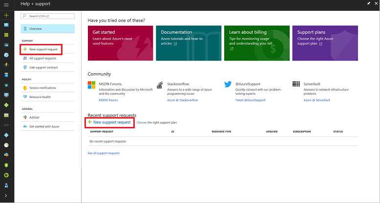
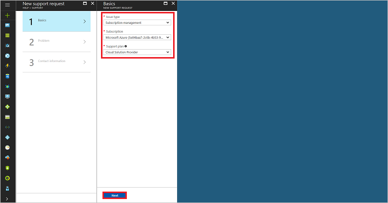
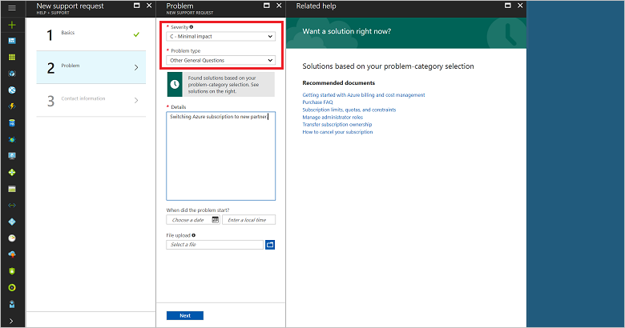
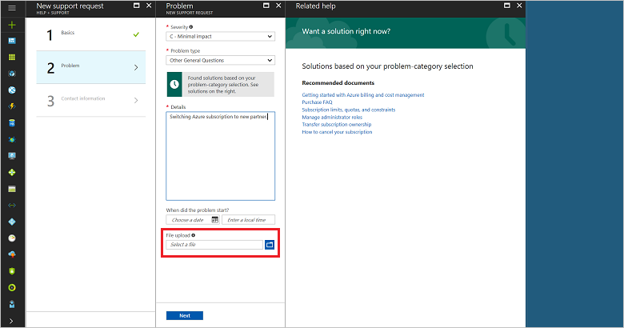
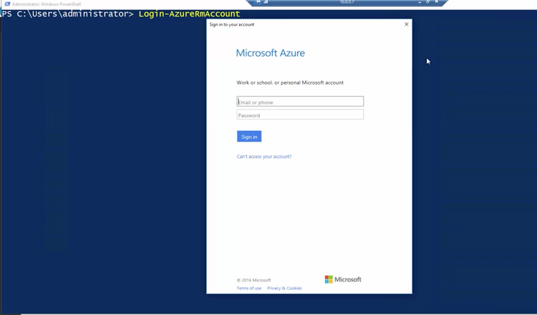
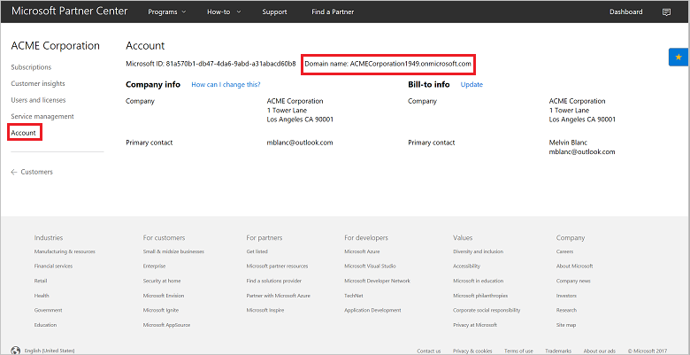
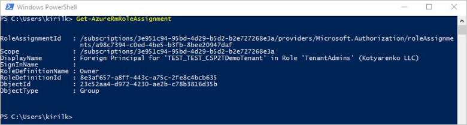

# Switch an Azure CSP subscription to a different CSP partner

This article describes how a customer can change which partner in the Azure Cloud Solution Provider (CSP) program to use for Azure services.

>[!NOTE] 
>This process is complicated, and it requires both partner and customer actions. Currently there is no automatic process to switch an Azure subscription from one CSP partner to another.

This process allows only CSP-to-CSP subscription migrations between existing CSP partners.

## Switch CSP partners for an Azure subscription

Three parties are involved in the process of switching CSP partners:
- CSP customer
- Existing CSP partner: The partner who currently owns the subscription
- New CSP partner: The partner who receives the subscription

Depending on your role in the partnership, switch partners by doing the following:

1. CSP customer: Contact the existing CSP partner in writing, stating a desire to begin the transfer process.

2. Existing CSP partner: Request a subscription transfer by creating an Azure service ticket in Partner Center:
	
	a. On the Partner Center dashboard menu, select **Customers**, select your customer in the list, and then select **classic deployment model**. 

	

	b. In the **Support tickets** section, in the **New ticket** drop-down list, select **Microsoft Azure**.
	
	

	c. On the Azure portal **Help & support** page, select **New support request**.  

	

	d. In the **New support request** pane, select step **1 - Basics**, select **Subscription management** as the issue type, specify the subscription ID you want to transfer, and then select **Cloud Solution Provider** as the support plan.
	
	

	e. Select step **2 - Problem**, select **C - Minimal impact** as the severity level, and then select **Other General Questions** as the problem type.

	

	f. Download the [CSP Subscription Transfer form](https://assets.windowsphone.com/5222c408-e546-4e01-b72a-2ec7d4c43d57/CSP_Subscription_Transfer_Form_Azure_InvariantCulture_Default.zip).

3. Existing CSP partner: Complete the CSP Subscription Transfer form, sign it, and then send it to the customer. To complete the form, you need the following information: 
	- The existing CSP partner's contact information and Microsoft ID. This information is listed on the Partner Center menu under **Account settings** > **Organization profile**.
	- The customer's Microsoft ID. On the Partner Center menu, select **Customers**, and then expand the listing to view the customer's Microsoft ID.
	- The subscription ID that you want to transfer. In the expanded customer listing, select **View Subscriptions**, and then expand the selected subscription to view the subscription ID.

4. Customer and new CSP partner: Review the form, add information about the new CSP partner, and then sign the form. Confirm that the new customer has a contract agreement in place, and then send the form back to the existing CSP partner.

    >[!IMPORTANT]
    >If the new CSP partner does not have a reseller relationship with the customer, establish one prior to transferring the subscription by following the instructions for [adding an existing customer](add-existing-customer.md).

5. Existing CSP partner: Ensure that the form contains correct contact information for both partner admins and that all three signatures are in place. Attach the completed form to the service request by using the **File upload** option. A Microsoft support engineer will contact you within 8 business hours to validate receipt and completion.

    

6. New CSP partner: Update the Azure subscription settings to remove the existing CSP partner from the account. To see which role assignments are set up, run two PowerShell cmdlets.

    a. To add the new CSP partner as the reseller on the account, run:

    ```powershell
    PS C:\> Add-AzureRMAccount -tenant "CustomerDomainName"
    ```

      

      To find the customer's domain name, in the Partner Center left pane, select **Customers**. In the customer list, select the customer. In the left pane of the customer's page, select **Account**, and then copy the domain name.

      

    b. To view roles on the account, including previous CSP partners, run:

    ```powershell
    PS C:\> Get-AzureRMRoleAssignment`
    ```

      

    c. To remove outdated access permissions to the subscription and resources in the Azure portal, on the Partner Center menu, select **Customers**. 

    d. Select the customer.

    e. On the customer menu, select **Service management**. 

    

    f. To go to the Azure portal, select the **Microsoft Azure** link. To remove unwanted user access, follow the instructions in [Assign permissions to an Azure CSP subscription](assign-permissions-to-azure-csp-subscription.md).

## Next steps
- [Learn how to add an existing Azure customer to your Partner Center account](add-existing-customer.md) 
- [Learn how to assign Azure CSP subscription permissions to a customer](assign-permissions-to-azure-csp-subscription.md) 
