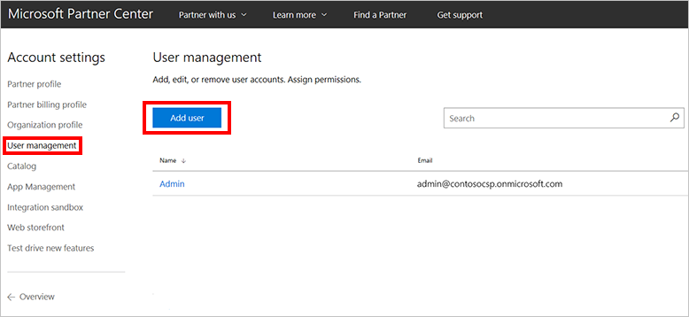
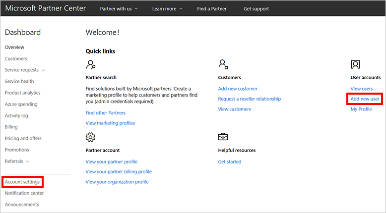
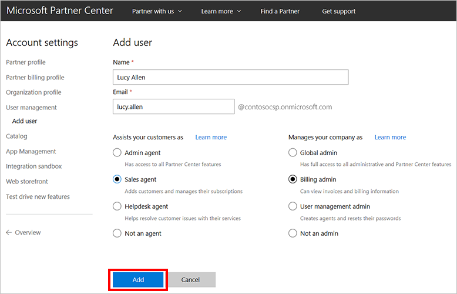
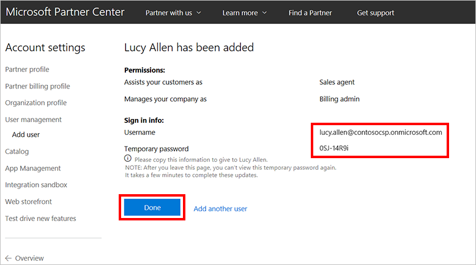

# Create a user account in Partner Center
Learn how to create user accounts for employees who need to access Microsoft Partner Center. The following tasks must be completed by an admin who has user management admin rights.

## Add a new user

1. In Partner Center, on the **Dashboard** menu, select **Account settings** > **User management** > **Add User**.

    

    > [!TIP]
    > For another option, in the **Quick links** section of the dashboard, under **User accounts**, select **Add new user**.

    

2. Enter the user's full name and a unique email address.
3. Select the type of agent and the admin type. Because Partner Center access is role-based, you can assign permissions to set the user's view to show only the features the user needs to complete specific tasks. For more information about what each role can do, see [Partner Center user roles](../../overview/partner-center-overview.md#partner-center-user-roles).
4. To create the user account, select **Add**. On the next page, confirm the user's details.

    

    > [!IMPORTANT] 
    > Take note of the new user's sign-in information that is displayed on the add user page. Copy it and send it to the user. You won't have access to this information again later.

    

## Next steps
- Learn about [APIs for Azure CSP integration](../available-apis-overview.md).
- See the list of [Azure CSP integration scenarios](../integration-scenarios-list.md).
