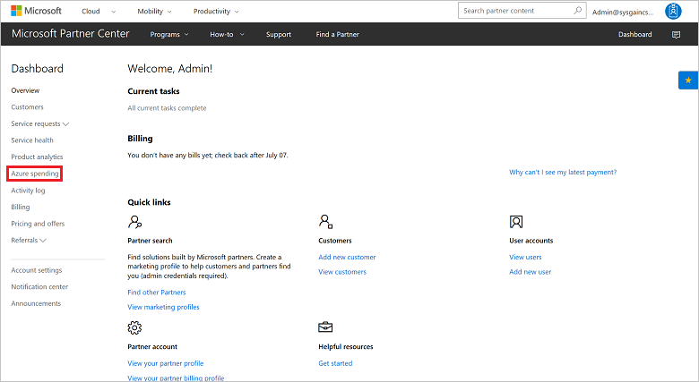
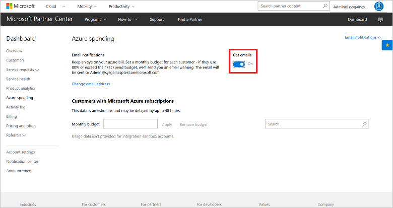
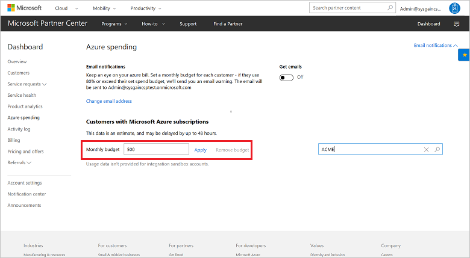
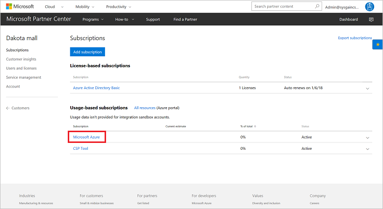

# Set an Azure spending budget for a customer

You can set up a monthly spending budget to help a customer manage their Azure costs. A spending budget can help a customer ensure that their Azure bill isn't higher than they had anticipated.

This feature includes:

- Email notifications if a customer is nearing a spending limit.
- Review of a customer's estimated costs per month.
- Notifications of unusual usage trends that might suggest fraud.
- Cost management and identification of root issues.

Azure spending data is an estimate. Actual billing amounts might vary. Azure spending data does not include taxes, credits, adjustments, and so on. Spending data is refreshed once each day. 

> [!NOTE]
> This feature is not available in sandbox accounts or in production test accounts.

> [!WARNING]
> Creating a budget does not stop a customer from going over the set spending limit, or from being charged for additional services. A budget is only a preventative tool.

## Turn on email notifications

1. On the Microsoft Partner Center **Dashboard** menu, select **Azure spending**.

    
2. Under **Get emails**, select **On**. With this setting turned on, you are notified if the customer uses 80 percent or more of their budget. This can help you monitor the customer's Azure bill. Make sure that the default email address is one that you will monitor for notifications.

    

## Set a budget

1. On the **Dashboard** menu, select **Azure spending**.
2. Select a customer.
3. In the **Monthly budget** box, enter a value, and then select **Apply**.

    
    
4. To check current spending, return to the **Azure spending** page.

You also can set a spending budget for a customer on the customer management page, under **Usage-based subscriptions**.

## See itemized costs

1. On the **Dashboard** menu, select **Customers**, and then select a customer.
2. Select **Subscriptions**, and then select the subscription.

    
    
On a customer management page, under **Usage-based subscriptions**, select a subscription. You can view the current estimated usage for the subscription, and see a list of itemized costs by service.

## Next steps

- Learn about [APIs for Azure CSP integration](../available-apis-overview.md).
- See the list of [Azure CSP integration scenarios](../integration-scenarios-list.md).