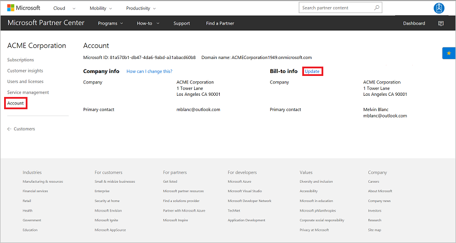
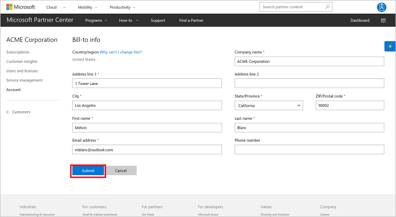

# Update a customer's billing profile

Learn how to update a customer's billing information. You can use one of the following options:

- Partner Center web UI
- PowerShell
- C#
- REST API

## Partner Center web UI

1. In Microsoft Partner Center, on the **Dashboard** menu, select **Customers**. Then, select a customer.
2. On the customer menu, select **Account**, and then select **Update**.

    

3. After you've made your changes, select **Submit**.

    

## PowerShell

```powershell
$customer = Get-PCCustomer -TenantId '<customer identifier>'

$customerBillingProfile = Get-PCCustomerBillingProfile -TenantId $customer.id

$customerBillingProfile.FirstName = '<first name>'
$customerBillingProfile.LastName = '<last name>'
$customerBillingProfile.Email = '<email>'

Set-PCCustomerBillingProfile -TenantId $customer.id -BillingProfile $customerBillingProfile
```

## C#

1. Retrieve the billing profile. Update the properties as needed.
2. Retrieve your **IPartner.Customers** collection, and then call the **ById()** method.
3. Call the **Profiles** property, followed by the **Billing** property.
4. Call the **Update()** or the **UpdateAsync()** method.

```csharp
// IAggregatePartner partnerOperations;
// var selectedCustomerId as string;

var billingProfile = partnerOperations.Customers.ById(selectedCustomerId).Profiles.Billing.Get();

// Apply changes to profile;

billingProfile = partnerOperations.Customers.ById(selectedCustomerId).Profiles.Billing.Update(billingProfile);
```

## REST API

### Request

**Request syntax**

|Method|Request URI|
|---|---|
|PUT|{baseURL}/v1/customers/{customer-tenant-id}/profiles/billing HTTP/1.1|

**URI parameter**

Use the query parameter in the following table to update the billing profile.

|Name|Type|Description|
|---|---|---|
|customer-tenant-id|guid|The value is a GUID-format customer tenant ID. The reseller can use **customer-tenant-id** to filter the results for a specific customer.|

**If-Match**: An HTML entity tag (ETag) is required for concurrency detection.

**Request example**

```json
PUT https://api.partnercenter.microsoft.com/v1/customers/<customer-tenant-id>/profiles/billing HTTP/1.1
Authorization: Bearer <token>
Accept: application/json
MS-RequestId: ff85f13a-eb65-4b8e-9b67-05beb0565410
MS-CorrelationId: ff1b757d-cfaf-463a-b48b-0f96d05e95d7
Content-Type: application/json
Content-Length: 639
Expect: 100-continue

{
    "Id": "a58ceba5-60ac-48e4-a0bc-2a855811807a",
    "FirstName": "FirstName",
    "LastName": "LastName",
    "Email": "email@sample.com",
    "Culture": "en-US",
    "Language": "en",
    "CompanyName": "CompanyName",
    "DefaultAddress": {
        "Country": "US",
        "Region": null,
        "City": "Redmond",
        "State": "WA",
        "AddressLine1": "One Microsoft Way",
        "AddressLine2": null,
        "PostalCode": "98052",
        "FirstName": "FirstName",
        "LastName": "LastName",
        "PhoneNumber": "4255555555"
    },
    "Links": {
        "Self": {
            "Uri": "/v1/customers/<customer-tenant-id>/profiles/billing",
            "Method": "GET",
            "Headers": []
        }
    },
    "Attributes": {
        "Etag": "<etag>",
        "ObjectType": "CustomerBillingProfile"
    }
}
```

### Response

If the request is successful, this method returns updated properties for **Profile** resources in the response body. This call requires an ETag for concurrency detection.

**Response example**

```json
HTTP/1.1 200 OK
Content-Length: 1210
Content-Type: application/json
MS-CorrelationId: ff1b757d-cfaf-463a-b48b-0f96d05e95d7
MS-RequestId: ff85f13a-eb65-4b8e-9b67-05beb0565410
Date: Mon, 23 Nov 2015 18:20:43 GMT

{
    "id": "a58ceba5-60ac-48e4-a0bc-2a855811807a",
    "firstName": "FirstName",
    "lastName": "LastName",
    "email": "email@sample.com",
    "culture": "en-US",
    "language": "en",
    "companyName": "companyName",
    "defaultAddress": {
        "country": "US",
        "city": "Redmond",
        "state": "WA",
        "addressLine1": "One Microsoft Way",
        "postalCode": "98052",
        "firstName": "FirstName",
        "lastName": "LastName",
        "phoneNumber": "4255555555"
    },
    "links": {
        "self": {
            "uri": "/v1/customers/<customer-tenant-id>/profiles/billing",
            "method": "GET",
            "headers": []
        }
    },
    "attributes": {
        "etag": "<etag>",
        "objectType": "CustomerBillingProfile"
    }
}
```

## Next steps

- Learn about [APIs for Azure CSP integration](../available-apis-overview.md).
- See the list of [Azure CSP integration scenarios](../integration-scenarios-list.md).