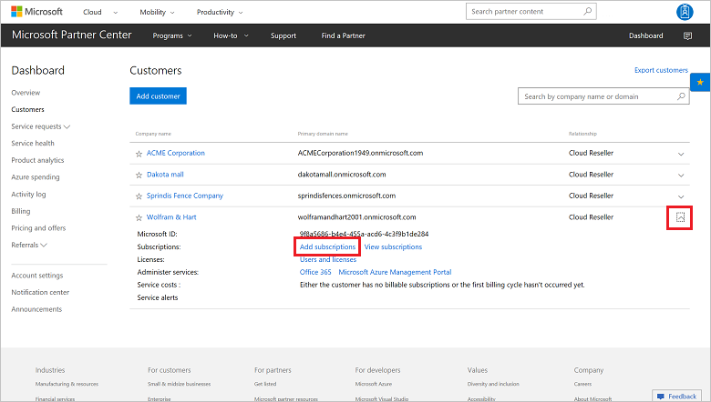
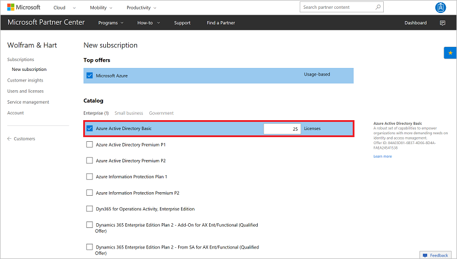
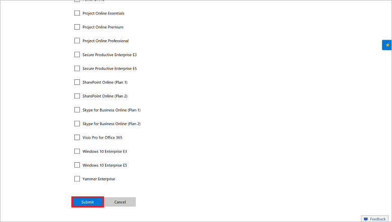

# Add subscriptions to a customer account

Learn how to add and edit the subscriptions and licenses that are available to a specific customer. You can use one of the following options:

- Partner Center web UI
- PowerShell
- C#
- REST API

## Partner Center web UI

### Order a new subscription

1. In Microsoft Partner Center, go to the **Customers** page.
2. In the far-right column, select the drop-down box. This shows expanded details for the customer. Select **Add subscriptions**.

    

3. On the **New subscription** page, select the offer or offers, and the number of licenses.

    

4. Select **Submit**.

    

The new subscription now appears in the customer's **Subscriptions** list.

## PowerShell

### Order a new subscription

```powershell
$customer = Get-PCCustomer -TenantId '<customer identifier>'

# Get offer
$offer = Get-PCOffer -CountryId '<country two-digit identifier>' -OfferId '<offer identifier>'

# Create the OrderLineItem
$lineItems = @()
$lineItems += [OrderLineItem]::new()
$lineItems[0].LineItemNumber = 0
$lineItems[0].FriendlyName = '<friendly name>'
$lineItems[0].OfferId = $offer.id
$lineItems[0].Quantity = <quantity>

# Send order
New-PCOrder -TenantId $customer.id -LineItems $lineItems
```

## C#

1. Instantiate an **Order** object. To record the customer, set the **ReferenceCustomerID** property to the customer ID. 
2. Create a list of **OrderLineItem** objects. Assign the list to the order's **LineItems** property. Each order line item contains the purchase information for one offer. You must have at least one order line item.
3. To get an interface for order operations:
    1. To identify the customer, call the **IAggregatePartner.Customers.ById** method with the customer ID.
    2. To retrieve the interface, use the **Orders** property.
4. To create the order, call the **Create** or the **CreateAsync** method.

```csharp
IAggregatePartner partnerOperations;
string customerId;
string offerId;

var order = new Order()
{
    ReferenceCustomerId = customerId,
    LineItems = new List<OrderLineItem>()
    {
        new OrderLineItem()
        {
            OfferId = offerId,
            FriendlyName = "new offer purchase",
            Quantity = 5
        }
    }
};

var createdOrder = partnerOperations.Customers.ById(customerId).Orders.Create(order);
```

## REST API

### Request

**Request syntax**

|Method|Request URI|
|---|---|
|POST|{baseURL}/v1/customers/{customer-id}/orders HTTP/1.1|

**URI parameters**

Use the following path parameter to identify the customer.

|Name|Type|Description|
|---|---|---|
|customer-id|guid|A GUID-format customer ID that identifies the customer.|

**Request body**

**_Order_**

The following table describes the **Order** properties in the request body.

|Name|Type|Required?|Description|
|---|---|---|---|
|id|string|N|An order identifier that is supplied when the order is successfully created. |
|referenceCustomerId|string|Y|The customer identifier.|
|billingCycle|string|N|The frequency with which the partner is billed for this order. The default is **Monthly**. The frequency is applied when the order is successfully created. Supported values are the member names found in **BillingCycleType**.<br/><br/> Note that the annual billing feature is not yet generally available. Support for annual billing is coming soon.|
|lineItems|array of objects|Y|An array of **OrderLineItem** resources.|
|creationDate|string|N|The date the order was created, in date/time format. The value for **creationDate** is applied when the order is successfully created.|
|attributes|object|N|Contains `ObjectType`:`Order`.|

**_OrderLineItem_**

The following table describes the **OrderLineItem** properties in the request body.

|Name|Type|Required?|Description|
|---|---|---|---|
|lineItemNumber|int|Y|Each line item in the collection has a unique line number, counting up from 0 to *count*-1.|
|offerId|string|Y|The offer identifier.|
|subscriptionId|string|N|The subscription identifier.|
|parentSubscriptionId|string|N|The ID of the parent subscription in an add-on offer. Applies to PATCH only.|
|friendlyName|string|N|The display name for the subscription, which is defined by the partner. You can use the display name to help disambiguate subscriptions.|
|quantity|int|Y|The number of licenses for a license-based subscription.|
|partnerIdOnRecord|string|N|When an indirect provider places an order on behalf of an indirect reseller, populate this field *only* with the Microsoft Partner Network (MPN) ID of the **indirect reseller** (never use the MPN ID of the indirect provider). This ensures proper accounting for incentives.|
|attributes|object|N|Contains `ObjectType`:`OrderLineItem`.|

**Request example**

```json
POST https://api.partnercenter.microsoft.com/v1/customers/4d3cf487-70f4-4e1e-9ff1-b2bfce8d9f04/orders HTTP/1.1
Authorization: Bearer <token>
Accept: application/json
MS-RequestId: 57870501-203b-468e-8a63-078a3826d8ec
MS-CorrelationId: 9c272436-538d-4dd4-a421-c811e004784c
X-Locale: en-US
Content-Type: application/json
Host: api.partnercenter.microsoft.com
Content-Length: 405
Expect: 100-continue
Connection: Keep-Alive

{
    "Id": null,
    "ReferenceCustomerId": "4d3cf487-70f4-4e1e-9ff1-b2bfce8d9f04",
    "BillingCycle": "unknown",
    "LineItems": [{
            "LineItemNumber": 0,
            "OfferId": "84A03D81-6B37-4D66-8D4A-FAEA24541538",
            "SubscriptionId": null,
            "ParentSubscriptionId": null,
            "FriendlyName": "new offer purchase",
            "Quantity": 5,
            "PartnerIdOnRecord": null,
            "Attributes": {
                "ObjectType": "OrderLineItem"
            }
        }
    ],
    "CreationDate": null,
    "Attributes": {
        "ObjectType": "Order"
    }
}
```

### Response
If the request is successful, the response body contains the populated **Order** resource.

**Response example**
```json
HTTP/1.1 201 Created
Content-Length: 801
Content-Type: application/json; charset=utf-8
MS-CorrelationId: 9c272436-538d-4dd4-a421-c811e004784c
MS-RequestId: 57870501-203b-468e-8a63-078a3826d8ec
MS-CV: VcfS+fqdQUW8Nap6.0
MS-ServerId: 030020525
Date: Thu, 30 Mar 2017 17:43:08 GMT

 {
    "id": "074bd849-9106-405c-9923-fa061839d487",
    "referenceCustomerId": "4d3cf487-70f4-4e1e-9ff1-b2bfce8d9f04",
    "billingCycle": "monthly",
    "lineItems": [{
            "lineItemNumber": 0,
            "offerId": "84A03D81-6B37-4D66-8D4A-FAEA24541538",
            "subscriptionId": "1DA3295E-C59A-476C-A7E7-D7E981FE79BE",
            "friendlyName": "new offer purchase",
            "quantity": 5,
            "links": {
                "subscription": {
                    "uri": "/customers/4d3cf487-70f4-4e1e-9ff1-b2bfce8d9f04/subscriptions/1DA3295E-C59A-476C-A7E7-D7E981FE79BE",
                    "method": "GET",
                    "headers": []
                }
            }
        }
    ],
    "creationDate": "2017-03-30T10:43:07.157-07:00",
    "links": {
        "self": {
            "uri": "/customers/4d3cf487-70f4-4e1e-9ff1-b2bfce8d9f04/orders/074bd849-9106-405c-9923-fa061839d487",
            "method": "GET",
            "headers": []
        }
    },
    "attributes": {
        "etag": "eyJpZCI6IjA3NGJkODQ5LTkxMDYtNDA1Yy05OTIzLWZhMDYxODM5ZDQ4NyIsInZlcnNpb24iOjF9",
        "objectType": "Order"
    }
}
```

## Next steps

- Learn about [APIs for Azure CSP integration](../available-apis-overview.md).
- See the list of [Azure CSP integration scenarios](../integration-scenarios-list.md).