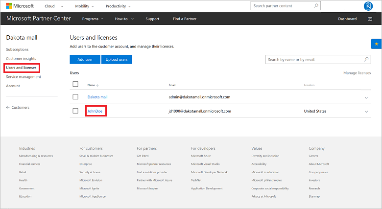
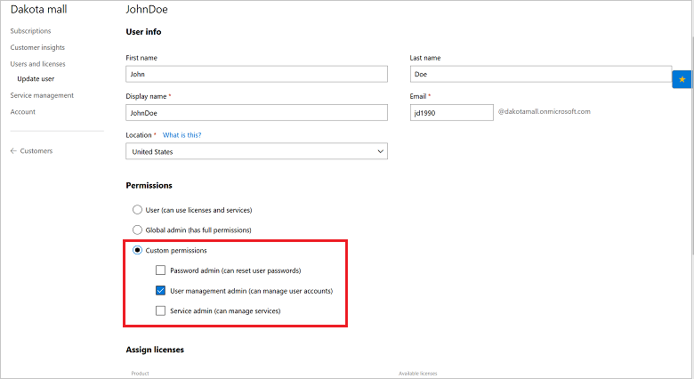

# Manage user permissions

Learn about the different ways you can manage the roles and permissions of users, both for a customer and for you, the Azure CSP partner. You can use one of the following options:

- Partner Center web UI
- PowerShell
- C#
- REST API

## Partner Center web UI

### Retrieve user permissions

Before you can modify a user's permissions, you must first find out what permissions the user has. 

1. In Microsoft Partner Center, on the **Dashboard** menu, go to **Customers**. Select the specific customer.
2. Select **Users and licenses**, and then select the specific user.

    

3. The user's permissions are displayed under **Permissions**. For an explanation of what the different permissions mean, see [Partner Center overview](../../overview/partner-center-overview.md).

### Edit permissions

To change the permissions you see on the user's permissions page, select or clear the permissions. You can set a user role to **User** or **Global admin**. Or, you can select **Custom permissions** to open new options for **Password admin**, **User management admin**, or **Service admin**.



When you are finished making changes, select **Submit**.

## PowerShell

### Retrieve a user role

To get a list of a customer user's roles by using PowerShell, use the following commands:

```powershell
$customer = Get-PCCustomer -TenantId '<tenant id GUID>'

$user = Get-PCCustomerUser -TenantId $customer.id -userid '<user id>'

Get-PCCustomerUserRole -TenantId $customer.id -user $user
```

### Set a user role

To add a user to a specific role by using PowerShell, use the following commands:

```powershell
$customer = Get-PCCustomer -TenantId '<customer identifier>'

$role = Get-PCCustomerRole -TenantId $customer.id | Where-Object name -Contains '<role name>'

$user = Get-PCCustomerUser -TenantId $customer.id -UserId '<user identifier>'

$customerRoleMember = [DirectoryRoleMember]::new()

$customerRoleMember.id = $user.id

Add-PCCustomerRoleMember -TenantId $customer.id -RoleId $role.id -CustomerRoleMember $customerRoleMember
```

### Remove a user role

To remove a user from a role by using PowerShell, use the following commands:

```powershell
$customer = Get-PCCustomer -TenantId '<customer identifier>'

$role = Get-PCDirectoryRoles -TenantId $customer.id | Where-Object name -Contains '<role name>'

$user = Get-PCCustomerUser -TenantId $customer.id -UserId '<user identifier>'

Remove-PCCustomerRoleMember -TenantId $customer.id -RoleId $role.id -UserId $user.id
```

## C#

### Retrieve a user role

To retrieve all the directory roles for a specific customer:

1. Retrieve the specified customer ID.
2. Use your **IAggregatePartner.Customers** collection and call the **ById()** method.
3. Call the **DirectoryRoles** property, followed by the **Get()** or the **GetAsync()** method.

```csharp
// string selectedCustomerId;
// IAggregatePartner partnerOperations;

var directoryRoles = partnerOperations.Customers.ById(selectedCustomerId).DirectoryRoles.Get();
```

To retrieve a list of customer users that are assigned a specific role:

1. Retrieve the specified customer ID and the directory role ID.
2. Use your **IAggregatePartner.Customers** collection and call the **ById()** method.
3. Call the **DirectoryRoles** property, then the **ById()** method, and then the **UserMembers** property.
4. Call the **Get()** or the **GetAsync()** method.

```csharp
// string selectedCustomerId;
// IAggregatePartner partnerOperations;
// string selectedDirectoryRoleId;

var userMembers = partnerOperations.Customers.ById(selectedCustomerId).DirectoryRoles.ById(selectedDirectoryRoleId).UserMembers.Get();
```

### Set a user role

To assign a directory role to a customer user:

1. Create a new **UserMember** with the relevant user details.
2. To identify the customer, call the **IAggregatePartner.Customers.ById** method with the specified customer ID.
3. To specify the role, use the **DirectoryRoles.ById** method with the directory role ID.
4. To add the new user member to the collection of user members assigned to that role, access the **UserMembers** collection, and then use the **Create** method.

```csharp
// UserMember createdUser;
// IAggregatePartner partnerOperations;
// Customer selectedCustomer;
// IDirectoryRole selectedRole;

// Create the new user member.
UserMember userMemberToAdd = new UserMember()
{
    UserPrincipalName = createdUser.UserPrincipalName,
    DisplayName = createdUser.DisplayName,
    Id = createdUser.Id
};

// Add the new user member to the role.
var userMemberAdded = partnerOperations.Customers.ById(selectedCustomer.Id).DirectoryRoles.ById(selectedRole.Id).UserMembers.Create(userMemberToAdd);
```

### Remove a user role

To remove a user from a directory role:

1. To select the customer that has the user whose permissions you want to modify, call the **IAggregatePartner.Customers.ById** method.
2. To specify the role, use the **DirectoryRoles.ById** method with the directory role ID.
3. To identify the user to remove, access the **UserMembers.ById** method.
4. To remove the user from the role, call the **Delete** method.

```csharp
// IAggregatePartner partnerOperations;
// string selectedCustomerId;
// string selectedRoleId;
// string selectedUserMemberId;

partnerOperations.Customers.ById(selectedCustomerId).DirectoryRoles.ById(selectedRoleId).UserMembers.ById(selectedUserMemberId).Delete();
```

## REST API

### Retrieve a user role

**Request syntax**

|Method|Request URI|
|---|---|
|GET|{baseURL}/v1/customers/{customer-tenant-id}/users/{user-id}/directoryroles HTTP/1.1|
|GET|{baseURL}/v1/customers/{customer-tenant-id}/directoryroles HTTP/1.1|
|GET|{baseURL}/v1/customers/{customer-tenant-id}/directoryroles/{role-ID}/usermembers|

**URI parameters**

Use the following query parameters to identify the correct customer.

|Name|Type|Description|
|---|---|---|
|customer-tenant-id|guid|A GUID-format customer tenant ID. The reseller can use the value for **customer-tenant-id** to filter the results for a specific customer that is associated with the reseller.|
|user-id|guid|(Optional) A GUID-format user ID that belongs to a single user account.|
|role-id|guid|A GUID-format role ID that belongs to a type of role. You can get these IDs by querying all the directory roles for a customer, across all user accounts.|


**Request example**

```http
GET https://api.partnercenter.microsoft.com/v1/customers/<customer-tenant-id>/users/<user-id>/directoryroles HTTP/1.1
Authorization: Bearer <token>
Accept: application/json
MS-RequestId: b1317092-f087-471e-a637-f66523b2b94c
MS-CorrelationId: 8a53b025-d5be-4d98-ab20-229d1813de76
```

If  the request is successful, this method returns a list of the roles associated with the user account.

**Response example**

```json
HTTP/1.1 200 OK
Content-Length: 31942
Content-Type: application/json
MS-CorrelationId: 8a53b025-d5be-4d98-ab20-229d1813de76
MS-RequestId: b1317092-f087-471e-a637-f66523b2b94c
Date: June 24 2016 22:00:25 PST

{
      "totalCount": 2,
      "items": [
        {
          "name": "Helpdesk Administrator",
          "id": "729827e3-9c14-49f7-bb1b-9608f156bbb8",
          "attributes": { "objectType": "DirectoryRole" }
        },
        {
          "name": "User Account Administrator",
          "id": "fe930be7-5e62-47db-91af-98c3a49a38b1",
          "attributes": { "objectType": "DirectoryRole" }
        }
      ],
      "attributes": { "objectType": "Collection" }
}
```

### Set a user role

**Request syntax**

|Method|Request URI|
|---|---|
|POST|{baseURL}/v1/customers/{customer-tenant-id}/directoryroles/{role-ID}/usermembers HTTP/1.1 |

**URI parameters**

Use the following URI parameters to identify the correct customer and role.

|Name|Type|Description|
|---|---|---|
|customer-tenant-id|guid|The value is a GUID-format customer tenant ID. The reseller can use the value for **customer-tenant-id** to filter the results for a specific customer that is associated with the reseller.|
|role-id|guid|The value is a GUID-format role ID that identifies the role to assign to the user.|

**Request body**

The following table lists the properties that you must include in the request body.

|Name|Type|Description|
|---|---|---|
|id|string|The ID of the user you are adding to the role.|
|DisplayName|string|The display name of the user.|
|UserPrincipalName|string|The name of the user principal.|
|Attributes|object|Contains `ObjectType`:`UserMember`|

**Request example**

```json
POST https://api.partnercenter.microsoft.com/v1/customers/4d3cf487-70f4-4e1e-9ff1-b2bfce8d9f04/directoryroles/f023fd81-a637-4b56-95fd-791ac0226033/usermembers HTTP/1.1
Authorization: Bearer <token>
Accept: application/json
MS-RequestId: a56cb2e5-a156-4f68-9155-57ffe2b93d18
MS-CorrelationId: 90bda268-7929-4ad6-be01-89c5af5fc504
X-Locale: en-US
Content-Type: application/json
Host: api.partnercenter.microsoft.com
Content-Length: 180
Expect: 100-continue

{
    "Id": "a9ef48bb-8758-4590-a312-d4a47bfaded4",
    "DisplayName": "Donovan Luong",
    "UserPrincipalName": "Donovan@dtdemocspcustomer005.onmicrosoft.com",
    "Attributes": {
        "ObjectType": "UserMember"
    }
}
```

When the user is successfully assigned the role, this method returns the user account, along with the role ID.

**Response example**

```json
HTTP/1.1 201 Created
Content-Length: 231
Content-Type: application/json; charset=utf-8
MS-CorrelationId: 90bda268-7929-4ad6-be01-89c5af5fc504
MS-RequestId: a56cb2e5-a156-4f68-9155-57ffe2b93d18
MS-CV: aia94+gnrEeQqkGr.0
MS-ServerId: 101112202
Date: Tue, 20 Dec 2016 23:36:55 GMT

{
    "displayName": "Donovan Luong",
    "userPrincipalName": "Donovan@dtdemocspcustomer005.onmicrosoft.com",
    "roleId": "f023fd81-a637-4b56-95fd-791ac0226033",
    "id": "a9ef48bb-8758-4590-a312-d4a47bfaded4",
    "attributes": {
        "objectType": "UserMember"
    }
}
```

### Remove a user role

**Request syntax**

|Method|Request URI|
|---|---|
|DELETE|{baseURL}/v1/customers/{customer-tenant-id}/directoryroles/{role-ID}/usermembers/{user-ID} HTTP/1.1|

**URI parameters**

The following URI parameters are required for identifying the correct customer, role, and user.

|Name|Type|Description|
|---|---|---|
|customer-tenant-id|guid|A GUID-format customer tenant ID that identifies the customer.|
|role-id|guid|A GUID-format role ID that identifies the role.|
|user-id|guid|A GUID-format user ID that identifies a single user account.|

**Request example**

```http
DELETE https://api.partnercenter.microsoft.com/v1/customers/4d3cf487-70f4-4e1e-9ff1-b2bfce8d9f04%20/directoryroles/729827e3-9c14-49f7-bb1b-9608f156bbb8/usermembers/4d3cf487-70f4-4e1e-9ff1-b2bfce8d9f04%20 HTTP/1.1
Authorization: Bearer <token>
Accept: application/json
MS-RequestId: 0a00ec08-6273-46bb-ab6f-14a13959b381
MS-CorrelationId: 87d18a45-81fc-40cf-921a-b91cb82d67fe
X-Locale: en-US
Host: api.partnercenter.microsoft.com
Content-Length: 0
Connection: Keep-Alive
```

If the user is successfully removed from the role, the response body is empty.

**Response example**

```http
HTTP/1.1 204 No Content
Content-Length: 0
MS-CorrelationId: 90bda268-7929-4ad6-be01-89c5af5fc504
MS-RequestId: e784d7aa-8c8d-45ee-8f97-9e09823d7338
MS-CV: es01VX8do0u2aTXw.0
MS-ServerId: 101112616
Date: Tue, 20 Dec 2016 23:16:35 GMT
```

## Next steps

- Learn about [APIs for Azure CSP integration](../available-apis-overview.md).
- See the list of [Azure CSP integration scenarios](../integration-scenarios-list.md).