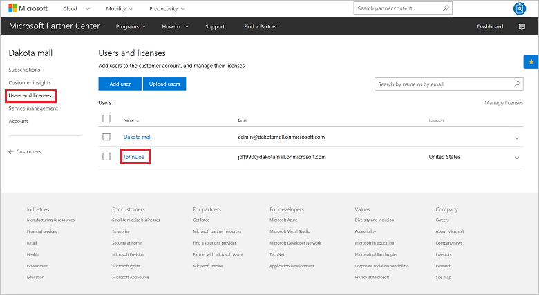
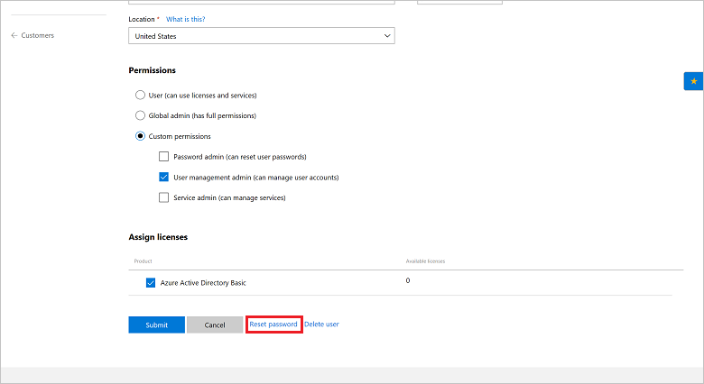
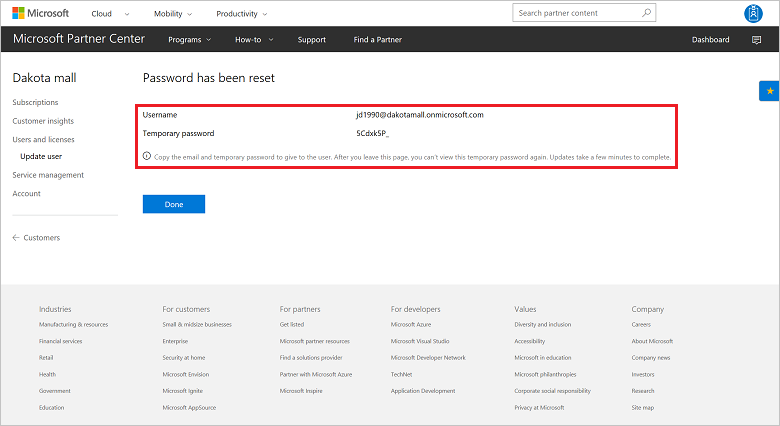

# Reset a user password

Learn how to reset a user password for a customer, if you need to. You can use one of the following options:

- Partner Center web UI
- PowerShell
- C#
- REST API

> [!NOTE]
> This task is not the same as resetting a user password in Microsoft Partner Center. 

## Partner Center web UI

1. In Partner Center, on the **Dashboard** menu, select **Customers**. Select the customer.
2. On the customer menu, select **Users and licenses**. Select the user.

   

3. Select **Reset password**.

   

4. You are redirected to the **Password has been reset** page (it might take a few minutes). Send the new, temporary password to the user.

   

## PowerShell

```powershell
$customer = Get-PCCustomer -TenantId '<customer identifier>'

$user = Get-PCCustomerUser -TenantId $customer.id -UserId '<user identifier>'

$password = '<password>'
$passwordSecure = $password | ConvertTo-SecureString -AsPlainText -Force

Set-PCCustomerUser -TenantId $customer.id -User $user -Password $passwordSecure -ForceChangePassword $true
```

## C#

1. Retrieve the specified customer ID and the targeted user.
2. Create a new **CustomerUser** object that contains the information for the existing customer, but with a new **PasswordProfile** object.
3. Use your **IAggregatePartner.Customers** collection and call the **ById()** method.
4. Call the **Users** property, the **ById()** method, and then the **Patch()** method.

```csharp
// string selectedCustomerId;
// IAggregatePartner partnerOperations;
// CustomerUser specifiedUser;

var selectedCustomer = partnerOperations.Customers.ById(selectedCustomerId).Get();
var userToUpdate = new CustomerUser()
   {
      PasswordProfile = new PasswordProfile() { ForceChangePassword = true, Password = "newPassword" },
      DisplayName = "User name",
      FirstName = "First",
      LastName = "Last",
      UsageLocation = "US",
      UserPrincipalName = Guid.NewGuid().ToString("N") + "@" + selectedCustomer.CompanyProfile.Domain.ToString()
   };

// Update customer user information.
User updatedCustomerUserInfo = partnerOperations.Customers.ById(selectedCustomerId).Users.ById(specifiedUser.Id).Patch(userToUpdate);
```

## REST API

### Request

**Request syntax**

|Method|Request URI|
|---|---|
|PATCH|{baseURL}/v1/customers/{customer-tenant-id}/users HTTP/1.1|

**URI parameters**

The following query parameters are required for identifying the correct customer.

|Name|Type|Description|
|---|---|---|
|customer-tenant-id|guid|A GUID-format customer tenant ID. The reseller can use the customer tenant ID to filter results for a specific customer that is associated with the reseller.|
|user-id|guid|A GUID-format user ID that belongs to a single user account.|

**Request example**

```json
PATCH https://api.partnercenter.microsoft.com/v1/customers/<customer-tenant-id>/users/<user-id> HTTP/1.1
Authorization: Bearer <token>
Accept: application/json
MS-RequestId: b1317092-f087-471e-a637-f66523b2b94c
MS-CorrelationId: 8a53b025-d5be-4d98-ab20-229d1813de76
{
     "passwordProfile":{
        password: "Renew456*",
        forceChangePassword: true
      },


      "attributes": {
        "objectType": "CustomerUser"
      }
}
```

### Response

If the request is successful, this method returns the user information and the updated password.

**Response example**

```json
HTTP/1.1 200 OK
Content-Length: 31942
Content-Type: application/json
MS-CorrelationId: 8a53b025-d5be-4d98-ab20-229d1813de76
MS-RequestId: b1317092-f087-471e-a637-f66523b2b94c
Date: June 24 2016 22:00:25 PST
{
  "usageLocation": "AX",
  "id": "95794928-9abe-4548-8b43-50ffc20b9404",
  "userPrincipalName": "username@contoso.onmicrosoft.com",
  "firstName": "First",
  "lastName": "Last",
  "displayName": "User name",
  "passwordProfile": {
    "forceChangePassword": false,
    "password": "Renew456*"
  },
  "lastDirectorySyncTime": null,
  "userDomainType": "none",
  "state": "active",
  "softDeletionTime": null,
  "links": {
    "self": {
      "uri": "/customers/eebd1b55-5360-4438-a11d-5c06918c3014/users/95794928-9abe-4548-8b43-50ffc20b9404",
      "method": "GET",
      "headers": [

      ]
    }
  },
  "attributes": {
    "objectType": "CustomerUser"
  }
}
```

## Next steps

- Learn about [APIs for Azure CSP integration](../available-apis-overview.md).
- See the list of [Azure CSP integration scenarios](../integration-scenarios-list.md).