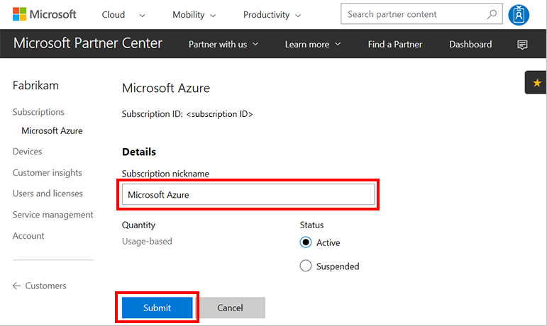

# Update a subscription nickname

Learn how to update the nickname for a subscription. Subscription nicknames help create common terminology between the provider and the customer. They also help differentiate between subscriptions in a customer's account. To update a subscription nickname, you can use one of the following options:

- Partner Center web UI
- PowerShell
- C#
- REST API


## Partner Center web UI

1. In Microsoft Partner Center, on the **Dashboard** menu, select **Customer**. Select the customer. 
2. Select **Subscriptions**, and then select the subscription.
3. Under **Details**, in the **Subscription nickname** box, enter the new nickname for the subscription. Then, select **Submit**.

    

## PowerShell

```powershell
$customer = Get-PCCustomer -TenantId '<customer identifier>'
$subscription = Get-PCSubscription -TenantId $customer.id | Where-Object {$_.FriendlyName -eq 'old friendly name'}
$subscription | Set-PCSubscription -TenantId $customer.id -FriendlyName '<friendly name>'
```

## C#

1. [Get the subscription](get-subscriptions-by-id.md).
2. Change the subscription's **FriendlyName** property.
3. Use your **IPartner.Customers** collection and call the **ById()** method.
4. Call the **Subscriptions** property, followed by the **ById()** method, and then the **Patch()** method.

```csharp
// IAggregatePartner partnerOperations;
// var SelectedcustomerId as string;

ResourceCollection<Subscription> customerSubscriptions = partnerOperations.Customers.ById(selectedCustomerId).Subscriptions.Get();
Subscription selectedSubscription = customerSubscriptions.Items.FirstOrDefault(sub => sub.Status == SubscriptionStatus.Active);

// Apply changes to the subscription.

var updatedSubscription = partnerOperations.Customers.ById(selectedCustomerId).Subscriptions.ById(selectedSubscription.Id).Patch(selectedSubscription);
```

## REST API

### Request

**Request syntax**

|Method|Request URI|
|---|---|
|PATCH|{baseURL}/v1/customers/{customer-tenant-id}/subscriptions/{id-for-subscription} HTTP/1.1|

**URI parameters**

The following query parameters are required for updating the subscription nickname.

|Name|Type|Description|
|---|---|---|
|customer-tenant-id|guid|A GUID that represents the customer.|
|id-for-subscription|guid|A GUID that represents the subscription.|

**Request body**

A full **Subscription** resource is required in the request body. Ensure that the **FriendlyName** property has been updated.

**Request example**

```json
PATCH https://api.partnercenter.microsoft.com/v1/customers/<customer-tenant-id>/subscriptions/<subscriptionID> HTTP/1.1
Authorization: Bearer <token>
Accept: application/json
MS-RequestId: ca7c39f7-1a80-43bc-90d8-ee7d1cad3831
MS-CorrelationId: ec8f62e5-1d92-47e9-8d5d-1924af105f2c
Content-Type: application/json
Content-Length: 1029
Expect: 100-continue
Connection: Keep-Alive

{
    "Id": "<subscriptionID>",
    "FriendlyName": "nickname",
    "Quantity": 2,
    "UnitType": "none",
    "ParentSubscriptionId": null,
    "CreationDate": "2015-11-25T06:41:12Z",
    "EffectiveStartDate": "2015-11-24T08:00:00Z",
    "CommitmentEndDate": "2016-12-12T08:00:00Z",
    "Status": "active",
    "AutoRenewEnabled": false,
    "BillingType": "none",
    "PartnerId": null,
    "ContractType": "subscription",
    OrderId": "6183db3d-6318-4e52-877e-25806e4971be",
    "Attributes": {
        "Etag": "<etag>",
        "ObjectType": "Subscription"
    }
}
```


### Response

If the request was successful, this method returns updated **Subscription** resource properties in the response body.

**Response example**

```json
PATCH http://partnerapi.store.microsoft.com/v1/customers/<customer-tenant-id>/subscriptions/<subscriptionID> HTTP/1.1
Authorization: Bearer <token>
Accept: application/json
MS-Contract-Version: v1
MS-RequestId: ca7c39f7-1a80-43bc-90d8-ee7d1cad3831
MS-CorrelationId: ec8f62e5-1d92-47e9-8d5d-1924af105f2c
Content-Type: application/json
Content-Length: 1029
Expect: 100-continue
Connection: Keep-Alive

{
    "Id": "<subscriptionID>",
    "FriendlyName": "nickname",
    "Quantity": 2,
    "UnitType": "none",
    "ParentSubscriptionId": null,
    "CreationDate": "2015-11-25T06:41:12Z",
    "EffectiveStartDate": "2015-11-24T08:00:00Z",
    "CommitmentEndDate": "2016-12-12T08:00:00Z",
    "Status": "active",
    "AutoRenewEnabled": false,
    "BillingType": "none",
    "PartnerId": null,
    "ContractType": "subscription",
    "Links": {
        "Offer": {
            "Uri": "/v1/offers/0CCA44D6-68E9-4762-94EE-31ECE98783B9",
            "Method": "GET",
            "Headers": []
        },
        "Entitlement": {
            "Uri": "/entitlements?key=<key>",
            "Method": "GET",
            "Headers": []
        },
        "Self": {
            "Uri": "/subscriptions?key=<key>",
            "Method": "GET",
            "Headers": []
        }
    },
    "OrderId": "6183db3d-6318-4e52-877e-25806e4971be",
    "Attributes": {
        "Etag": "<etag>",
        "ObjectType": "Subscription"
    }
}
```

## Next steps

- Learn about [APIs for Azure CSP integration](../available-apis-overview.md).
- See the list of [Azure CSP integration scenarios](../integration-scenarios-list.md).
