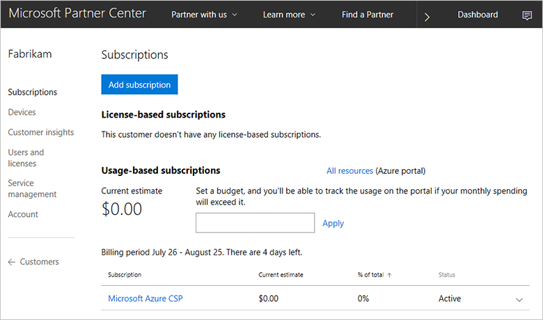
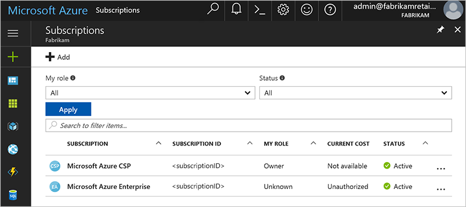

# Migrate an Azure subscription from a customer Enterprise Agreement to an Azure CSP

Because [Azure Resource Move](ea-open-direct-arm-to-csp.md) doesn't support cross-tenant migrations, the source subscription and destination subscription must be in the same directory. You need to migrate Azure resources from a subscription inside a customer's Enterprise Agreement enrollment to a Cloud Solution Provider (CSP). To do so, create an Azure CSP subscription within an existing customer tenant.

## Create an Azure CSP subscription in the existing directory

The source subscription should exist within the Azure Active Directory (Azure AD)-based directory. You can't use a subscription that's associated with a Microsoft account. If the source subscription is associated with a Microsoft account, see [Transfer ownership of an Azure subscription to another account](https://docs.microsoft.com/azure/billing/billing-subscription-transfer). Then move the subscription to an Azure AD-based directory. In the following example, we use the fabrikamretail.onmicrosoft.com directory, which belongs to a fictional customer, Fabrikam.

1. To generate a link, see [Add an existing customer to an Azure Cloud Solution Provider](../../customer-management/add-existing-customer.md). Send the link to the global administrator of the fabrikamretail.onmicrosoft.com directory.

2. After the global administrator approves the reseller relationship, Fabrikam appears in the list of Azure CSP customers. Create a new Azure CSP subscription within this Azure CSP customer in the Microsoft Partner Center.

	

3. [Create a new user](../../integration/manage-customers/manage-user-permissions.md) in the Fabrikam customer account. In our example, we use admin@fabrikamretail.onmicrosoft.com.

	

4. Assign owner rights to the admin@fabrikamretail.onmicrosoft.com user account in the destination Azure CSP subscription. For instructions, see [Assign and manage permissions within an Azure subscription](../../customer-management/assign-permissions-to-azure-csp-subscription.md).

5. Ask the customer to assign owner rights to the admin@fabrikamretail.onmicrosoft.com user account in the source Azure Enterprise Agreement subscription. Use a similar procedure to Step 4, but on the customer side.

After you finish the preceding steps, sign in to the [Azure portal](https://portal.azure.com) by using the admin@fabrikamretail.onmicrosoft.com account. You should see both the source subscription and the destination subscription in the subscription list.

Now you can migrate Azure resources from an Azure Enterprise Agreement subscription to an Azure CSP subscription within the same customer tenant.

## Next steps

- [Assess the migration](ea-open-direct-assessment.md) to understand the issues that you identify during the process.
- [Convert](ea-open-direct-asm-to-arm.md) resources from the Azure classic deployment model to the Azure Resource Manager deployment model.
- [Migrate](ea-open-direct-arm-to-csp.md) supported Resource Manager resources to an Azure CSP.
