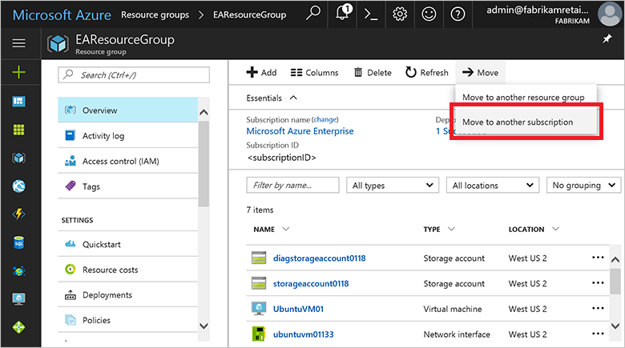
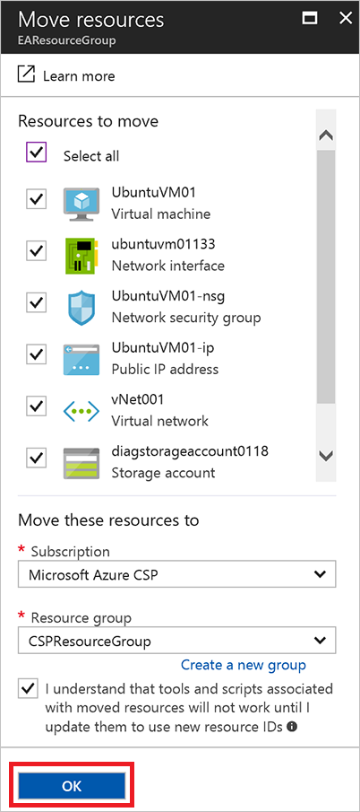
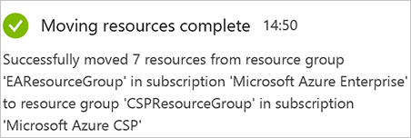
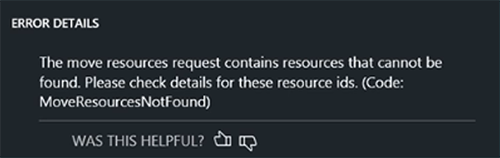

# Use Azure Resource Move to migrate an EA or PAYG subscription to Azure CSP

After you've [upgraded all Azure classic deployment model resources](ea-open-direct-asm-to-arm.md) to the Azure Resource Manager model, you can migrate the resources from an Enterprise Agreement (EA) or Pay-As-You-Go (PAYG) subscription to an Azure Cloud Solution Provider (Azure CSP) subscription by using [Azure Resource Move](https://docs.microsoft.com/azure/azure-resource-manager/resource-group-move-resources).

>[!NOTE]
>Resource Move is a detailed process. If you don't want to [perform this upgrade](ea-open-direct-asm-to-arm.md), you can leave the resources as is and migrate only those that were created in Resource Manager mode.

Although the following scenario shows the procedure for a single subscription, the procedure also applies to multiple subscriptions.

In the procedure, the term *source subscription* refers to the EA, Open, or PAYG subscription that is to be migrated. The term *destination subscription* refers to the Azure CSP subscription.

## Move resources from the source subscription to the Azure CSP subscription

Choose a resource group in the source subscription that you want to migrate to the Azure CSP subscription. Select **Move**, and then select **Move to another subscription**.

Cross-subscription migrations require resources and all their dependencies to be moved at once. If you have VM resources in one resource group, and that VM's disks are stored in a storage account in another resource group, first move all dependent resources to a single resource group, and then migrate them to another subscription at the same time.

Select all resources that you want to migrate from the source subscription to the Azure CSP subscription, and then select a resource group in the destination subscription. After you select **OK**, the migration possibility is validated. Select **OK** again to confirm the migration of selected resources from the source subscription to the Azure CSP subscription.

Migration usually takes from several seconds to a few minutes. To ensure that all resources are migrated without errors, check the activity status.

At this point, all resources in the selected resource group have been moved. In this example, the resource group includes the VMs and all storage accounts, public IPs, and NICs that are associated with the running VMs. After the migration is complete, the source resource group is displayed as empty.

### Resource Move is not supported by all Azure services 

Some Azure services do not support the Resource Move feature. For a list of supported services and workaround suggestions for services that are not supported, see [Move resources to new resource group or subscription](https://docs.microsoft.com/azure/azure-resource-manager/resource-group-move-resources).

## Known errors

During the migration, you might encounter one or more known errors, which are discussed in the following sections.

### Dependency errors

The platform-native Resource Move feature requires that you place all objects and their dependencies in the same resource group.

If any resource with a dependency on other objects isn’t in the same resource group as those objects (for example, a storage account that isn't in the same resource group as the VM), Resource Move displays an error when you start the migration process.

>[!NOTE]
>Because the migration process takes place on the management plane, this error has no impact on the service itself. In this example, the migration will fail but the VM will continue to work.

You can move the object (a storage account, for example) within the resource group, and then you can restart the migration between subscriptions. 

You can move resources between resource groups by using the native platform-migration feature. To access the feature, open the resource group, and then select the **Move** button. On the **Move resources** blade, select the resources that you want to move, select the correct resource group, and then move the resources. Again, because the migration process takes place on the management plane, no changes are made to the data itself.

### Storage account-location errors

When you move a storage account and multiple other resources from a different region, you might see this error:

You must migrate the storage account separately from the other resources. Clear the check box next to the storage account that's based in a different location, and then move the other resources. After the move is complete, you can move the storage account successfully. Alternatively, you can choose to move the storage account first.

### Fabric errors

Another type of error might result from fabric changes that occur at the time of the migration:

After you've completed the fabric changes, you can complete the migration successfully. In the tested case, the migration succeeded after about six hours. No downtime was involved.

## Next steps

- [Assess the migration](ea-open-direct-assessment.md) to understand the issues that you identify during the process.
- Read an overview of [Azure CSP migration scenarios](../migration-to-azure-csp.md).
