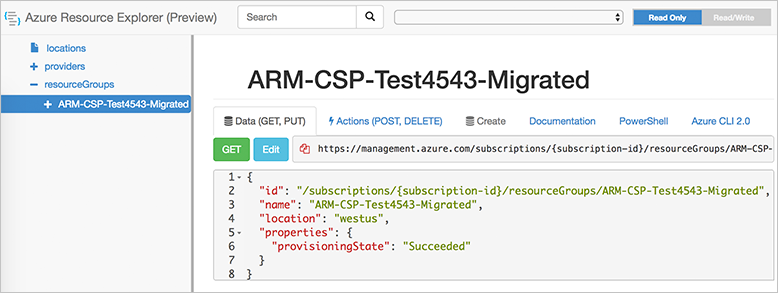
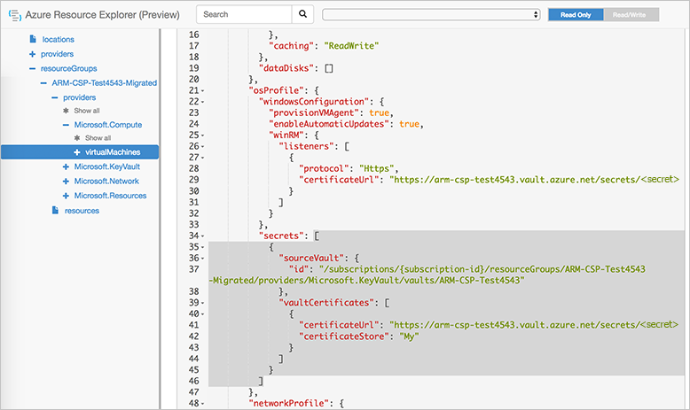
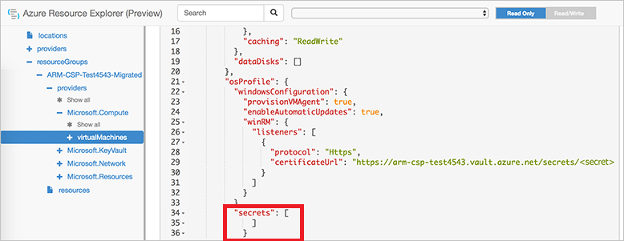

# Upgrade from classic to Resource Manager to move an existing subscription to Azure CSP

If you have resources that you created by using the Azure classic deployment model, but which you've assessed as eligible to move to Azure Cloud Solution Provider (Azure CSP), you need to transfer your resources to Azure Resource Manager before you can migrate them to Azure CSP. You can use the following process to migrate existing resources without any downtime.

Migrate Azure classic deployment model resources to Resource Manager within the same source subscription by using subscription administrator permissions. In the classic deployment model, the process requires service administrator or co-administrator permissions.

The migration process involves three major steps:

1. **Move VMs**. You can do this by using PowerShell or the Azure command-line interface (Azure CLI).
2. **Move dependencies that are in the same resource group**. You also do this by using PowerShell.
3. **Remove the "secrets" dependency**. After the VMs are in Resource Manager, you must remove a secrets dependency that is part of Windows Remote Management (WinRM).

The migration process creates three resource groups:

- **One for each cloud service**. Name the resource group *[cloud service]-migrated*. This resource group contains all the VMs in that cloud service.
- **One for the virtual network**. Name the resource group *[virtual network]-migrated*.
- **One for storage accounts**. Name the resource group *[storage account]-migrated*.

When you've finished this migration process, you can move resources between resource groups. You can configure names and permissions without any downtime in service.

## Move VMs

For detailed information about moving your VMs by using PowerShell, see [Migrate resources from classic to Azure Resource Manager by using Azure PowerShell](https://docs.microsoft.com/azure/virtual-machines/windows/migration-classic-resource-manager-ps).

For detailed information about moving your VMs by using Azure CLI, see [Migrate resources from classic to Azure Resource Manager by using Azure CLI](https://docs.microsoft.com/azure/virtual-machines/linux/migration-classic-resource-manager-cli).

## Move dependencies

For detailed information about moving dependencies within a resource group by using PowerShell or Azure CLI, see [Move resources to a new resource group or subscription](https://docs.microsoft.com/azure/azure-resource-manager/resource-group-move-resources).

## Remove the secrets dependency

VMs that you originally created by using the classic deployment model have a specific secrets dependency that you must remove before you can move the VMs to an Azure CSP subscription. You can remove these dependencies by using one of the following options:

- PowerShell
- Azure CLI
- Azure Resource Explorer

### PowerShell

```azurepowershell-interactive
$vm = Get-AzureRmVM -ResourceGroupName $rgName -Name $vmName
$vm.OSProfile.Secrets = New-Object -TypeName "System.Collections.Generic.List[Microsoft.Azure.Management.Compute.Models.VaultSecretGroup]"
Update-AzureRmVM -ResourceGroupName $rgName -VM $vm -Debug
```

### Azure CLI

```azurecli-interactive
az vm update -g rgname -n vmname --set osProfile.Secrets=[]
```

### Azure Resource Explorer

1. Go to [resources.azure.com](https://resources.azure.com), and then select **subscriptions** > **resourceGroups**. Find the name of the resource group where the objects were migrated.

    

2. For each VM, select the **Microsoft.Computer** resource, remove the secrets values (highlighted in the following screenshot), and then select the **PUT** button.

    

3. When the secrets dependency has been removed, the page looks similar to this:

    

4. Repeat this process for all migrated VMs.

## Next steps

- Do an [assessment](ea-open-direct-assessment.md) to identify the caveats for migrating your Azure subscription to Azure CSP.
- [Migrate](ea-open-direct-arm-to-csp.md) supported Resource Manager resources to Azure CSP.
