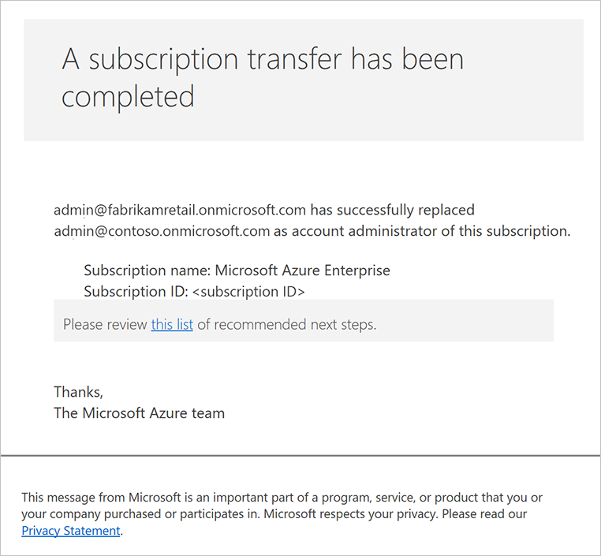

#  Migrate Azure subscription from partner EA to Azure CSP

If you are a Cloud Solution Provider and previously you've also signed an Enterprise Agreement to host workloads of your customers inside Azure subscriptions, you may would like to migrate Azure subscriptions from your EA to CSP.

[Azure Resource Move](ea-open-direct-arm-to-csp.md) requires source and target subscriptions to be inside the same Microsoft Online tenant (directory). If you use your own partner EA, most probably source Azure subscription exists inside your partner tenant. CSP requires to create Customer accounts, which also creates a tenant for customer. In general you will need to move source subscription from partner tenant to customer tenant in order to use Azure Resource Move.

## Move Azure subscription from partner tenant to customer tenant

1. Sign in to [Partner Center portal](http://partnercenter.microsoft.com) using CSP partner credentials.

2. Create a [new customer account](../../customer-management/create-new-customer.md) or [add an existing one](../../customer-management/add-existing-customer.md). In the following example, we use the *fabrikamretail.onmicrosoft.com* directory, which belongs to a fictional customer, Fabrikam.

3. Save admin user credentials of the customer's tenant, that are shown in clear text during the customer creation. As alternative, you can create a new user account inside customer tenant and assign Global Administrator privileges. We will use <em>admin@fabrikamretail.onmicrosoft.com</em> user in this example.

	

4. Create new Azure CSP subscription inside this customer account (if you haven't did it on step 2) and [assign Owner role](../../customer-management/assign-permissions-to-azure-csp-subscription.md) to the customer's tenant admin user.

5. Sign in to [Azure EA portal](https://ea.azure.com) using Enrollment Administrator credentials of partner's EA. In this example we will use partner *Contoso* with <em>admin@contoso.onmicrosoft.com</em> as Enrollment Administrator.

6. Go to **Manage** section and open **Enrollment** tab. Change **Auth Level** to **Work or School Account Cross Tenant** in order to add another tenants to this Azure EA enrollment.

	

7. Switch to **Account** tab and click **Add account**. In the appeared menu select *Work of School Account* for *Authentication Type*, provide a friendly name in *Account Name* field and provide the e-mail of customer tenant admin. 

	

8. If customer tenant admin user is mail-enabled (which is not required), you will receive a notification e-mail from Azure EA portal.

	

9. Sign in to [Azure EA portal](https://ea.azure.com) using customer tenant admin credentials (<em>admin@fabrikamretail.onmicrosoft.com</em> in this case) and click **Continue** to associate customer's tenant with partner's Azure EA enrollment.

	

10. Sign in again to [Azure EA portal](https://ea.azure.com) using Enrollment Administrator credentials of partner's EA (<em>admin@fabrikamretail.onmicrosoft.com</em> in this case). Go to **Manage** section and open **Account** tab. Now you should see customer account in the account list as "Active". Select partner account and click **Transfer Subscription**.

	

11. Select the source subscription you would like to transfer from partner's tenant to customer's tenant.

	

12. Select the customer account as target account.

	

13. Review the information on the page and click **Submit**.

	

14. The process will take few minutes. If target account is mail-enabled, you will receive a notification when subscription migration from partner's tenant to customer's tenant will be completed.

	

15. Sign in to [Azure Management portal](https://portal.azure.com) using customer's admin user credentials and you should see both subscriptions - EA and CSP - in the Subscription list.

	

Now you can proceed to next steps and migrate Azure resources from Azure EA subscription to Azure CSP subscription withing the same customer tenant.

## Next steps

- [Assess the migration](ea-open-direct-assessment.md) to understand the issues that you identify during the process.
- [Convert](ea-open-direct-asm-to-arm.md) resources from the Azure classic deployment model to Resource Manager.
- [Migrate](ea-open-direct-arm-to-csp.md) supported Resource Manager resources to Azure CSP.
