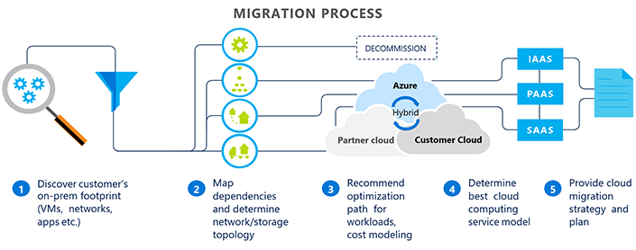

# Migrate on-premises workloads to Azure CSP

Many customers want to migrate their existing workloads to the cloud. You, as an Azure Cloud Solution Provider (Azure CSP) partner, can help them migrate to Azure.

Be aware that some customers have never used cloud services before. All of their workloads are on-premises, or handled by physical servers they own. Transferring these workloads to Azure CSP can sometimes be challenging, but this guide will help you through the process.

Note that there is no easy "switch" for this process. Make sure that you and the customer are both aware that migration takes time. Do not leave your customer to do this alone. In the Azure CSP model, you are responsible for customer support.

## Migration process overview

After your customer is ready to make the change to Azure, there are really only three major steps left.

> [!TIP]
> If your customer is not convinced yet, and doesn't understand the benefits of moving to Azure in CSP, see the [Why migrate from on-premises to Azure CSP](https://azurecsp.blob.core.windows.net/files/why-migrate-from-onpremise-to-azure-csp.pptx) deck.

**Discovery**: Work together with your customer to determine exactly what needs to be migrated. Because some of your customers might have complicated processes running on their on-premises servers, it's important to make sure you don't miss a vital component when carrying everything over in the migration.

**Assessment**: After you know what needs to be migrated, you must evaluate the processes and workloads, and determine how to migrate it to Azure CSP. This includes moving over a few small workloads to test how they work in Azure, and identifying any issues that might arise. In many cases, this is a straight-forward transfer, but sometimes the customer's existing system involves something that Azure CSP cannot do. It's good to know what these blockers are ahead of time, so you can account for them during the migration process.

**Migrate**: If any blockers appeared during the assessment step, you need to work together with the customer to restructure the architecture of their system. Your goal is to circumvent the blocking issues, producing the same results. After that is done, you can begin the process of transferring remaining workloads to Azure CSP.

## Migration guides

For much greater detail about the process of migration, consult the following guides. 

Note that whereas these guides are provided to help in the process, Microsoft offers no warranty, expressed or implied, in these guides.

### Discovery 

These resources are helpful when you're first engaging the customer and planning out the migration process:

- [Architectural design and considerations guide](on-premises-to-azure-csp/architectural-design-considerations-guide.md)
- [Crossing the chasm, part 1: Migrating the first workloads](on-premises-to-azure-csp/migrate-first-workload-to-azure-csp.md)

### Assessment

After you have completed basic discovery, use these resources to help determine the best method for migrating, and to identify any issues that might arise:

- [Architectural design and considerations guide – advanced networking scenarios](on-premises-to-azure-csp/advanced-design-considerations-guide.md)
- [Crossing the chasm, part 2: Migrating additional workloads](on-premises-to-azure-csp/migrate-additional-workloads-to-azure-csp.md)

### Migration 

Use these guides when it is time to migrate the complete workload. They walk you through the use of the Azure Site Recovery tool.

- [Azure Site Recovery capacity planning guide](on-premises-to-azure-csp/asr-capacity-planning.md)
- [Azure Site Recovery setup and configuration guide](on-premises-to-azure-csp/asr-setup-guide.md)

### Additional Azure Site Recovery resources

These Azure websites might also be useful during the migration process:

- [Azure Site Recovery overview: What is site recovery?](https://azure.microsoft.com/documentation/articles/site-recovery-overview/)
- [Azure Site Recovery in multi-tenant mode](https://docs.microsoft.com/azure/site-recovery/site-recovery-multi-tenant-support-vmware-using-csp)
- [Migrate on-premises virtualized workloads to Azure using Azure Site Recovery](https://docs.microsoft.com/azure/site-recovery/site-recovery-migrate-to-azure)

These slide decks offer a simple look at the Azure CSP migration process and Azure Site Recovery:

- [Why migrate from on-premises to Azure CSP](https://azurecsp.blob.core.windows.net/files/why-migrate-from-onpremise-to-azure-csp.pptx)
- [Azure Site Recovery training](https://azurecsp.blob.core.windows.net/files/asr-for-azure-csp-migrations.pptx)

## Next steps

- [Review](../overview/azure-csp-overview.md) the Azure CSP model overview.
- [Learn more](migration-to-azure-csp.md) about migration scenarios from other channels to Azure CSP.
- [Learn more](https://blogs.technet.microsoft.com/hybridcloudbp/2018/08/08/moving-windows-server-and-sql-server-licenses-from-spla-to-csp/) how to convert Windows Server and SQL Server licenses from SPLA to CSP during the migration.
