# Azure Site Recovery capacity-planning guide for migrations

This guide covers how to complete Azure Site Recovery capacity planning for migrations to Azure Cloud Solution Provider (Azure CSP). Capacity planning is an important step that must be completed before migration can occur.

## Prerequisites

Before you begin Azure Site Recovery capacity planning, ensure that the following tasks are complete:

* **Discovery** of source (on-premises) infrastructure details.
* **Planning, assessment, and cloud suitability** steps for all on-premises applications. Also, select the applications that are best suited for migration to Azure.
* **Azure Network Mapping** setup, to support the workload or application migration.

To get the *daily data change rate (%)* for Hyper-V VMs, your setup must meet the following requirements on the Hyper-V hosts:
  - Operating system: Windows Server 2012/2012 R2 with Hyper-V enabled
  - Memory: 20 MB in addition to total guest VM requirements
  - CPU: 5 percent overhead (minimum)
  - Disk space: 5-MB overhead (minimum)
  
## Azure Site Recovery Capacity Planner tool

You should already have a source inventory report from the Discovery phase, which you generated by using either the Microsoft Assessment and Planning Toolkit or a third-party or custom solution. This report contains details of all the servers and VMs that are running workloads that you can now put into the Azure Site Recovery Capacity Planner tool.

>[!NOTE]
>Ensure that, at minimum, you have supplied the following information for each server, VM, or application to be migrated. The information is required for accurate data computation:
>- **Processor cores**: The total number of cores on the source server or VM.
>- **Memory allocation (MB)**: The RAM that's available to the source server or VM.
>- **Number of NICs**: The number of active network adapters on a source server or VM.  
>- **Total storage (GB)**: The total size of the storage. For example, if the source server has three disks with 500 GB each, the total storage is 1,500 GB.  
>- **Number of disks attached**: The total number of disks (not volumes) that are attached to a source server.  
>- **Disk capacity utilization (%)**: The average disk capacity that's being utilized. If the source disk is 1 TB and 500 GB is being used, the utilization is 50%.  
>- **Daily change rate (%)**: The daily data change rate (%) from the source server.

The Azure Site Recovery Capacity Planner is a macro-enabled Excel workbook. You can run it in either of two modes:

- **Detailed Planner**: Provides detailed information for each server in the source environment to get the final assessment. We recommend this mode for medium to large enterprise migration projects.
- **Quick Planner**: Provides basic information about the source environment, based on input average. We recommend this mode for small enterprise migration projects.

### Detailed Planner

1. Download the [Azure Site Recovery Capacity Planner](https://gallery.technet.microsoft.com/Azure-Recovery-Capacity-d01dc40e), and then open the **Site Recovery Capacity Planner.XLSM** worksheet.
2. To work with the file, select **Enable Editing**, and then select **Enable Content**. (You must have the current version of Office or Excel installed.)
3. On the **Getting Started** worksheet, in the **Select a planner type** list, select **Detailed Planner**.

    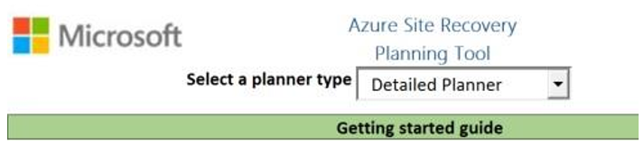

4. You are directed to the **Workload Qualification** worksheet where, under **Summary**, you can select the appropriate environment. This selection changes the remaining properties slightly.

   >|Property|Description|Azure datacenter/physical to Azure|Hyper-V to Azure|
   >|---|---|---|---|
   >|Compression|Generally refers to WAN compression.|30% is the default for Azure datacenter, and 0 is the default for physical servers. If you're using third-party WAN compression tools, specify the appropriate values.|Use 0 for no compression or use the respective values, based on the WAN compression solution that your enterprise uses.|
   >|Retention in days|The number of days for which you want to save the application recovery points in Azure after migration has begun.|3|N/A|
   >|Number of recovery points|The number of recovery points to be saved in Azure for your application when it is replicating.|N/A|16 (default, can be changed)|
   >|Number of hours in which initial replication for the batch of virtual machines should be completed| | 16 (default, can be changed)|16 (default, can be changed)|
   >|Number of virtual machines per initial replication batch| |3 (default, can be changed)|3 (default, can be changed)|
   >|Example|A preview of the chart.|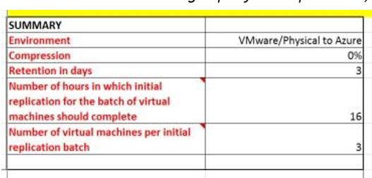|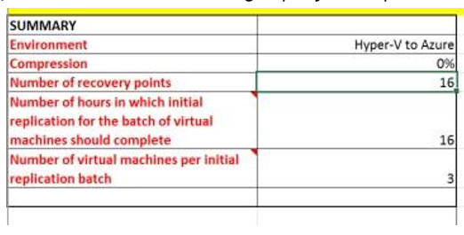|

5. Using the details from the source inventory (discovery) report, for each server, do the following:

    a. Fill out the mandatory columns (in red), through **Disk capacity utilization (%)**.

    b. Leave the **Daily data change rate (%)** column empty for now.

    c. Either leave or delete the default values in the **Mapping Azure VM Size** column. These values will be computed later.

    d. Fill out the additional columns (in gray), from **Operating System & Version** through **EFI Boot?**, and replace any default values if they are already present.
    
    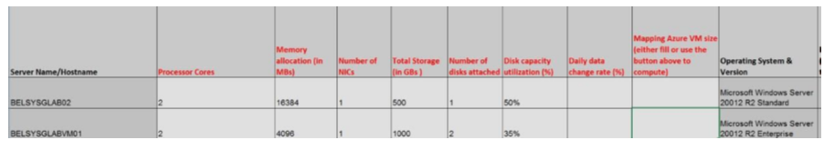

6. Calculate the daily data change rate for servers or VMs, based on their type. For more information, see [Daily data change rate & calculation](#calculate-the-daily-data-change-rate). Fill out the form for all corresponding servers.

7. After you've entered all server details, select **Computer IaaS VMs**. The macro runs and populates some columns:
    - **Mapping Azure VM**: Provides the corresponding virtual-machine SKU sizes in Azure.
    - **Is VM Qualified?**: Provides an update if the server or VM can be migrated to Azure.
    - To reveal the Azure Storage Account details, such as Standard or Premium, scroll to the right.
 
8. Select **Submit Data to Planner Tool**.  
    After you've submitted the data, a new worksheet called **Capacity Planner** is generated. It contains the assessment summary. To better understand the computed values, see [Understanding the Azure Site Recovery Capacity Planning Report](#azure-site-recovery-capacity-planning-report). 

### Quick Planner

1. Download the [Azure Site Recovery Capacity Planner](https://gallery.technet.microsoft.com/Azure-Recovery-Capacity-d01dc40e), and then open the **Site Recovery Capacity Planner.XLSM** worksheet.

2. To work with the file, select **Enable Editing**, and then select **Enable Content**. (You must have the current version of Office or Excel installed.)

3. On the **Getting Started** worksheet, in the **Select a planner type** list, select **Quick Planner**.

    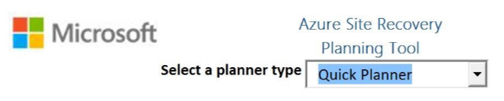

4. On the **Capacity Planner** worksheet, you are *required* to provide *average values* about your source environment. The properties are as follows:

|Property|Description|
|---|---|
|**Select your scenario**|Choose either **Hyper-V to Azure** or **Azure datacenter/physical to Azure**.|
|**Total number of virtual machines**|The number of servers (physical or VM) in the source environment.|
|**Average number of VHDs per virtual machine**|The average number of physical disks attached to each server (physical or VM).|
|**Average size of VHD (in GBs)**|The average size or total capacity of each physical disk.|
|**Average utilization per disk (%)**|Refer to **Daily data change rate & calculation** to collect this data and enter that data here.|
|**Compression**| Compression is offered with replication Azure datacenter VMs. The values here are typical but can be changed based on your Enterprise guidelines: <ul><li>**Physical only**: 0 </li><li>**Azure datacenter**: 30%</li><li>**Hyper-V**: 0</li></ul>|
|**Retention Inputs**|Specifies how long replicas should be retained. For Azure datacenter or physical servers, the input value is expressed as days. For Hyper-V, the input value is expressed as hours.|
|**Number of hours in which initial replication for the batch of virtual machines should complete** and **Number of virtual machines per initial replication batch**|Enter data, expressed as hours, that you expect the Site Recovery infrastructure to replicate the entire initial data set to Azure.|

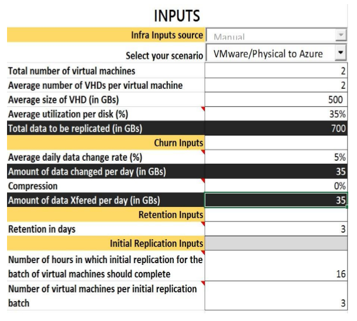

## Azure Site Recovery Capacity Planning report

Regardless of which planner type you use, the final assessment report consists of two sections:

- **Inputs**: Summarizes data of the source infrastructure, based on the details provided.

    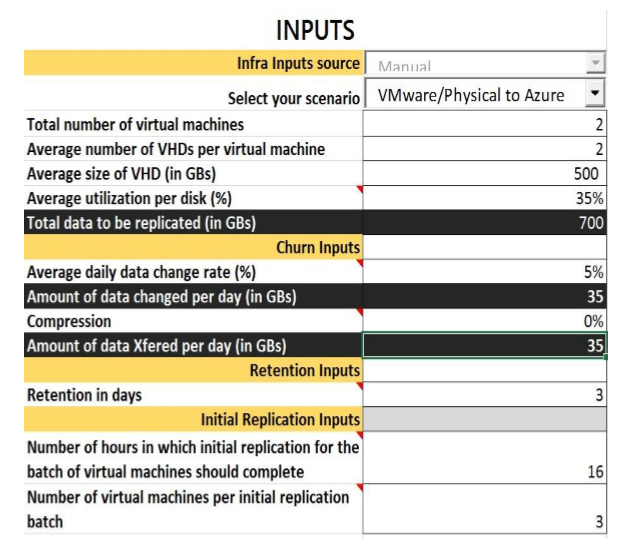

- **Output**: Displays the network bandwidth requirements, Azure storage account components, and Azure Site Recovery infrastructure components that are *required* to support migrations to Azure.

    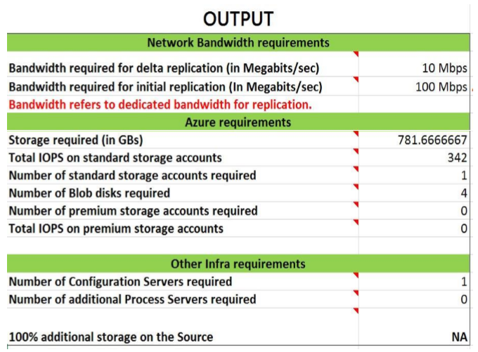

|Output field|Description|
|---|---|
|**Bandwidth required for delta replication (in Megabits/sec)**|Calculated based on average daily data change rate.|
|**Bandwidth required for initial replication (in Megabits/sec)**|Calculated based on initial the replication values provided.|
|**Storage required (in GBs)**|Total Azure storage required.|
|**Total IOPS on standard storage accounts**|Calculated based on 8,000 input/output operations per second (IOPS) unit size for the total standard storage accounts. This number is calculated from the total number of VMs that are mapped to standard Azure VMs, and the data change rate for those VMs.|
|**Number of standard storage accounts**|The total number of standard storage accounts needed to protect the VMs. A standard account holds up to 20,000 IOPS across all VMs, and a maximum of 500 IOPS per disk.|
|**Number of Blob disks required**|The number of disks that are created on Azure storage.|
|**Number of premium storage accounts required**|The total number of premium storage accounts needed to protect the VMs. A premium storage account can store up to 80,000 IOPS.|
|**Total IOPS on premium storage**|Calculated based on 256,000 IOPS unit size for the  total premium storage accounts. This number is calculated from the total number of VMs that are mapped to premium Azure VMs (DS and GS series), and the data change rate on those VMs.|
|**Number of configuration servers required**|The number of configuration servers that are required for deployment.|
|**Number of additional process servers required**|Shows whether additional process servers are required, in addition to the process server that's running on the configuration server by default.|
|**100% additional storage on the source**|Shows whether additional storage is required in the source location.|

Based on the report, you must meet the following requirements. You might need to set up new resources in Azure:

- The source + ISP network bandwidth must be capable of handling 100 Mbps or greater.
- Create Azure resource groups to bind migration-related Azure resources into manageable containers.
- Create one *standard* storage account in Azure.
- Set up one configuration server.
- *If necessary*, set up premium storage accounts.
- *If necessary*, set up additional process servers.


## Network setup

### Create Azure resource groups

1. Sign in to the Azure portal, select **New** > **Resource Groups**, and then select **Add**.
2. Type a meaningful name that's based on the convention determined in the planning phase. 
3. Select the correct subscription and region details, and then select **Save**.
4. Repeat steps 1, 2, and 3 as needed if additional resource groups are required.

### Create Azure storage accounts

1. Sign in to the Azure portal, and then select **New** > **Storage** > **Storage Account**.
2. Type an appropriate name for the storage account, and then set the following options:
   - **Deployment model**: *Resource Manager*
   - **Account kind**: *General Purpose*
   - **Performance**: *Standard* or *Premium*, based on capacity-planning results
   - **Replication**: *Geo-redundant storage (GRS)*
   - **Storage service encryption**: *Disabled*
   - **Resource group**: The resource group name that you created previously.
   - **Location**: The region where the resource group is located.

     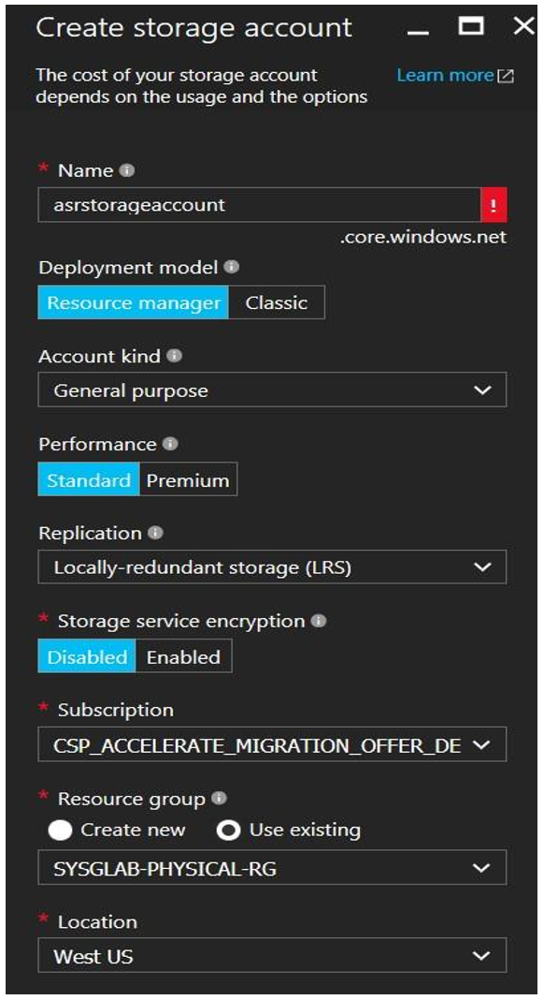


### Set up configuration servers on-premises

Depending on the number of servers or VMs that you're migrating to Azure, use the following table to set up Windows servers to run configuration server components in the source environment. They must be Windows Server hosts for migrating to Azure.

|CPU|Memory|Cache disk size|Data change rate| Number of servers to migrate to Azure|
|---|---|---|---|---|
|**8 vCPUs (2 sockets * 4 cores @ 2.5 GHz)**|16 GB|300 GB|500 GB or less|Fewer than 100|
|**12 vCPUs (2 sockets * 6 cores @ 2.5 GHz)**|18 GB|600 GB|500 GB to 1 TB|100 to 150|
|**16 vCPUs (2 sockets * 8 Cores @ 2.5 GHz)**|32 GB|1 TB|1 TB to 2 TB|150 to 200|
|**Deploy another process server**| | |\>2 TB|Deploy additional process servers if you're migrating more than 200 machines, or if the daily data change rate exceeds 2 TB.|

>[!NOTE]
>
>- The server should have a static IP address.
>- The server should not be a domain controller.
>- The host name of the server should contain 15 or fewer characters.
>- The operating system should be in English only.
>- The configuration server needs Internet access. Outbound access is required as follows:
>     - Temporary access on HTTP 80 during setup of the Site Recovery components (to download MySQL).
>     - Ongoing outbound access to HTTPS 443 for replication management.
>     - Ongoing outbound access on HTPPS 9443 for replication traffic (this port can be modified). 
>     - Access to the following URLs to connect to Azure:
>        - *.hypervrecoverymanager.windowsazure.com
>        - *.accesscontrol.windows.net 
>        - *.backup.windowsazure.com
>        - *.blob.core.windows.net 
>        - *.store.core.windows.net  
>- If you have IP address-based firewall rules on the server, check to ensure that the rules allow communication to Azure. The rules must allow the Azure datacenter IP ranges and the HTTPS (443) protocol.


### Set up source process servers

Depending upon the number of servers or VMs that you're migrating to Azure, set up Windows servers to run additional process servers in the source environment by using the following table:

|Configuration server|Additional process server|Cache disk size|Data change rate|Number of servers to migrate to Azure|
|---|---|---|---|---|
|8 vCPUs (2 sockets * 4 cores @ 2.5 GHz), 16 GB of memory| 4 vCPUs (2 sockets * 2 cores @ 2.5 GHz), 8 GB of memory|300 GB|250 GB or less|Fewer than 85|
|8 vCPUs (2 sockets * 4 cores @ 2.5 GHz), 16 GB of memory|8 vCPUs (2 sockets * 4 cores @ 2.5 GHz), 12 GB of memory|600 GB|250 GB to 1 TB|85 to 150|
|12 vCPUs (2 sockets * 6 cores @ 2.5 GHz), 18 GB of memory|12 vCPUs (2 sockets * 6 cores @ 2.5 GHz), 24 GB of memory|1 TB| 1 TB to 2 TB|150 to 225|

>[!NOTE]
>
>- The server should have a static IP address.
>- The server should not be a domain controller.
>- The host name of the server should contain 15 or fewer characters.
>- The operating system should be in English only.
>- The configuration server needs Internet access. Outbound access is required as follows:
>     - Temporary access on HTTP 80 during setup of the Site Recovery components (to download MySQL).
>     - Ongoing outbound access to HTTPS 443 for replication management.
>     - Ongoing outbound access on HTPPS 9443 for replication traffic (this port can be modified). 
>     - Access to the following URLs to connect to Azure:
>        - *.hypervrecoverymanager.windowsazure.com
>        - *.accesscontrol.windows.net 
>        - *.backup.windowsazure.com
>        - *.blob.core.windows.net 
>        - *.store.core.windows.net  
>- If you have IP address-based firewall rules on the server, check to ensure that the rules allow communication to Azure. They need to allow the Azure datacenter IP ranges and the HTTPS (443) protocol.

If it is required, set up additional process servers based on the capacity-planning recommendations. Also consider the following suggestions:

Depending on the number of servers or VMs that you need to migrate to Azure or for daily data change rates greater than 2 TB, you can either scale up your existing process server or scale out your process servers by adding more. 

The way you scale your servers depends on your preference for a scale-up or scale-out model. You scale up by deploying fewer higher-end configuration and process servers, or scale out by deploying more servers with fewer resources. For example, if you need to protect or migrate 220 machines, you can do either of the following: 

- Set up the configuration server with 12vCPUs and 18 GB of memory, set up an additional process server with 12vCPUs and 24 GB of memory, and configure protected machines to use the additional process server only. 
- Configure two configuration servers (2 x 8vCPU, 16 GB of RAM), set up two additional process servers (1 x 8vCPU and 1 x 4vCPU to handle 135 + 85 [220] machines), and configure protected machines to use the additional process servers only.

## Calculate the daily data change rate

### Physical servers

Unfortunately, there is currently no guidance for calculating the daily data change rate for physical servers. However, there are many third- party solutions to complete this step for your source (physical) servers. Azure architects must work with system administrators and other stakeholders to estimate the rates from surveys and discussions.   

### Hyper-V

> [!NOTE]
> The daily data change rate cannot be calculated for VMs if they:
> 
> - Have already been enabled for replication.
> - Are not *running*.
> - Are running on a remote standalone server with their virtual disks residing in SMB shares. The error you encounter is related to constrained delegation. For more information, see [Using SMB shares with Hyper-V Replica](https://blogs.technet.microsoft.com/virtualization/2013/06/14/using-smb-shares-with-hyper-v-replica/).

1. Go to the [Hyper-V Capacity Planning tool](https://www.microsoft.com/download/details.aspx?id=39057), select **Download**, select **HVRCapacityPlanner.Exe**, and then save the file to a known location, such as [C:\Temp] for each Hyper-V host from which VMs will be migrated to Azure.
2. On the Hyper-V host, run **HVRCapacityPlanner.exe**, select **Yes**, accept the license terms, and then select **Next**.
3. Leave the **Duration for metric collection** default setting at **1440 minutes**, because you need to calculate the rate daily and over an entire day. 
    >[!NOTE]
    >We highly recommend that you run the tool during production hours, a practice that ensures that you're collecting the most representative data.

    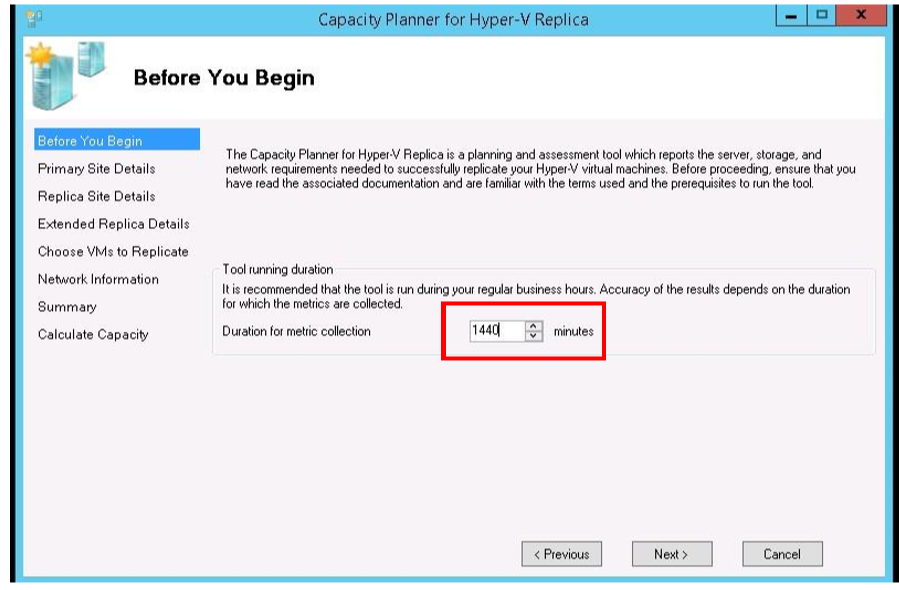

4. On the **Primary Site Details** page, enter the **FQDN** or **NetBIOS** names of the Hyper-V hosts that you want to collect data from, and then select **Add**.

    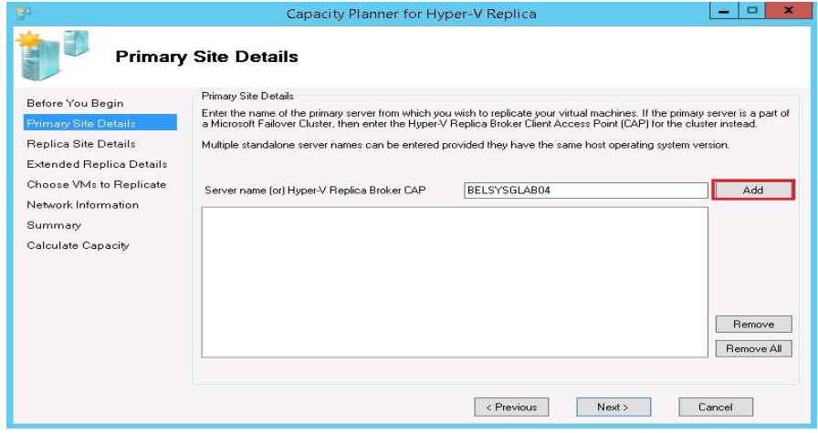

5. On the **Replica Site Details** page, select the **Skip tests involving replica site** check box, because the migration is to Azure and not to another onsite replica. 

    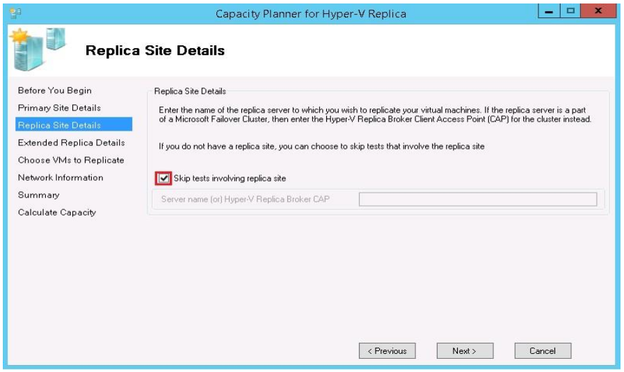

6. Select **Next**, and then select **Next** again.

7. When you get a warning that only VMs that are *not* enabled for replication are displayed, select **OK**.

8. Choose the VMs to collect data for, and then select **Next**.

   > [!NOTE]
   > 
   > - If you plan to exclude a virtual disk, clear the check box next to the VM name so that the capacity-planning guidance is reported correctly.
   > - If you plan to exclude a full VM, make sure the VM and all its virtual disks are unchecked.

    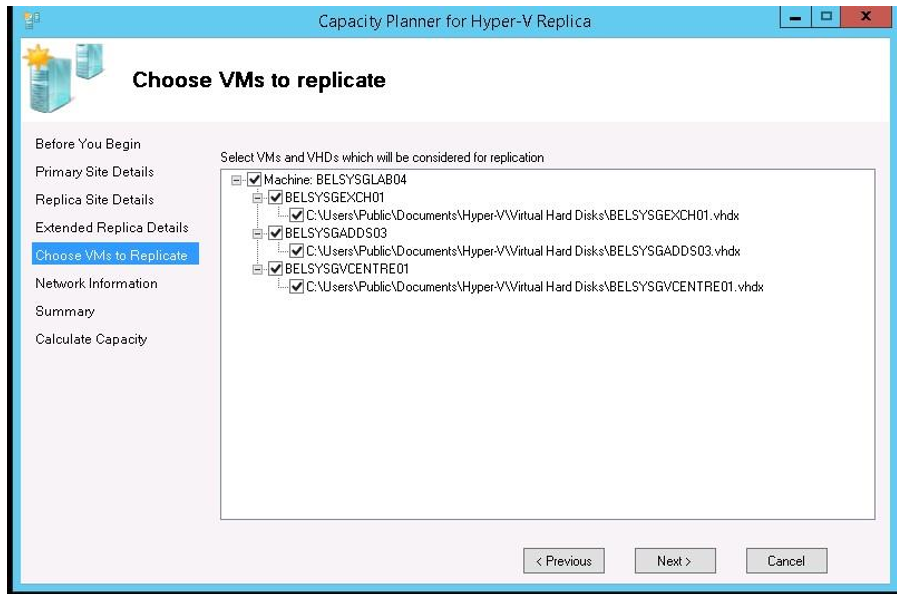

9. On the **Network Information** page, select **Next**.
10. Review the **Summary** to ensure that the correct properties are selected, and then select **Next**.

11. The tool now captures the metrics in the background for the time selected (30 minutes). After the report is completed, select **View report**.

12. On the generated report, compute the daily data change rate as follows:

    a. In the **Additional Storage during delta replication (GB)** column, note the value. 

    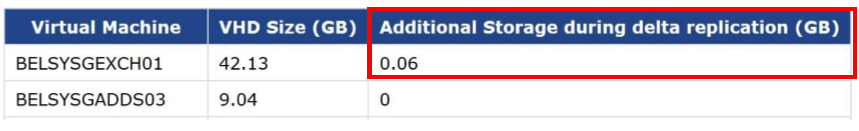

    b. Open the **ASR Capacity Planning report**, select the same server, and then note the value in the **Total Storage (in GBs)** column.
	
    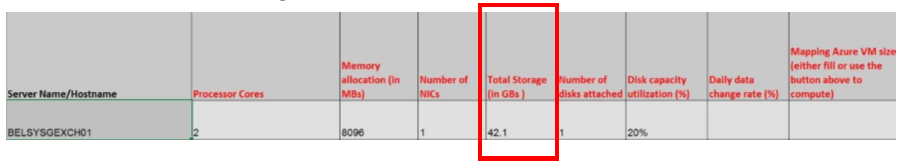

    c. Calculate the daily data change rate as **[additional storage during delta replication / total storage * 100 ]**. For example: [(0.06 / 42.1) \* 100 ] = 0.142%

    d. In the Azure Site Recovery Capacity Planning tool, in the **Daily data change rate (%)** column, enter the final value (for example, *0.142*), and then repeat these steps for any other VMs. 
    >[!NOTE]
    >Any values less than 1% are automatically converted to 0.

13. Repeat the previous steps for all Hyper-V VMs.

### Azure datacenter

1. On a server that has the vSphere client installed, go to the [vSphere capacity planning appliance](https://labs.vmware.com/flings/vSphere-replication-capacity-planning-appliance), download the tool to a known location, and then extract the files to a known folder.

    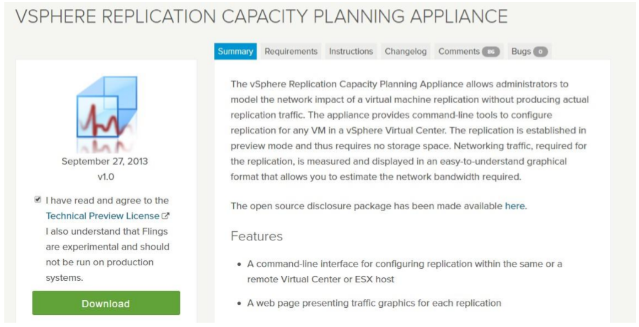

2. Connect to your **VCenter** server by using the **vSphere Client**.

3. Select **File** > **Deploy OVF Template**.

    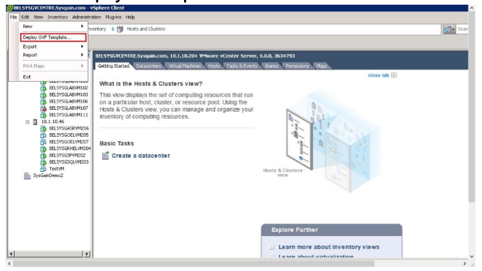

4. Select **Browse**, select **vSphere_Replication_Traffic_Modeler_OVF10.ovf** at the download location, select **Next**, and then select **Next** again.

    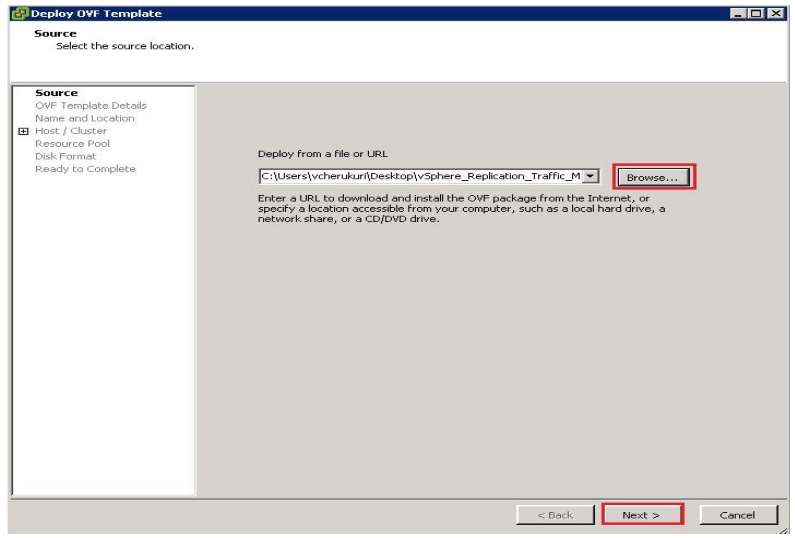

5. On the **Name and Location** page, enter a suitable name, select the datacenter and possibly the ESXi host where you want to run and monitor the VMs, and then select **Next**.

    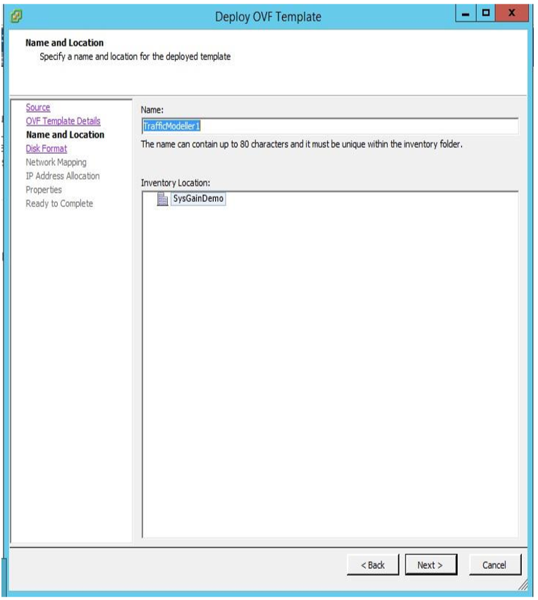

6. Choose a suitable datastore, and then select **Next**.

    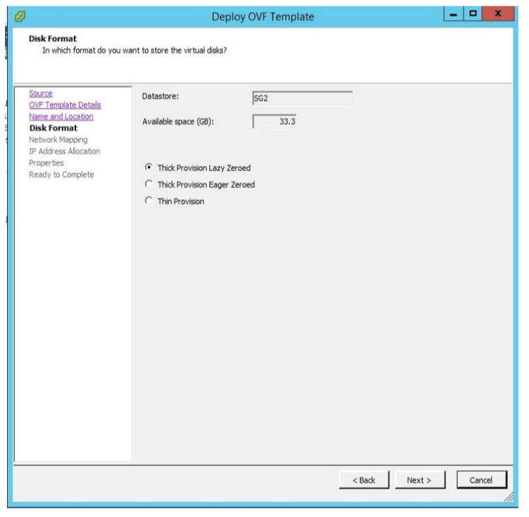

7. On the **Network Mapping** page, select a suitable network profile, and then select **Next**. 
8. Set **IP address allocation** to **StaticIP**, and then select **Next**.
9. On the **Ready to Complete** page, select the **Power on after deployment** check box, and then select **Finish**.

    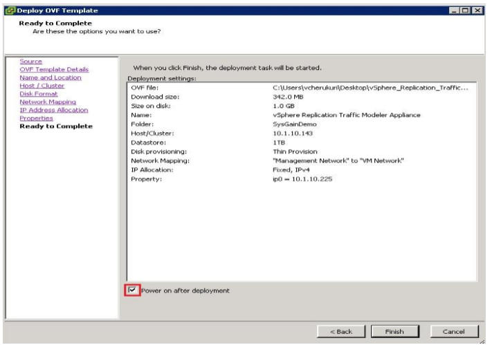

10. After the VM is deployed, connect to the appliance via SSH (using PuTTY or a similar tool), and sign in by using the default credentials:
	- **Username**: *root*
	- **Password**: *Azure datacenter*
11. After you are signed in, run the following commands:

    ```
    cd /opt/Azure datacenter/hbrtraffic/bin  
    ./configureReaplication –vc <vcenter server address> --vcuser <vcenter username> --vcpass  <vcenter password>  --lwd <IP_of_the_Appliance>  --vmname <VM_name>
    ```

    - \<vcenter server address>: The IP address of the vCenter server

    - \<vcenter username>: The vCenter username

    - \<vcenter password>: The vCenter password

    - \<IP_of_the_Appliance>: The IP address of the vSphere replication traffic-modeler appliance

    - \<VM_name>: The name of the VM that you want to monitor or collect data from

      >[!NOTE]
      >To enable monitoring of other VMs that are managed by this vCenter server, repeat the preceding command by changing \<VM_name>.

    For additional help with these commands, enter **./configureReplication –help**. 

12. After you have enabled capacity planning for the VMs, you can view their statistics by going to **https://\<*IP address of capacity planning appliance*>:5480/vr-graphs/**.

    >[!NOTE]
    > We recommend that you monitor during production hours for at least 24 hours to capture quality metrics. Please allow at least 15 to 20 minutes for initial data captures to begin.

13. The website displays a list of VMs. To open a report, select a VM name.

    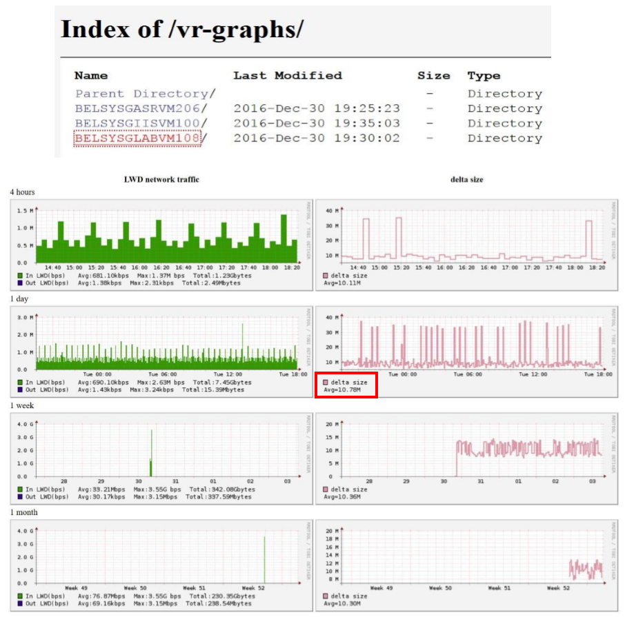

    The report has two columns: **LWD (Light Weight Delta) Network Traffic** and **Delta Size**.

    - **LWD In**: The network traffic that's generated by the VM replication data.
    - **LWD Out**: The network traffic that's generated by the replication appliance, mostly acknowledgments and status information/updates, as well as checksums.
    - **Delta Size**: The change rate of the VM size.

14. To compute the daily date change rate for a server, do the following:

    a. In the Azure datacenter server report, get the **Average delta size computer for 1**.

    b. If the average delta size is expressed as GB, use the value as is for the next step. However, if it is expressed as MB, you must first convert it to GB by dividing by 1,000. For example, 10.78 MB = [10.78/1000] = 0.0178 GB.

    c. Open the **ASR Capacity Planning report**, select the same server, and then note the value in the **Total Storage (in GBs)** column.

       

    d. Calculate the daily data change rate as *[Additional Storage during delta Replication / Total Storage (In GBs) \* 100]*.

    e. In the Azure Site Recovery Capacity Planning tool, in the **Daily data change rate (%)** column, enter the preceding value, and repeat the steps for any other VMs.

    >[!NOTE]
    >Any values less than 1% are automatically converted to 0. 

## Next steps

- Review [Azure Site Recovery setup and configuration guide](asr-setup-guide.md).
- Start [migrating your first workloads](migrate-first-workload-to-azure-csp.md).
