# Azure Site Recovery setup guide for migrations

This guide covers how to migrate all relevant data from the on-premises environment to Azure Cloud Solution Provider (Azure CSP) by using Azure Site Recovery. Specifically, it covers the setup and configuration of the configuration server, process server, and mobility services components of the on-premises environment. It also covers setting up the Site Recovery components in Azure to perform migrations.

## What is Azure Site Recovery?

Site Recovery is a cloud service that provides management and orchestration for disaster-recovery scenarios. When you've set up and configured Site Recovery properly, you can use it to migrate on-premises workloads (virtualized or bare metal environments) to Microsoft Azure. 

To learn more about Site Recovery before you begin the process, see the "Additional Azure Site Recovery resources" section of [Migrate on-premises workloads to Azure CSP](../migration-from-on-premises-to-azure-csp.md).

## Prerequisites

Before you begin Site Recovery setup, ensure that *all* of the following tasks are complete:

* **Discovery** of source (on-premises) infrastructure details, including the migration of the [first](migrate-first-workload-to-azure-csp.md) and [second](migrate-additional-workloads-to-azure-csp.md) test workloads.
* **Planning, assessment, and cloud suitability** steps for all on-premises applications. For architectural design tips, see the [Architectural Design and Considerations Guide – Advanced Networking Scenarios](advanced-design-considerations-guide.md) page.
* **Azure Network Mapping** setup, to support the migrated applications post-failover.
* [**Site Recovery capacity planning**](asr-capacity-planning.md).

You must also provide a Windows Server 2012 R2 server that you can use as the configuration or process server. We recommend high availability, but it is not required. The server must meet the following requirements:
- The server is domain joined and has a static IP.
- The operating system is English only.
- The server does *not* have the following services or roles installed:
    - Active Directory Domain Services
    - Internet Information Services
    - Hyper-V
- The server has vSphere PowerCLI 6.0 installed, if the infrastructure contains VMware VMs that also need to be migrated to Azure.
- The server has internet access (inbound and outbound), with the following additional requirements:
    - Outbound internet access on HTTP Port 80 for Site Recovery setup. You can turn off the access after setup is complete.
    - Outbound internet access on HTTPS port 443 for replication management. You cannot change the port.
    - Inbound internet access on HTTPS port 9443 for replicating traffic to Azure. If your IT team wants to implement it, the port can be a custom port. 
    - To communicate with Azure, the server must be able to access the following URLs:
        - *.hypervrecoverymanager.windowsazure.com
        - *.accesscontrol.windows.net
        - *.backup.windowsazure.com
        - *.blob.core.windows.net
        - *.store.core.windows.net 
        - https://cdn.mysql.com/archives/mysql-5.5/mysql-5.5.37win32.msi (not required for a scale-out process server)
        - time.nist.gov
        - time.windows.com

## VMware setup

If your on-premises environment contains a VMware infrastructure and your migration plan includes VMs that are hosted on this infrastructure, the environment must meet certain requirements before you can migrate the VMs to Azure by using Site Recovery. *If you are not migrating any VMware VMs, skip this section*.

* The VMware hosts should be running a supported version of ESXi with the latest updates installed.
* At least one vCenter server *must* be deployed to manage the VMware hosts with the latest updates.

### Prepare the VMware account for automatic VM discovery

The Site Recovery process server can automatically discover VMware VMs from a vCenter server that manages hosts. To perform automatic discovery, Site Recovery needs credentials that can access VMs on the vSphere servers. To create a dedicated account for automatic discovery of VMs at the vCenter level, do the following: 

1. Sign in to your vCenter server. 

2. Go to **Administration** > **Users and Groups**.

    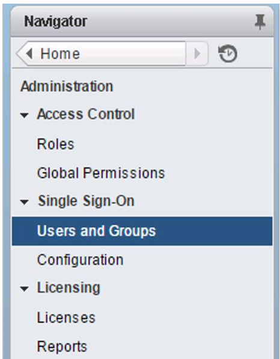

3. Create a user account according to your company policies.

    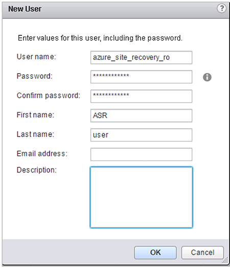

4. Using a vSphere client, connect to either the vCenter server or the VMware host, and then grant the new account access to the VMs.

    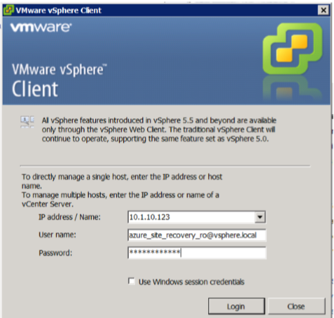

5. Select a VMware host, and then select the **Permissions** tab.

    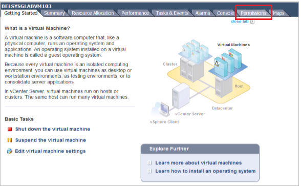

6. Right-click the name, and then select **Add Permission**.

    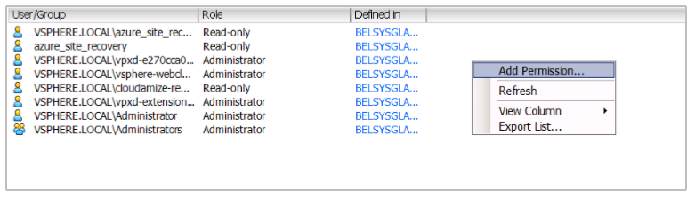

7. Select **Add** and then, in the **Domain** box, select the appropriate domain in the drop-down list.

    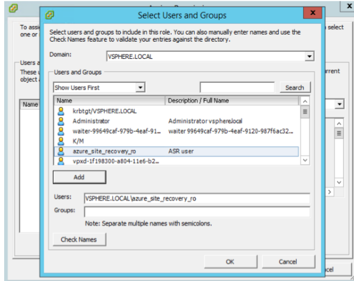

8. Select the user account that you created earlier, select **Add**, and then select **OK**.

9. Confirm that the information is correct, and then select **OK**.

## Azure Site Recovery architecture

Make sure that you have the following components to set up the on-premises Site Recovery infrastructure and its Azure counterparts.

- Configuration server and process server
- Mobility services agent
- Microsoft Azure

The following diagram shows a typical on-premises environment for preparing for Azure migration:

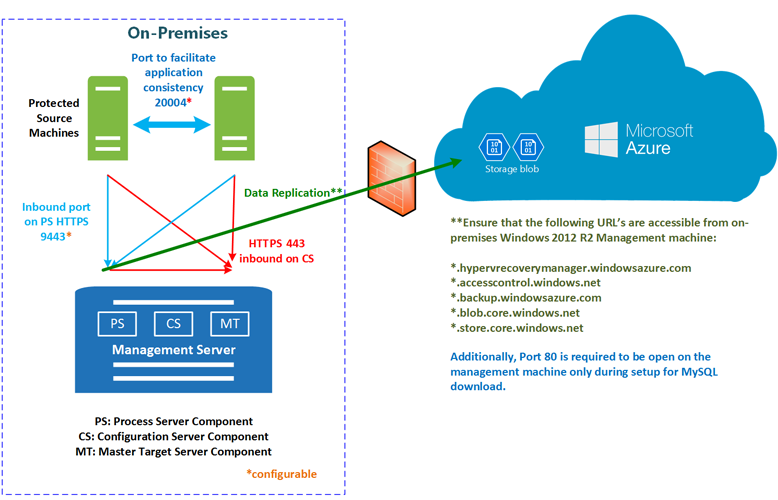

### Configuration server

This component is a pre-provisioned, on-premises Windows Server that manages communication, data replication, and recovery processes. Run Unified Setup on this machine to install the configuration server, which includes the process server component.

The process server acts as a replication gateway. It receives replication data from the protected source machines. It optimizes this data with caching, compression, and encryption, and then sends it to Azure Storage. It also handles push installation of the mobility service to protected machines. The default process server is installed on the configuration server. To scale your migrations, you can deploy additional standalone process servers. 

### Mobility services

This component is deployed as an agent on every server that's replicated to Azure. It captures data, writes it to the server, and then forwards it to the process server. You can deploy the agents to the on-premises servers in a variety of ways.

### Azure

In this section, you set up an Azure Recovery Services vault. Additionally, you set up Azure subscriptions, storage accounts, resource groups, and Azure virtual networks. These components should have been addressed during Site Recovery capacity planning.

## Azure Site Recovery vault setup

Site Recovery configuration contains two major steps, as illustrated in the following diagram:

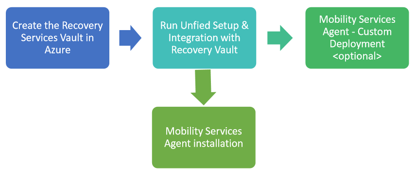

### Create a Recovery Services vault

First, create a Recovery Services vault in Azure that will host the Site Recovery components and the servers to be migrated to Azure.

1. From the configuration server, sign in to the Azure portal.

2. Select **New** > **Management** > **Backup and Site Recovery (OMS)**.

    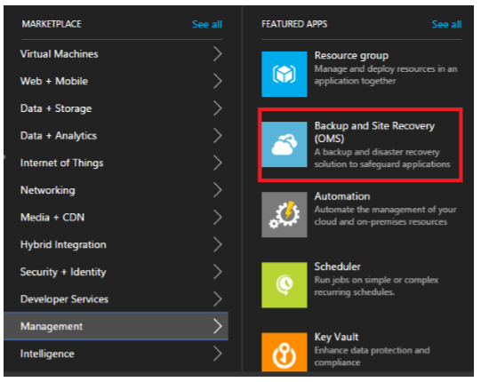

3. In the **Name** box, select a friendly name to identify the vault.

4. Select the correct Site Recovery subscription.

5. In the **Resource Group** box, select **Use existing**, and then select the resource group that you created for the migration efforts during [Site Recovery capacity planning on-site setup](asr-capacity-planning.md).

6. Select the same location as your other Site Recovery-related resources.

7. Select the **Pin to dashboard** check box, if you want, and then select **Create**.  
    The new vault appears on **Dashboard** > **All resources**, and on the main **Recovery Services Vaults** blade. 

### Run Unified Setup and integration with the Site Recovery vault

After you've set up the configuration server (on-premises) and created a Recovery Services vault, configure them correctly to ensure that they can protect (and migrate) the workloads. This phase also includes the installation of the mobility services agent to the servers that must be migrated.

To choose your protection goals and set up your source environment, do the following:

1. Under **All Resources**, search for or select the Site Recovery vault that you just created, and then select the blade.

2. Select **Site Recovery** > **Step 1: Prepare Infrastructure** > **Protection goal**.

3. On the **Protection goal** blade, select **to Azure**, select **Not virtualized / Other**, and then select **OK**.

    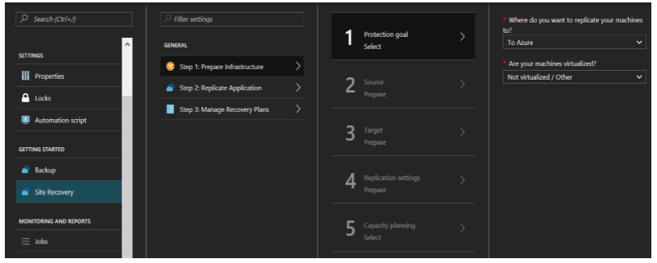

4. If you don't yet have a configuration server, select **Source**.
 
    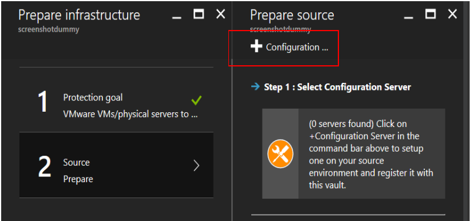 

5. On the **Prepare source** blade, select **Configuration**.

6. On the **Add Server** blade, ensure that the **Server type** box contains **Configuration Server**.

7. Download the **Microsoft Azure Site Recovery Unified Setup** installation file and the **vault registration key** to a known location on the configuration server. 

    >[!NOTE]
    > The vault registration key is valid for only five days after you generate it. You must either install the configuration server within five days or repeat steps 1-6 to download a new registration key file.

    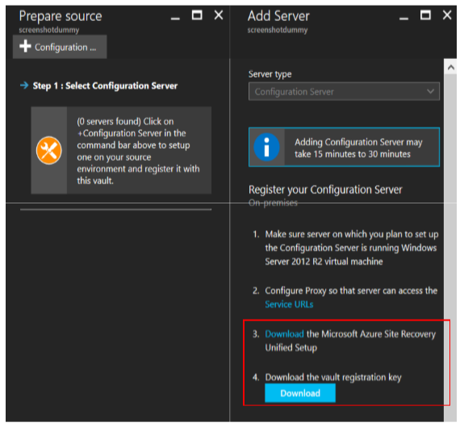

8. To run the Microsoft Azure Site Recovery Unified Setup installation file (MSI) as an administrator, right-click it, and then select **Run as administrator**.

9. On the **Before you Begin** tab, select **Install the configuration server and process server**, and then select **Next**.

10. On the **Third Party Software License** tab, select the **I accept the third party license agreement** check box to download and install MySQL, and then select **Next**.

    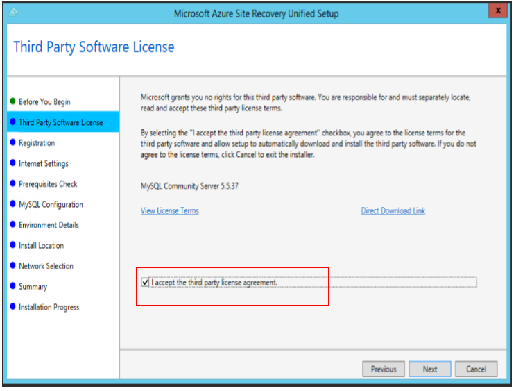

11. On the **Registration** tab, select **Browse**, select the registration key that you downloaded from the vault in step 6, and then select **Next**.

    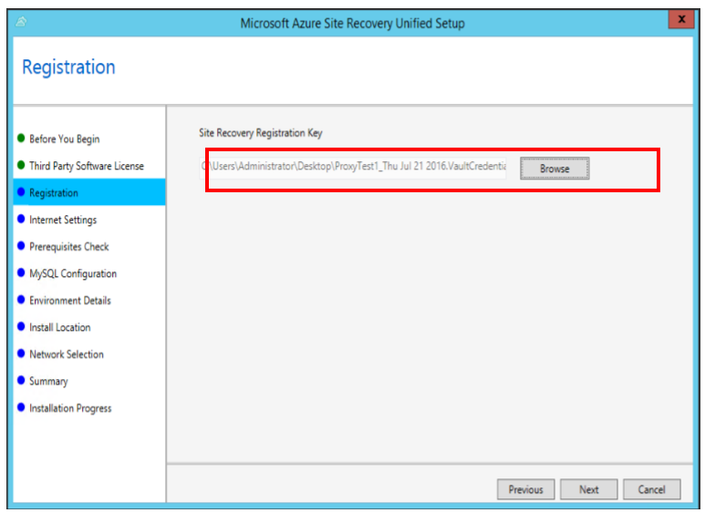

12. On the **Internet Settings** tab, select the internet connection method, and then select **Next**. 

    >[!NOTE]
    >In the example scenario, the connection is direct, without a proxy server. If you are using a proxy server, provide the required additional details. If you need assistance, contact your IT or networking team.

13. On the **Prerequisites Check** tab, setup runs a series of checks to make sure that installation can run without issues. After you've completed the setup successfully, select **Next**. 

    >[!IMPORTANT]
    >To avoid future issues, view and fix any warnings or errors. To view a message with more details about a warning or error, select the link under the message's status.

14. On the **MySQL Configuration** tab, provide credentials for the local instance of MySQL server that will be installed, and then select **Next**. 

    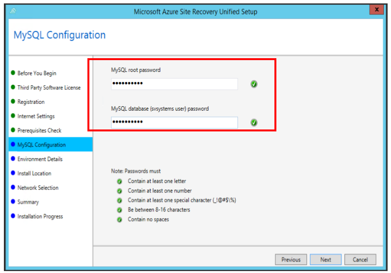

15. On the **Environment Details** tab, indicate whether you are migrating VMware VMs, and then select **Next**. Selecting **Yes** checks to ensure that vSphere PowerCLI 6.0 is installed.

16. On the **Install Location** tab, select where to install the binaries and store the cache. You can select any drive with at least 5 GB of storage, but we recommend that the cache drive have *at least 600 GB* of free space. Select **Next**.

17. On **Network Selection** tab, in the **Network Interface** box, select the correct network interface, and leave the port default setting at **9443**. You can change the default setting if you want, but it is not necessary or recommended. *Port 443 is prohibited.* Select **Next**.

    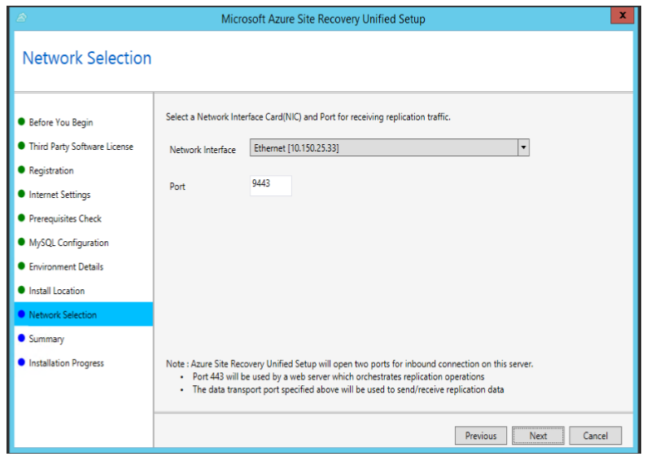

18. On the **Summary** tab, review the information, and then select **Install**.  
    When the installation is complete, a passphrase is generated. Save it to a file at a secure location for later use.
    The cspsconfigtool.exe file should open. If it doesn't, open it manually by using the desktop shortcut.

19. On the **Manage Accounts** tab, select **Add Account**, and then add the management accounts that the Site Recovery server will use to communicate with the migrating servers.

    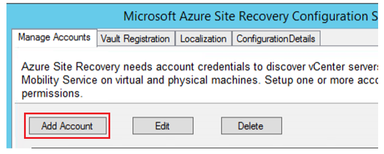

20. Add a domain account to the configuration server. This account should also be a Local Administrator on all migrating servers. 
    >[!NOTE]
    >This guide does not cover creating this domain account in Active Directory (or a similar identity management service). For assistance, contact your IT team.

21. Add the vCenter discovery account, a read-only account that you can use to automatically discover VMs that are managed by the vCenter server. *If you are not migrating VMware VMs, skip this step.*

22. Go to the Site Recovery vault, and then select **Your Recovery Vault** > **Site Recovery** > **Prepare infrastructure** > **Source**. The new configuration server is displayed. Select **OK**.

    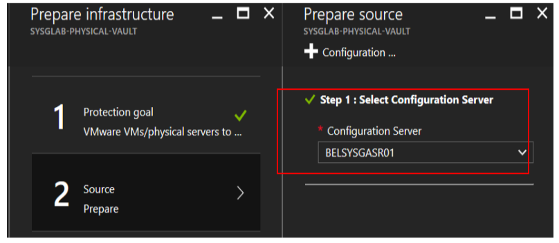

    >[!NOTE]
    >If the server is not listed, go to **Your Recovery Vault** > **Site Recovery Infrastructure** > **Configuration Servers (For VMware & Physical Machines)**, select the ellipsis (**...**), and then select **Refresh Server**.

23. In the **Target** pane, make sure that the correct **Subscription** is selected, and then select **Resource Manager** for the deployment model. Wait for Azure to confirm steps 2 and 3, and then select **OK**.

    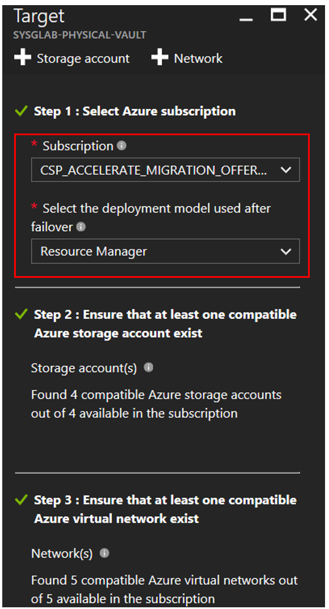

24. In the **Replication policy** pane, select the **Create and Associate Policy** button, and then do the following:

    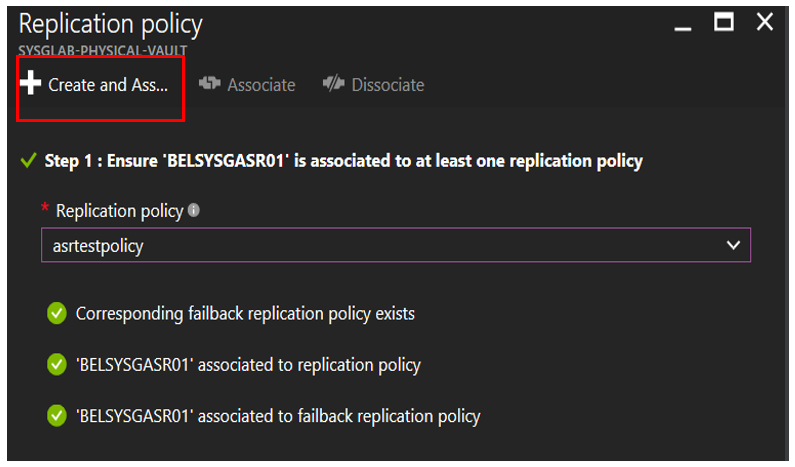

    a. Specify a suitable name.

    b. Leave the defaults for **RPO threshold** (15), **Recovery point retention** (24), and **App-consistent snapshot frequency** (60). For more information about each feature, right-click the small **i** icon.

    c. Every replication policy automatically creates a matching policy for failback. For example, if the policy is called **asrtestpolicy**, another policy will be created called **asrtestpolicy-failback**. This is default behavior, and the failback policy is of no use for migrations.

    d. Select **OK** to create the policy. It is automatically associated with the configuration server.

25. For **Capacity Planning**, select **Yes, I have completed**, select **OK**, and then select **OK** again.

### Add the vCenter server to the vault

>[!NOTE]
>If you are not migrating any VMware virtual machines, skip this section.

1. In the Azure portal, go to **Your Recovery Vault** > **Site Recovery Infrastructure** > **Configuration Servers (For VMware & Physical Machines)**, select the ellipsis (**...**) next to the configuration server, and then select **Add vCenter**.

2. Provide the following required information:
	- **vCenter / vSphere Host Friendly Name**: Any friendly name, according to company policy.
	- **vCenter / vSphere IPAddress**: The on-premises IP address of the vCenter server.
	- **Port**: Use 443 (the default port) unless you're using another port.
	- **vCenter / vSphere host account**: Select the vCenter discovery account on the Site Recovery server.

3. To add the VCenter server to your vault, select **OK**.

4. The **Notifications** tab (the bell icon at the top right) shows the progress of the task. After the task is completed, select the configuration server to open a new blade, which you can expand to display your vCenter server and its status.

## Deploying the mobility services agent

The mobility services agent gathers local server information and data, communicates with the configuration server, and assists in the overall data migration process. You can install the agent in a variety of ways:

### Automated push from the Azure portal

After you have decided to replicate an application and servers, the workload-specific migration documentation provides instructions for how the mobility services agent is automatically pushed by using the Site Recovery vault in Azure.

### Manual installation

To manually install the mobility services agent on either a Windows or Linux server, do the following:

**Windows**

1. On the configuration server, go to `%Install Path%\Microsoft Azure Site Recovery\home\svsystems\pushinstallsvc\repository\`, and then download the installer file **Microsoft-ASRUA_9<em>.0.0_Windows</em>release.exe** to the migrating servers.

2. On the server, run the installer as an administrator by right-clicking **File** and then selecting **Run as administrator**.

3. On the **Before You Begin** tab, select **Mobility service**, and then select **Next**.

4. On the **Configuration Server Details** tab, specify the IP address of the server and the passphrase that you generated during Unified Setup, and then select **Next**.
	>[!NOTE]
    >If you do not have the passphrase, see Retrieving the Unified Setup passphrase.

    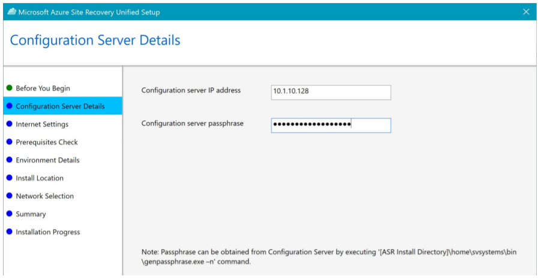

5. Leave the default **Install Location** settings, and then select **Next**.

6. Monitor the **Installation Progress** screen, and restart the machine if you are prompted to do so.  
    After you've installed the service, it can take about 15 minutes for the status to be updated in the portal.

7. Repeat steps 1-6 for any additional servers that you want to migrate to Azure.

**Linux**

1. On the configuration server, go to `%Install Path%\Microsoft Azure Site Recovery\home\svsystems\pushinstallsvc\repository\`, and then download and execute the relevant installer from the following table to the migrating server.

   |Source operating system|Mobility services installation file|
   |---|---|
   |CentOS 6.4, 6.5, 6.6 (64 bit only)|Microsoft-ASRUA_9.*.0.0_RHEL6-64*release.tar.gz|
   |SUSE Linux Enterprise Server 11 SP3 (64 bit only)|Microsoft-ASRUA_9.*.0.0_SLES11-SP3-64*release.tar.gz|
   |Oracle Enterprise Linux 6.4, 6.5 (64 bit only)|Microsoft-ASRUA_9.*.0.0_OL6-64*release.tar.gz|

2. In the table, copy the appropriate tar.gz string to the Linux machines that you want to protect.

3. Open a shell program, and then extract the zipped tar.gz string to a local path by running:

    `tar -xzvf Microsoft-ASR_UA_9.3.0.0_OL6-64_GA_17Aug2016_Release.tar.gz `

4. Copy the passphrase from the configuration server located at `C:\ProgramData/Microsoft Azure Site Recover\private\connection.passphrase`, and then save the passphrase by running `# echo [the file path the tar.gz string was extracted to] > ASRpassphrase.txt`. Running the command creates an ASRpassphrase.txt* file with the same path as the tar.gz string. 

5. Install the mobility service by running the following command: 

    `./install -t both -a host -R Agent -d <path to install> -i <IPAddress of ASR server> -p 443 -s y -c https -P ASRpassphrase.txt `

6. Repeat steps 1-5 for any Linux servers to be migrated to Azure.

### Enterprise-wide custom push

>[!NOTE]
>The configuration server setup must be complete before you proceed with this section.

Your enterprise can also automatically push the mobility services agents to all servers that need to be protected by using custom change-management processes, such as Windows Server Update Services (WSUS), Microsoft System Center Configuration Manager, or Azure Automation Desired State Configuration.  

Because this guide does not explain the process involved here, follow your customized enterprise execution model. 

### Retrieve the Unified Setup passphrase

Unless you need to retrieve the configuration server passphrase in the [Windows installation](#manual-installation) step, you can skip this section.

1. Sign in to the configuration server.

2. Open PowerShell as an administrator (select the **Windows** key+**Q**, type **PowerShell**, right-click the result, and then select **Run as administrator**).

    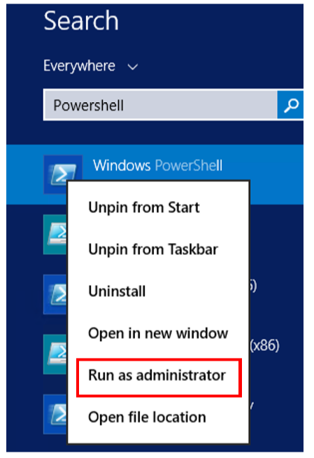

3. In the command prompt:

   * Type `CD “%installpath%\Microsoft Azure Site Recovery\agent\”` to change the directory to the folder where the configuration server is installed. (The default installation path is C:\Program Files(x86)\Microsoft Azure Site Recovery\Agent.)

     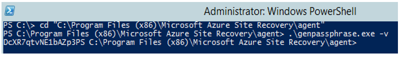

   * Type `./genpassphrase.exe -v`.

## Validate the infrastructure

To migrate on-premises workloads or servers, validate the Site Recovery on-premises infrastructure and ensure that it successfully communicates with Azure. To do so: 
 
1. In the Azure portal, go to **Your Recover Vault** > **Site Recovery Infrastructure** > **Configuration Servers**, and then select your server to view various operational details of the configuration server. 

2. Under **Associated servers**, in the **Status** column, ensure that there is a green check mark and the word **Connected** next to the process server, vCenter server (if applicable), and configuration server.

## Additional steps

Site Recovery infrastructure should be ready to protect, replicate, and migrate all workloads to Azure. However, some additional steps might be required, depending on the scale of the migration.

Complete the following steps *only if* you determined during capacity planning that you need more configuration or process servers during migration.

### Additional servers

This step is required *only if* you are migrating a large number of applications, workloads, or servers to Azure from on-premises and you need to ensure that the configuration servers and process server can scale accordingly.  

### Additional configuration servers

1. In the Azure portal, under **All Resources**, search for or select **Your Recovery Vault**, and then select the blade.

2. Select **Your Recovery Vault** > **Site Recovery Infrastructure** > **Configuration Servers (For VMware & Physical Machines)**. 

3. Select **Server**, and then do the following:   

	a. Ensure that **Server type** is **Configuration Server**.  

	b. Download the Site Recovery Unified Setup installation file to a known location (for example, C:\Temp).  

	c. Download the vault registration key to the same location that you downloaded the file from in the preceding step (for example, C:\Temp). 

      >[!NOTE]
      >The key is valid for five days after you generate it. 

    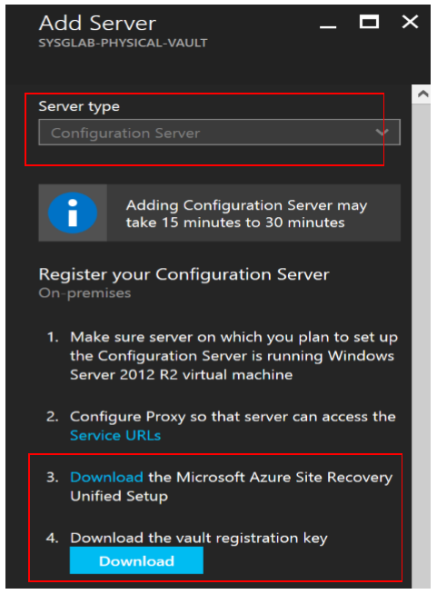

4. To complete the new server setup, follow the setup instructions from the Run Site Recovery Unified Setup section.

5. After you've completed the preceding steps, you should now be able to see the new configuration server in the Azure portal. To do so, go to **Your Recovery Vault** > **Site Recovery Infrastructure** > **Configuration Servers (For VMware & Physical Machines)**. 

### Additional process server

1. In the Azure portal, go to **Your Recovery Vault** > **Site Recovery Infrastructure** > **Configuration Servers (For VMware & Physical Machines)**. 

2. Select the configuration server (for example, ConfigurationServer#1) to which you want to add the new process server. 

3. On the new configuration server blade, select **Process Server**, and then select **Deploy a scale out process server on-premises**. 

4. Copy the Unified Setup file to the new process server to be configured. If you do not have the file, select **Download**, and then save the file to the new process server.

5. On the new process server, to run the Site Recovery Unified Setup installation file (MSI) as an administrator, right-click the file name, and then select **Run as administrator**. 

6. On the **Before You Begin** tab, select **Add Additional Process Server to Scale Out Deployment**, and then select **Next**. 

7. Under **Configuration Server Details**, specify the IP address of the configuration server (for example, ConfigurationServer#1) and the passphrase. To get the passphrase, do the following:  

	a. Sign in to the configuration server (for example, ConfigurationServer#1).  

	b. Open PowerShell as an administrator by selecting the **Windows** key+**Q**, typing **PowerShell**, right-clicking the result, and then selecting **Run as administrator**.
	
      

    c. In the PowerShell command prompt:

   * Type `cd “%installpath%\Microsoft Azure Site Recovery\agent\"` to change the directory to the folder where the configuration server is installed. In this scenario, the default installation path is C:\Program Files (x86)\ Microsoft Azure Site Recovery\Agent.
   * Type `.\genpassphrase.exe –v` 

     

8. Select **Next**.

9. On the **Internet Settings** tab, select the internet connection method, and then select **Next**.

    >[!NOTE]
    >In the example scenario, the connection is direct, without a proxy server. If you are using a proxy server, provide the additional required details. If you need assistance, contact your IT or networking team.

10. On the **Prerequisites Check** tab, setup runs a series of checks to make sure that installation can run without issues. After you've completed setup successfully, select **Next**. 

    >[!IMPORTANT]
    >To avoid future issues, view and fix any warnings or errors. To view a message with more details about a warning or error, select the link under the message's status.

11. On the **Environment Details** tab, indicate whether you are migrating VMware VMs, and then select **Next**. If you select **Yes**, this option checks to see whether vSphere PowerCLI 6.0 is installed.

12. On the **Install Location** tab, select where to install the binaries and store the cache. You can select any drive with at least 5 GB of storage, but we recommend that the cache drive have *at least 600 GB* of free space. Select **Next**.

13. On the **Network Selection** tab, select the correct network interface, and leave the default port at **9443**. *Port 443 is prohibited*. You can change the default if you want, but it is not necessary or recommended. Select **Next**.

14. On the **Summary** tab, review the information, and then select **Install**.

15. You can now use this new process server to either *switch* (from an existing server to the new process server) or *load balance* (across multiple process servers). 
	- To switch, do the following: 

    	a. Select any existing process server, and then select **Switch**. 

        b. Select the new process server you want to use, and then select the virtual machines that the new process server will handle. 

        d. Select the information icon to get information about the server. To help you make load decisions, the pane displays the average space that's needed to replicate each selected virtual machine to the new process server. 

        e. Select the check mark to start replicating to the new process server.

	- To load balance, do the following: 

	    a. Select any existing process server, and then select **Load Balance**.

        b. Select the new process server, and then select **OK**. 

        c. Select the servers that the new process server will manage, and then select **OK**. 

## Next steps

- Start [migrating your first workloads](migrate-first-workload-to-azure-csp.md).
- Review [Azure Site Recovery capacity-planning guide](asr-capacity-planning.md).
