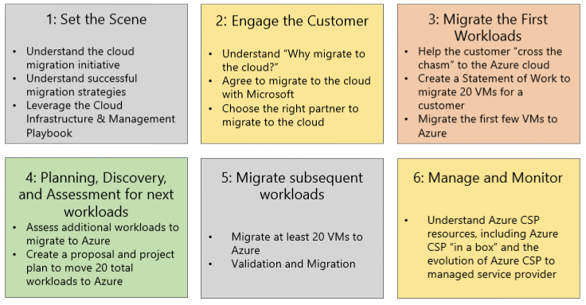

# Migrate initial workloads from on-premises to Azure CSP

When a customer is considering migrating their on-premises systems to the cloud, it's important to start out by migrating just a few simple workloads. This tests the migration process, and helps increase customer confidence in the cloud services that you provide.

In this article, we describe how to migrate initial workloads for a customer. Initial workloads usually consist of between 3 and 5 virtual machines (VMs).

> [!NOTE]
> This article covers just one of many possible migration methods for Azure. The method that we describe here is only a suggestion. If you think another method will work better for your purposes, or if you feel more comfortable with a different method, feel free to use that method.

## Cloud migration timelines

The overall migration timeline is shown in the following figure:

Workload migration from on-premises datacenters to Azure typically occurs in two steps:

1.  Migrate initial workloads
2.  Migrate subsequent workloads

### Initial workloads

For initial workloads, identify and migrate a handful of basic application servers to Azure. This is on an accelerated timeline, where a partner can help a customer migrate the initial 3 to 5 VMs to Azure within a week or two.  

This initial experience helps the customer better understand Azure, and how administering and managing workloads works in Azure. It's also an opportunity for a customer to gain confidence in the reliability and dependability of Azure. The customer can extend the process of performing their usual, day-to-day tasks with workloads that have been moved to Azure in the cloud. 

### Subsequent workloads 

When a customer has a foothold of servers running in Azure and is comfortable with how Azure operates, the next step is to migrate another 15 to 20 additional VMs to Azure. These workloads typically consist of more complex applications. They might have more structure and downtime service-level agreements (SLAs) associated with them. 

Even with subsequent workloads, partners should ensure that the 20 or so VMs that are migrated are expected to be the easiest applications or workloads as part of the initial extension of the enterprise datacenter to the cloud. For more information about migrating subsequent workloads, see [Migrating additional workloads from on-premises to Azure CSP](migrate-additional-workloads-to-azure-csp.md).

## Migration process (initial workloads)

The migration process for the initial workloads focuses on a few simple workloads (a maximum of 3-5 VMs) that are intentionally easy workloads to migrate. 

### Choose initial workloads

The selection of the initial workloads is critical to ensuring that the customer’s first experience with migrations and Azure is not overly complicated. It's also important that learning and training exercises include giving the customer an opportunity to gain basic familiarity with Azure. Show the customer how to run VMs in Azure, and how to administer and manage Azure-based systems. One of the keys to a successful migration is giving the customer proof that they can manage Azure workloads with the same level of familiarity that they have been managing their on-premises systems. 

Successful candidates for initial workload migration might include the following: 

* Standalone systems: A server or application that is a standalone service. A standalone system is self-contained, with as few dependencies as possible. These qualities might make it the best candidate for an initial migration to Azure. This might be a standalone web server (like an internet web server) or a standalone website. 

* Single-node systems: A server or application that is a single-node configuration, rather than a server that is part of a cluster, or a complex client/server application. This also makes a good candidate for an initial migration to Azure. 

The initial workload might not seem strategic or complicated. But, for the customer who has had limited (or no) experience with Azure, the initial workload migration can help get the customer started with Azure. The goal is minimal effort, few challenges, and a high success factor. 

For information about general application support in Azure (for example, the versions of Windows Server or Linux OS that are supported in Azure), see [Microsoft server software support for Azure virtual machines](https://support.microsoft.com/help/2721672/microsoft-server-software-support-for-microsoft-azure-virtual-machines).

### Confirm initial workload compatibility with Azure

After you've identified the initial candidate for a VM (workload) to migrate from an on-premises datacenter to Azure, the first step in the migration process is to run the [Microsoft Azure Virtual Machine Readiness Assessment tool](https://azure.microsoft.com/downloads/vm-readiness-assessment/).

The Azure Virtual Machine Readiness Assessment tool automatically inspects the on-premises environment, whether it is physical or virtual. It gives you a checklist and detailed report on steps you need to take to move the on-premises environment to the cloud. The Virtual Machine Readiness Assessment tool also validates the version of the operating system, running services, and the environment configuration, to make sure that the VM can run in Azure. An assessment report notes any areas that might require configuration or design changes.

If the assessment tool reports multiple items that require remediation, you might want to choose a different (simpler) workload for the initial migration. Again, the purpose of the exercise of choosing the first workload to migrate is to get an initial VM running in Azure as quickly and as easily as possible.

### Choose the best approach for migrating initial workloads

You have multiple options for getting the first workload to Azure:

* Reinstallation
* Export and import
* Azure Site Recovery

For a simple application like a web server with HTML pages, you can install a Windows Server VM in Azure. Then, install or copy the customer’s HTML code onto that server. Many organizations have simple installation and reinstallation procedures documented for building a web server. This is why a web server application typically is recommended as the best first workload. We discuss this in the [Reinstallation approach](#reinstallation-approach) section. 

For some migrations, it might be easier to export the entire server to a file, and then import the file as a server to Azure. This is noted in the [Export and import approach](#export-import-approach) section. A third approach is to use [Azure Site Recovery](#site-recovery-approach). Site Recovery replicates VMs between on-premises datacenters and Azure. This approach is a good method for later, automated VM migrations. But, for the first couple of workload migrations, we suggest that you choose an initial application and one of the two simpler migration approaches. 

**Reinstallation approach**

A reinstallation approach might involve creating a new VM and installation, or restoring the application program and data onto a newly created VM. For some applications and for some organizational processes, this manual process might be familiar. The customer's IT team might prefer it. For example, if an application is a Microsoft Internet Information Services (IIS) web server, building a new Windows Server VM in Azure, enabling the IIS service on the server, and then installing the application code and data is something that many organizations are familiar with. They can successfully complete the process in an hour or two. 

The advantage of this option is that the organization is following well-known and well-defined installation processes. Also, this installation method might lead an organization to install the latest Windows Server 2016 environment, potentially replacing an earlier Windows Server 2012 R2 or Windows Server 2012 configuration. The organization not only gets its IIS-based web application running in Azure, but also upgrades the underlying operating system so that it's running the latest Windows Server operating system. 

The disadvantage of this method is that the organization must have all the application code, plug-ins, or other configuration settings to properly reinstall the application. Many organizations no longer have the installation discs or installation instructions to re-create installations from scratch. This might be a roadblock for using the reinstallation approach. 

**Export and import approach**

Another migration option is to export an existing server configuration, and then import the entire configuration to Azure. This commonly is referred to as a P2V (physical-to-virtual) or V2V (virtual-to-virtual) migration. First, you use an export tool to export an existing (running) system. Then, you import the exported image to Azure. 

The advantage of this type of migration is that it captures the entire system configuration, including the operating system, application, and data. This is a good solution for an organization that no longer has its installation disks, or that might not have the installation and configuration instructions to reinstall the application from scratch. 

The disadvantage of an export and import approach is that the organization brings whatever was working (or not working) in their on-premises environment to Azure. If an application has an atypical configuration or operating issues, existing issues likely will be imported to Azure. So, potentially there might be problems with moving from on-premises to Azure. 

However, for well-running, complex applications, the export and import approach allows a full migration of a working application to Azure with little effort. 

**Azure Site Recovery approach**

For organizations that believe the export and import approach of moving an entire application image to Azure might not be its best option, Azure Site Recovery simplifies the process.  Site Recovery effectively takes a running physical server or VM (running in Microsoft Hyper-V or in VMware) and replicates the running system in Azure.  

The advantage of using Site Recovery is that it provides scale via automation and by seeding the on-premises servers with full synchronization and continuous replication (in 30-second increments) until the organization is ready to start using the application in Azure. After seeding is implemented, an organization can choose when to perform the full migration. Site Recovery also has a test failover process that an organization can use to test its migration. Test failover helps to ensure that the end-state configuration works before using the application in a fully operational production state. With Site Recovery, you also can fail back a migration to the on-premises environment if there are problems in the initial move to the Azure cloud. 

These are the disadvantages of using Site Recovery for migration: 

- If a customer chooses this approach, they need to learn a new tool like Site Recovery. They will need to understand how to set it up and configure it. Microsoft offers step-by-step guidance on how to use Site Recovery. Despite a short learning curve, Site Recovery typically is the recommended method for helping an organization migrate their applications to Azure.
-  Site Recovery has some specific requirements. To see the supported applications, configurations, and prerequisites for using Site Recovery, see the [Site Recovery support matrix](https://docs.microsoft.com/azure/site-recovery/site-recovery-support-matrix-to-azure). 

As noted, using Site Recovery to migrate workloads to Azure is a focus for subsequent workload migrations. For the initial workloads, start with the simpler reinstallation or export and import methods. 

### Migrate the first workload to Azure

If a customer chooses the reinstallation approach, the process of migrating the first workloads might be as simple as building a VM in Azure and then installing the application code (and data) on the VM. For detailed procedures for building VMs in Azure, see [Architectural design and considerations guide: Initial workload migration](architectural-design-considerations-guide.md). The guide includes detailed information about steps you can take if the on-premises network needs to be “stretched” to Azure to accommodate a hybrid integrated networking mode. 

## Azure workload administration and management knowledge sharing

After the first workload has been migrated to Azure, it's a good idea to make sure that the customer becomes familiar with administering and managing the VM that's now running in Azure. For the customer, having the knowledge and reassurance that they can perform usual, daily tasks in Azure that they might have been doing for years in their on-premises environment can help ensure acceptance of the move to Azure. This reinforces for the customer that running their application in Azure is “just the same” as running their applications on-premises. 

These are some of the common management tasks to discuss with the customer: 

- Remotely accessing the running VM (by using a Microsoft Remote Desktop client to connect to the server instance).
- Setting up the VM for patching and updates (by using Windows Software Update Services, System Center Configuration Manager, or another update tool).
- Monitoring the health and operations of the VM in Azure (by using System Center Operations Manager, or by using the Azure portal to get information about server operations).

Typically, this familiarization and knowledge-sharing process is done in a session after the first workload is migrated to Azure. The session might run from two to four hours. Because VMs that are running in Azure are similar to VMs that run on-premises, customers typically learn the process quickly.  

For managed service providers that handle daily tasks, administration, and management, knowledge sharing might be just a one-hour overview with the customer. You can show them that the tasks that the partner will be doing for the customer are similar to what the managed service provider has done for the customer with their on-premises workloads. These activities can go a long way in easing any apprehension the customer might have. It also can build trust, so that the customer knows that the partner transferred their knowledge, expertise, and services to a similar platform with proven experience.

## What's next?

After the first workload has been migrated to Azure, the next step is to immediately begin the process of migrating the second workload. The process of migrating the second workload is identical to the migration of the first workload. Again, select a workload that you anticipate will be easy to migrate. It might be a little more complicated, like potentially an IIS or web application, with an integrated SQL Server component.  

Select a system that can be migrated with limited challenges. While the migration of the second workload is underway, it's important to simultaneously get ready to migrate the next 3 to 5 subsequent workloads. Avoiding a delay between the completion of the initial 3 to 5 VMs and the start of the next set of VMs helps ensure continuity and partner success.

## Next steps

- Review the [advanced design considerations guide](advanced-design-considerations-guide.md).
- Review [Migrate additional workloads from on-premises to Azure CSP](migrate-additional-workloads-to-azure-csp.md).