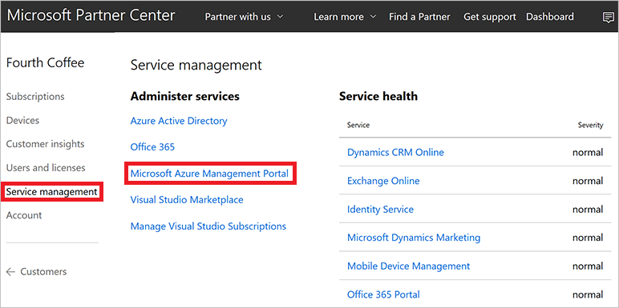

# Azure CSP management options

The Azure Cloud Solution Provider (Azure CSP) model provides three ways to manage Azure CSP resources:

- Web UI: This is a manual approach where all steps are taken through a web browser.
- PowerShell: This is an automated approach that uses scripts.
- REST API or managed API: This is an integrated approach that requires developer skills.

## Web UI

The web UI approach is a good choice when you start your journey with Azure CSP and take all steps manually through a web browser. There are two portals that you use:

- [Partner Center portal](https://partnercenter.microsoft.com): For more information about Partner Center capabilities for Azure management, read [Partner Center overview](partner-center-overview.md).
- [Azure portal](https://portal.azure.com): Use the Azure portal to manage Azure resources inside Azure CSP subscriptions.

To manage a customer's Azure CSP subscription in the Azure portal, you need to use the context of the customer's tenant. There are two ways to do that:

- Use the **Microsoft Azure Management Portal** link on the **Service Management** page in the [Partner Center portal](https://partnercenter.microsoft.com).

- Use a link in the following format: https://portal.azure.com/customertenantname.onmicrosoft.com.

A partner user with an **AdminAgent** role in Partner Center can use both methods to access the Azure portal in the context of customer's tenant. There they can see and manage the Azure CSP subscriptions that were created inside the customer's tenant (tenant directory).

## PowerShell

If you want to automate routine Azure CSP management operations, you can write PowerShell scripts by using the following two modules:

- [Partner Center PowerShell module](https://github.com/Microsoft/Partner-Center-PowerShell)
- [Azure Resource Manager PowerShell module](https://docs.microsoft.com/powershell/azure/install-azurerm-ps)

> [!IMPORTANT]
> The Partner Center PowerShell module is an open source project that's not officially supported by Microsoft.

 Partner Center PowerShell cmdlets provide customer management, subscription management, and billing capabilities that are similar to those in the web UI approach. Azure Resource Manager PowerShell cmdlets make it possible for you to manage Azure services inside Azure CSP subscriptions.

Make sure your app management is [already configured](https://msdn.microsoft.com/library/partnercenter/mt709136.aspx) to enable access to the Partner Center API.

```powershell
# Install the Partner Center and Azure Resource Manager modules from the PowerShell Gallery
Install-Module PartnerCenter
Install-Module AzureRM

# Get a partner's user credentials.
$credentials = Get-Credential '<username@domain>'

# Authenticate and connect to Partner Center.
Connect-PartnerCenter -ApplicationId '<Native-App-Id>' -Credential $credentials

#Find an Azure CSP customer and select their subscription.
$customer = Get-PartnerCustomer | Where-Object {$_.Name -eq '<name>'}
$subscription = Get-PartnerCustomerSubscription -CustomerId $customer.CustomerId

# Authenticate and connect to Microsoft Azure.
Login-AzureRmAccount -Credential $credentials -TenantId $customer.CustomerId

Select-AzureRmSubscription -SubscriptionID $Subscription.SubscriptionId -TenantId $customer.CustomerId
```

## REST APIs and managed APIs

If you want to integrate Azure CSP capabilities with existing systems, you can use a [rich set of APIs in Partner Center and Azure](../integration/available-apis-overview.md):

- The Partner Center REST API and managed API scenarios overview is available on the [Partner Center scenarios page](https://msdn.microsoft.com/library/partnercenter/mt634715.aspx).
- Azure REST API documentation for different Azure components is available in the [Azure REST API reference](https://docs.microsoft.com/rest/api).

In the following articles, we cover most common Azure CSP management scenarios by using all three approaches.

## Next steps

- [Review](../integration/integration-scenarios-list.md) the list of management scenarios.
- [Review](../integration/available-apis-overview.md) the available APIs for Azure CSP integration.
- [Create](../customer-management/create-new-customer.md) your first customer in Azure CSP and deploy Azure services.
