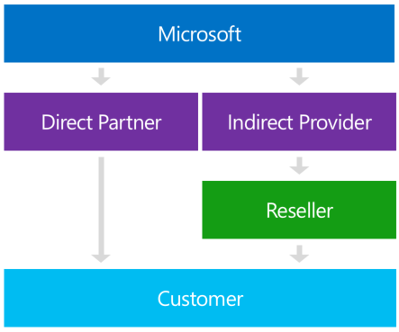
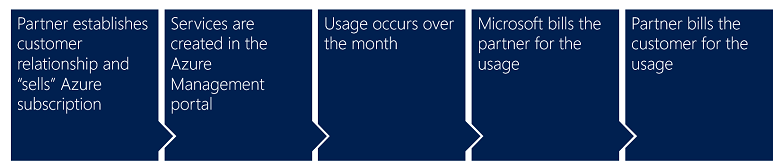

# Azure CSP overview

Welcome to the Azure documentation for Azure Cloud Solution Provider (Azure CSP) partners. This page gives you more information about the basics of the Azure CSP program and some specifics about Azure.

## What is Azure CSP?

Azure CSP is a program for Microsoft partners. It's also a license channel for various Microsoft cloud services. In addition, it's a new way to provide added value for customers while creating an end-to-end relationship with them and becoming a trusted advisor for various Microsoft cloud services, including Azure.

The Azure CSP product portfolio includes Office 365, Dynamics 365, Enterprise Mobility + Security, Azure, and other Microsoft online services for business.

Azure CSP enables partners to have end-to-end ownership of the customer lifecycle and relationship for Microsoft Azure. That means partners are empowered to manage sales, own the billing relationship, provide technical and billing support, and be the customer's single point of contact. In addition, Azure CSP provides a full set of tools, including a self-service portal and accompanying APIs to easily provision, manage, and provide billing for customers and their subscriptions.

[The Partner Center](partner-center-overview.md) portal acts as an entry point for all Azure CSP partners. It provides rich customer management capabilities, automated processing, and more. Azure CSP partners can use Partner Center capabilities by using a web-based UI or by using [PowerShell and various API calls](azure-csp-management-options.md).

> [!TIP]
> Check the [Azure in CSP 101](https://azurecsp.blob.core.windows.net/files/azure-in-csp101.pptx) PowerPoint deck for a high-level program overview.

Azure CSP offers many benefits over traditional cloud reselling, including the following:

- *Bundle services more easily*: With Azure CSP, you can bundle third-party services (including your own unique solutions) with traditional Azure services to create a product that only you can provide.

- *Control pricing*: Because you own the relationship and Microsoft is not involved in any billing or invoicing, you can name your price based on the value that you believe you give customers.

- *Complete management*: You are completely in charge of managing your customer subscriptions. This means that you have the power to make any changes, additions, or removals yourself, without needing to go through Microsoft. (Don't worry, if you run into a problem you can't tackle on your own, you can still escalate issues to Microsoft.)

- *Tiers of investment*: If you like the idea of Azure CSP, but aren't quite ready to invest in full billing or support infrastructure, you can always become an indirect reseller. (See details in the following section.)

## Azure CSP direct and Azure CSP indirect 

There are two different business models in the Azure CSP program: *Azure CSP direct* (one tier) and *Azure CSP indirect* (two tiers).

Watch this video to learn about the fundamental differences between the two models:

> [!VIDEO https://channel9.msdn.com/Shows/Azure-CSP/csp-overview/player]

### Azure CSP direct

Azure CSP direct (Tier 1) partners work with Microsoft directly. They take on the entire customer relationship, including support, billing, and invoicing. They become a customer's only point of contact for their Azure services. This provides continuity in the customer experience and helps build strong business relationships.

Azure CSP direct partners are responsible for customer support. Microsoft doesn't provide support for Azure CSP customers. This means Microsoft relies on Azure CSP partners to manage their Azure workloads and solve technical problems. To learn more about customer support in the Azure CSP program, see the [Azure CSP support overview](../support/azure-csp-support-overview.md) page.

 Azure CSP direct partners are also responsible for customer billing. Microsoft provides partner-facing billing capabilities to Azure CSP direct partners through the Partner Center portal and APIs. Azure CSP direct partners are responsible for the customer-facing part of pricing, billing and invoicing. For more information about billing in the Azure CSP program, see the [Azure CSP billing overview](../billing/azure-csp-billing-overview.md) page.

The Azure CSP direct program requires that partners invest in the  support and billing practices for the Microsoft cloud products that they want to deliver to their customers.

### Azure CSP indirect

The Azure CSP indirect model (Tier 2) defines two types of partners: Azure CSP indirect providers (distributors) and Azure CSP indirect resellers. Azure CSP indirect providers work with Microsoft directly, but reach customers indirectly through their partner channel, Azure CSP  resellers.

Azure CSP indirect reseller is a good choice for partners who don't want to manage as much infrastructure as an Azure CSP direct partner, so they team up with an indirect provider to handle their support, billing, and invoicing needs. They still build strong relationships with the customer and get many of the benefits of the Azure CSP program, but they offload support and billing to Azure CSP indirect providers.

A partner can be an Azure CSP indirect reseller for Azure (to reduce investments to Azure billing and support) and an Azure CSP direct partner at the same time (for Office 365, Dynamics 365, and other license-based products). Such mixes are not prohibited.

## Enroll in the Azure CSP program

If you are a Microsoft partner and want to enroll in the Azure CSP program, visit the [Cloud Solution Provider program page](https://partnercenter.microsoft.com/partner/programs). This page provides more information about the Azure CSP direct and  indirect program requirements. You can enroll in any of those programs easily from this page.

The global Azure CSP program is divided into several multi-regional markets. If you want to transact in multiple markets, you must apply separately in every market. More details are available at [Enroll in the Cloud Solution Provider program](https://msdn.microsoft.com/partner-center/enrolling-in-the-csp-program).

Two national clouds--[Microsoft Azure Germany](https://azure.microsoft.com/overview/clouds/germany/) and [Microsoft Azure Government](https://azure.microsoft.com/overview/clouds/government/)--have special application processes and require separate authorizations.
- To get access to Azure Germany, follow the instructions at [Enroll in the Cloud Solution Provider program for Microsoft Cloud Germany](https://msdn.microsoft.com/partner-center/enroll-in-csp-for-microsoft-cloud-germany), and enroll in **Azure CSP for Microsoft Cloud Germany**.
- To get access to Azure Government, follow the instructions at [Enroll in the Cloud Solution Provider program for Microsoft Cloud for US Government](https://msdn.microsoft.com/partner-center/enroll-in-csp-for-microsoft-us-govt-cloud), and enroll in **Azure CSP for Microsoft US Government Cloud**.

> [!NOTE]
> [Azure China](https://www.azure.cn/) is not available in the Azure CSP program.

## Frequently asked questions
### How is Azure CSP billed?

In the Azure CSP direct model, Microsoft bills the Azure CSP direct partner monthly based on the usage of all Azure CSP customers and all Azure CSP subscriptions. Partners receive an invoice for all charges, along with an accompanying reconciliation file that provides additional details. For more information about billing, see [Read your bill](https://msdn.microsoft.com/partner-center/read-your-bill).
In the Azure CSP indirect model, Microsoft bills Azure CSP  providers in a similar way, and Azure CSP indirect providers set the billing rules for their Azure CSP indirect resellers.

### How is Azure CSP priced?

Azure CSP pricing is specific to the services that are consumed. The partner sets the price for the customer. Detailed pricing for Azure services is available to Azure CSP direct partners via the [Partner Center pricing and offers page](https://partnercenter.microsoft.com/pcv/sales) or via the [RateCard API](https://msdn.microsoft.com/library/partnercenter/mt427350.aspx). Azure CSP indirect resellers should contact their Azure CSP indirect  providers for Azure CSP pricing details.

### I heard that not all Azure services are available in Azure CSP. Is that true?

Yes, it's true that not all Azure services are available in Azure CSP. Although some niche services are currently missing, all major Azure services are available, so it's definitely not a blocker for partners. Microsoft is working to create full-service parity between Azure CSP and other Azure partner models. For more information, see [Available Azure services in Azure CSP](azure-csp-available-services.md).

### I want to be an Azure CSP partner. I want to focus on sales, and I don't want to worry about customer support because it's not my specialty. Is this possible?

Yes. In this case, you should consider enrolling in the Azure CSP indirect model as an Azure CSP indirect reseller. You focus on sales, and your Azure CSP indirect provider manages customer support. By the way, your Azure CSP indirect provider might also help you to increase the sales skills of your sellers and build a cloud sales practice if needed.

### I want to enroll in the Azure CSP indirect program as an Azure CSP indirect reseller. I want to know who the Azure CSP indirect providers are in my region.

The list of all Azure CSP indirect  providers in different countries is available at  [Find a provider](https://partnercenter.microsoft.com/partner/find-a-provider). Note that not all Azure CSP indirect providers have Azure practice (support, billing, or sales enablement, for example). It's best to contact these providers directly and ask which capabilities they provide to accelerate your Azure business.

### I prefer to manage Azure subscriptions of my customers through the [Azure portal](https://portal.azure.com). Why should I use [Partner Center](https://partnercenter.microsoft.com)?

Partner Center is a portal where Azure CSP partners manage their customers and get information about different aspects of the Azure CSP program. Azure CSP direct partners also receive invoices from Microsoft through the Partner Center portal. Azure resource management inside a subscription (for example, creating a VM, configuring a virtual network, and so on) is still done through the [Azure portal](https://portal.azure.com). Learn more about Partner Center portal capabilities on the [Partner Center overview page](partner-center-overview.md).

### I'm an Azure CSP partner and I want to provide a managed cloud solution for my customer. But that customer already has an Azure subscription, purchased through an Enterprise Agreement. Is this a blocker?

The Azure CSP model supports multi-channel and multi-partner capabilities. One customer can have several Azure subscriptions, purchased by using different channels (for example EA, Open, or Azure CSP), or even from different Azure CSP partners. For more information, see [Work with other partners](https://msdn.microsoft.com/partner-center/work-with-other-partners).

### Is it possible to use CSP to deploy multi-tenant applications and solutions, that are spanned among different customers?

Yes, you can use [partner shared services](partner-shared-services.md) functionality for that.

## Next steps

- [Review](azure-csp-available-services.md) which Azure services are available in Azure CSP.
- [Learn](../support/azure-csp-support-overview.md) how customer support works in the Azure CSP model.
- [Enroll](https://partnercenter.microsoft.com/partner/programs) in the Azure CSP program and start creating business through Azure CSP.
