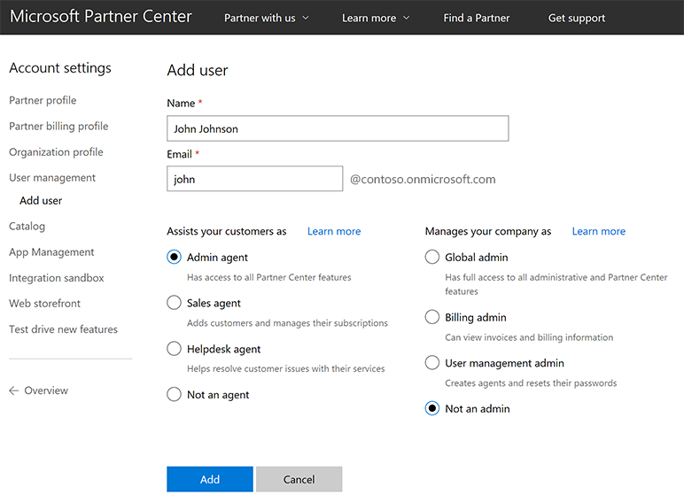
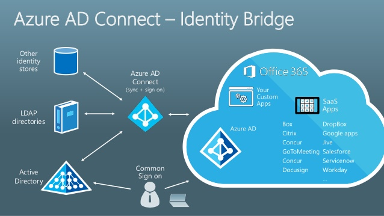

# Partner Center overview

The [Partner Center](https://partnercenter.microsoft.com) portal acts as an entry point for all Azure Cloud Solution Provider (CSP) partners. It provides rich customer management capabilities and automated processing. CSP partners can use Partner Center through a web-based UI, or by using [PowerShell](azure-csp-management-options.md) and various [API calls](https://partnercenter.microsoft.com/partner/developer).

The following short video introduces you to basic concepts and functions of Partner Center:

> [!VIDEO https://channel9.msdn.com/Shows/Azure-CSP/partner-center-overview/player]

> [!IMPORTANT]
> Partner Center is a portal for CSP partners only. It is not available for CSP customers.

## Partner Center capabilities for Azure

On the Partner Center portal, CSP direct partners, CSP indirect providers, and CSP indirect resellers can:

- Manage customers and create Azure subscriptions.
- Manage customers' Azure resources on their behalf.
- Manage a partner's [profile](https://msdn.microsoft.com/partner-center/update-your-partner-profile).
- Manage a partner's [user accounts](https://msdn.microsoft.com/partner-center/create-user-accounts-and-set-permissions), and assign permissions to internal staff.
- Create a [marketing profile](https://msdn.microsoft.com/partner-center/create-a-marketing-profile), and respond to referrals.
- Buy [Azure VM reservations](https://docs.microsoft.com/partner-center/azure-reservations) and [software subscriptions](https://blogs.technet.microsoft.com/hybridcloudbp/2018/08/08/moving-windows-server-and-sql-server-licenses-from-spla-to-csp/) on behalf of customers.

In addition, CSP direct partners and CSP indirect providers can:

- View a customer's Azure usage.
- Receive invoices from Microsoft, view reconciliation files, and check invoice payment status.
- Get Azure CSP pricing.
- [Escalate issues](../support/create-azure-csp-support-request.md) with Partner Center to Microsoft, and track ticket progress.

CSP indirect resellers should use solutions, provided by their CSP indirect providers, for support escalations, billing, and pricing.

## Partner Center user roles

Partner Center access is role-based, so the user's view can be customized to only show features that the user needs. Note that a user's role can be changed when necessary through Partner Center web UI or APIs.

Each user has two permission levels:
- **Agent permissions** control what kind of customer data and account information the user can see and change. These settings affect all CSP customers managed in this Partner Center account.
- **Admin permissions** control the level of access the user has to Partner Center features. This setting has impact outside Partner Center. For example, a billing admin can access bills for all Microsoft services (even those unrelated to CSP), and a global admin can access user accounts and customer accounts beyond CSP as well.

You can find more details about available Partner Center user roles in the article [Create user accounts and set permissions](https://msdn.microsoft.com/partner-center/create-user-accounts-and-set-permissions).

## Azure Active Directory and Partner Center

Partner Center uses Azure Active Directory (Azure AD) authentication to sign in. If you already use Azure AD in your organization (for example, for an internal Office 365 subscription), you can use the same user credentials and rights management capabilities in Partner Center.

Also, you can [connect](https://docs.microsoft.com/azure/active-directory/connect/active-directory-aadconnect) your on-premises Active Directory to Azure Active Directory by using Azure AD Connect. Then sign in to Partner Center by using corporate domain credentials and custom domain. With Azure AD, you can use [Active Directory Federation Services and multi-factor authentication capabilities](https://blogs.technet.microsoft.com/hybridcloudbp/2016/07/12/hybrid-cloud-identity-ad-and-azuread/) to strengthen the Partner Center authentication process.

## Next steps

- [Create](../customer-management/create-new-customer.md) your first customer in CSP, and deploy Azure services.
- [Learn](../support/azure-csp-support-overview.md) how customer support in the CSP model works.
- [Migrate](../migration/migration-to-azure-csp.md) existing customers from on-premises and other channels to Azure CSP.