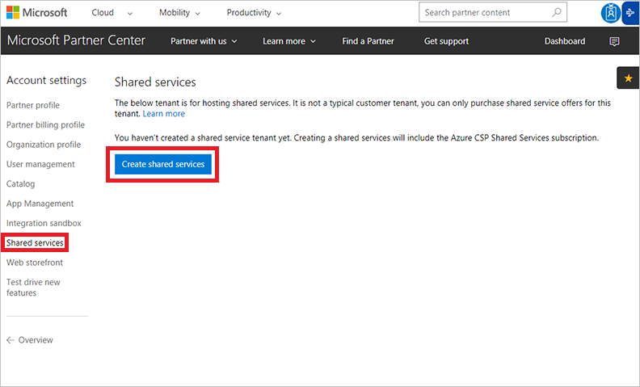
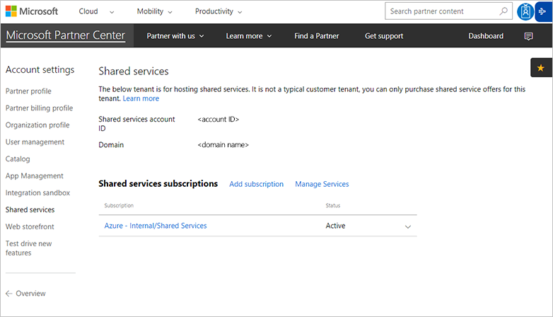
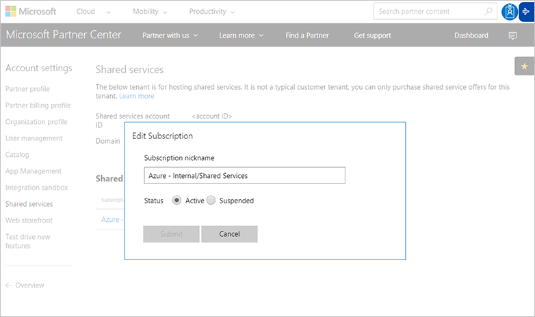

# Azure partner shared services

Azure Partner Shared Services is a new offer type for partners in the CSP program.  It allows partners to purchase Azure subscriptions for their own use.  This allows partners to use a uniform method for purchasing, tracking and managing Azure. Partners may now be able to consolidate their Azure licensing and reselling agreements with Microsoft. With Azure Partner Shared Services partners now have the same flexibility to use Azure subscriptions in CSP as they do in the Microsoft Enterprise Agreement and Web Direct programs. Partners in CSP will now be able to do things like:

- Host shared services and multi-tenant applications
- Deploy internal workloads and management solutions, that manage different customers with different Azure subscriptions
- Build development and test environments, that are not fitting into [Partner Center Integration Sandbox](https://msdn.microsoft.com/library/partnercenter/dn974940.aspx)

> [!NOTE]
> Regular CSP discounts and incentives are not applied on Azure Partner Shared Services. To estimate the cost of solution, deployed inside shared services tenant, partners can use [Azure Pricing Calculator](https://azure.microsoft.com/pricing/calculator).

## Create shared services tenant
To leverage this new capability a partner needs to create a shared services tenant that applies an Azure CSP Shared Services subscription.

> [!NOTE]
> Azure Partner Shared Services functionality is available to CSP direct partners and CSP indirect providers. It is not available to CSP indirect resellers.

1. In Partner Center, go to the **Dashboard** menu > **Account settings** > **Shared services**. If a shared services tenant does not exist, the partner can click **Create shared services**.

	

2. This will create a shared services tenant and purchase the Azure CSP Shared Services subscription, to be used for shared resources and internal workload.

	

3. Partners can cancel the subscription after it is purchased like any other subscription, this is done in **Dashboard** menu > **Account settings** > **Shared services** and then selecting the **Azure - Internal/Shared Services subscription**, enabling the Partner to change the friendly name or cancel the subscription.

	

## Shared services tenant specifics
- Azure – Internal/Shared Services offer does not share CSP pricing and are not eligible for discounts and incentives.
- A partner in CSP only needs one shared services tenant, multiple Azure – Internal/Shared Services offers can be purchased after the tenant is created.
- The Shared services tenant cannot be created without purchasing at least one subscription of Azure – Internal/Shared Services.
- A shared services tenant cannot be removed once created, however if a CSP doesn’t want to use the tenant for shared services they can simply cancel the Azure – Internal/Shared Services subscription.
- Azure consumption through this offer would appear on the CSP invoice and the reconciliation file. It would be included as part of Microsoft Azure line item in the invoice. While the granular consumption information will be accessible through the reconciliation file against the tenant that was created for this offer.
- Azure Partner Shared Services (APSS) no longer supports Marketplace offers as of March 1st, 2019. To take advantage of the full catalog of Marketplace offers available (not just BYOL and free services) CSP partners can deploy shared services using web direct Azure subscriptions. 

## Next steps
- [Learn](partner-center-overview.md) about the available capabilities for Azure in Partner Center.
- [Migrate](../migration/migration-to-azure-csp.md) existing customers from on-premises and other channels to Azure CSP.
