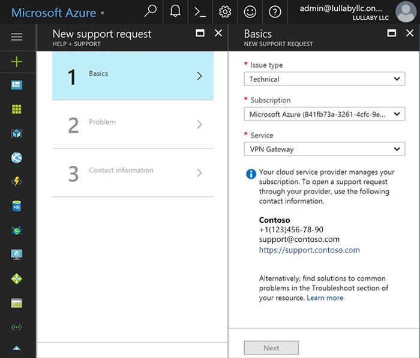

# Azure CSP support overview

In the Azure Cloud Solution Provider (Azure CSP) model, the CSP partner is the first point of contact for CSP customers. This article provides an overview of the customer support model in Azure CSP.

## Customer support services

Azure CSP direct partners provide technical and account support services for their customers. This includes the following:
- Describe the capabilities of different Azure services.
- Provide answers to Azure pricing and usage questions.
- Provide billing and subscription support.
- Provide provisioning and deployment help.
- Resolve performance problems, service availability problems, incomplete software integration problems, or other deployment problems.

> [!IMPORTANT]
> In the Azure CSP indirect model, these responsibilities are shared between the Azure CSP indirect provider and the Azure CSP indirect reseller. If you are an Azure CSP indirect reseller, ask your Azure CSP indirect provider for details.

Azure CSP partners must provide a clear description to customers of how they will receive support. If you do not provide round-the-clock phone support, you must provide a service level agreement to explain the options to your customers.

Microsoft does not provide any support to Azure CSP customers. These customers rely on their Azure CSP partners.

## Customer self-service troubleshooting

Azure CSP customers can handle troubleshooting tasks on their own, without an Azure CSP partner. If the Azure CSP partner provided their customers with [access to the Azure portal](../customer-management/assign-permissions-to-azure-csp-subscription.md), they can sign in to and view several helpful features. These include viewing information about service health, seeing in-product notifications and communications, and performing administrative tasks.

Azure CSP customers can get information about publicly known service interruptions in Azure by visiting the [Azure status](https://azure.microsoft.com/status/) page. They can also subscribe to [service health notifications](https://docs.microsoft.com/azure/monitoring-and-diagnostics/monitoring-service-notifications).

They cannot alter, add, or cancel subscriptions without help from their Azure CSP partner. Nor can customers escalate any service problems to Microsoft. Their Azure CSP partner [should do it](create-azure-csp-support-request.md) on their behalf.

For example, if a customer has access to the Azure portal, and tries to create a new support request via the portal, it doesn't work. Instead, the customer sees a message that this subscription is an Azure CSP subscription, and all support requests must be addressed to a managing Azure CSP partner.

> [!TIP]
> Don't forget to update your partner's organizational profile on Partner Center. Specify the correct email and phone number of your helpdesk. If you have a web-based ticket managing system or IT Service Management solution, provide a link to the page where your Azure CSP customers can submit a support request.

## Partner technical support

Because Azure CSP partners are responsible for technical support, here are some general activities you need to provide:
- Check Azure service health regularly, and notify customers who may be affected by service interruptions.
- Build a knowledge base, and provide resolution suggestions for common problems.
- Use monitoring solutions to see the full picture, and prevent problems.
- To do deep troubleshooting and apply fixes, use admin-on-behalf capabilities to access customer workloads in Azure.
- [Escalate](create-azure-csp-support-request.md) customer problems that you can't resolve to Microsoft.

### Check Azure service health

If your customers are having a problem with Azure services, such as services that are down, or a degraded or buggy experience, check the health of that service. You can determine if the problems are on your end, or if there is a known problem with a product. In the latter case, Microsoft might already be working to solve it.

You can get information about known service interruptions in Azure by visiting [Azure status](https://azure.microsoft.com/status/). You can also subscribe to subscription-specific [service health notifications](https://docs.microsoft.com/azure/monitoring-and-diagnostics/monitoring-service-notifications), which are more granular.

### Use integrated monitoring solutions

It is always better to know about a problem before it causes customer service interruption. If you know what's going on with the Azure workloads of your customers on all levels, you can prevent problems, and resolve problems much faster.

Use an integrated monitoring solution that supports multi-customer view, and can provide deep analysis of Azure service reliability and performance.

Review the [Azure monitoring and diagnostics guide](https://docs.microsoft.com/azure/monitoring-and-diagnostics/monitoring-overview) to get started.

Microsoft provides the following solutions:
- [Azure Log Analytics](https://docs.microsoft.com/azure/log-analytics/log-analytics-service-providers)
- [Operations Management Suite](https://blogs.technet.microsoft.com/hybridcloudbp/2017/02/17/oms-in-csp/). Operations Management Suite includes Azure Log Analytics as an engine, and provides additional monitoring capabilities like Service Map and compliance monitoring.

You can also use the following third-party integrated monitoring solutions that support Azure CSP:
- [Datadog](https://www.datadoghq.com/azurecsp/). This is a monitoring solution with greater than 200 integrations with other services.
- [Alert Logic](http://www.alertlogic.com/azurecsp). This is a deep security monitoring and breach prevention solution.

All the preceding solutions are offered in a software as a service (SaaS) model. You don't need to install anything additional in your environment.

### Administer on behalf of the customer

As an Azure CSP partner, you have delegated admin privileges that give you access to your customers' environments. This allows you to directly support, configure, and manage their subscriptions.

With Partner Center, you can view customer service health and service incidents, as well as perform administrative tasks on their behalf to correct missing or poorly configured settings.

To perform administrative tasks in Partner Center, from the **Dashboard**, go to **Customers** > select the specific customer > **Service management**. Then, under **Administer services**, select **Microsoft Azure Management Portal**.

## Billing support

You own the billing relationship with your customers, and must fully support any billing-related questions or problems they have. For more details about billing in Azure CSP, see the [billing overview](../billing/azure-csp-billing-overview.md).

Azure CSP customers might ask you about Azure service pricing rules, how they can optimize their spending, and what their current spending is between billing cycles.

To help your customers better understand their spending in Azure CSP, you can use the following third-party cloud management solutions that support Azure CSP:
- [Cloudyn](http://www.cloudyn.com/azurecsp)
- [CloudCheckr](http://www.cloudcheckr.com/azurecsp)
- [CloudHealth](http://www.cloudhealthtech.com/azurecsp)
- [RightScale](http://www.rightscale.com/azurecsp)

If you are a CSP direct partner, you are responsible for payment to Microsoft. You receive an invoice for consumed Azure CSP services by all your customers every billing cycle, and that invoice should be paid within 60 days. It is then your responsibility to ensure collection of on-time payment from your customers. Microsoft recommends establishing a clear collections policy with customers, including when a subscription may be affected by non-payment.

If necessary, you can [suspend a customer's subscription](../integration/place-orders/suspend-reactivate-subscription.md) due to non-payment.

If the customer wants to dispute a bill, has concerns about fraudulent subscription use, or has any other billing concerns that you cannot handle, you can escalate the problem to Microsoft.

## Escalate problems to Microsoft

Although you are responsible for customer technical and billing support, your customer might have problems that only Microsoft can solve. These include the following:

- Undocumented problems with services that aren't operating according to service descriptions
- Unavailable services
- Bugs and other irregularities that affect service appearance or operation
- Large scale network disruptions
- Regional problems with multi-tenant impact
- Billing disputes

In these cases, you must escalate such problems to Microsoft. Create a service request in Partner Center, as outlined in the [escalation guide](create-azure-csp-support-request.md).

Even if you've escalated a customer's problem to Microsoft, it is still your responsibility to manage the process. Microsoft support engineers communicate with a customer only through partner.

You can expect a response from Microsoft within 8 hours for a Severity C request, 4 hours for Severity B, and 2 hours for Severity A. Note that these times are reduced if you have purchased other [partner support plans](support-options-for-csp-partners.md). Phone and email support is similarly only available to those who have purchased additional support plans.

After you communicate with Microsoft, you must communicate with the customer to provide updates or confirmation that the problem is resolved.

## Support tickets in Partner Center and the Azure portal

Be aware that a support request filed through Partner Center and one filed through the Azure portal are not the same.

From the Partner Center **Dashboard**, in the left pane, you can select **Service Requests**. You then see two options: **Partner Center requests** and **Customer requests**.

Partner Center requests are strictly for reporting problems with Partner Center itself. Customer requests are where you can see any support requests that your customers have filed with you.

If a customer request is for a problem you cannot solve, you must go to the Azure portal to submit a request to Microsoft, as detailed in the [escalation guide](create-azure-csp-support-request.md). 

If you are filing a service request about Azure services with Microsoft, and you are not in the Azure portal, you are filing your service request in the wrong place.

## Next steps
- Learn [how Azure CSP partners can escalate customer problems with Azure to Microsoft](create-azure-csp-support-request.md).
- Review [available support plans for Azure CSP partners](support-options-for-csp-partners.md).