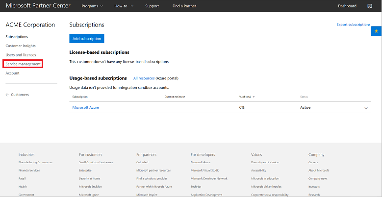
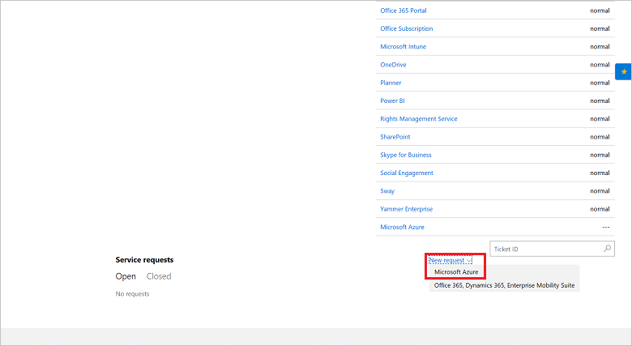
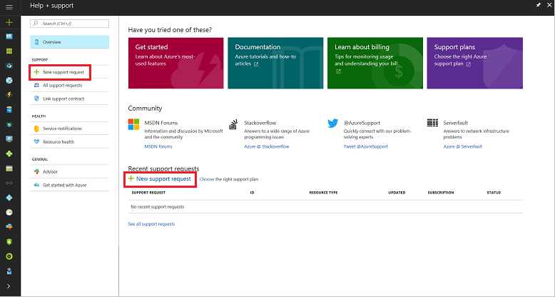
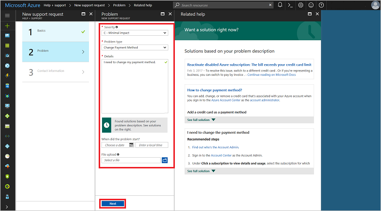
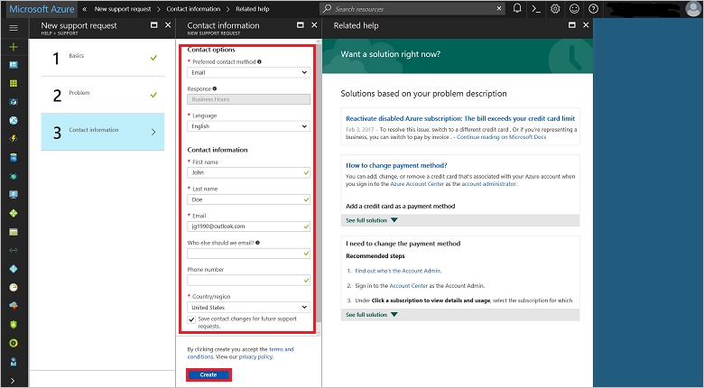

# Escalate Azure Cloud Solution Provider issues to Microsoft

If you are an Azure Cloud Solution Provider (Azure CSP) partner, you are [responsible for customer technical and billing support](azure-csp-support-overview.md). But sometimes your customers will experience issues with Azure that only Microsoft can solve. These might include the following:

- Undocumented problems with Azure services that aren't operating according to service descriptions
- Unavailable services
- Bugs and other irregularities that affect service appearance or operation
- Large-scale network disruptions
- Regional issues that have multitenant impact
- Billing disputes

You need to escalate these kinds of issues with Azure services to Microsoft, and create a support request. First, though, ensure that the issue is not caused by an incorrect service configuration. Also, ensure that Microsoft supports the customer's architecture. 

> [!IMPORTANT]
> Don't escalate every customer issue to Microsoft. First, complete proper troubleshooting on your side.

Even if you've escalated a customer's issue with Azure to Microsoft, it's still your responsibility to manage the resolution process. Microsoft support engineers will communicate with a customer only through a partner.

> [!IMPORTANT]
> In this article, we cover the support process for Azure CSP direct partners. If you're an Azure CSP indirect reseller, contact your Azure CSP indirect provider for details about how this process will work for you.

## Create a service request
1. On the Partner Center **Dashboard** menu, select **Customers**. Select the customer, and then select **Service management**.

    

2. In the **Support tickets** section, select the **New request** drop-down menu, and then select **Microsoft Azure**.

    

3. In the Azure portal, select **New support request**.

    

4. Enter the relevant information for the service request, and then select **Submit**. For more information about how to fill out the support request, see Support request form.

**Support request form**

1. On the **Basics** blade: 
   1. Select an **Issue type** (**Technical**, **Billing**, **Quota**, or **Subscription management**).
   2. Select the **Subscription** to which the issue applies.
   3. Select the **Support plan**. The default support plan is **Cloud Solution Provider**. [Additional plans](support-options-for-csp-partners.md) might be listed, if you've purchased them.

      

2. On the **Problem** blade:
   1. Select the problem's **Severity**. This ranges from **C - Minimal impact** (low priority) to **A - Critical impact** (immediate priority).
   2. Select the **Problem type**. The options vary, depending on the issue type you selected in step 1. Select the option that most closely resembles the problem. When you select the problem type, you see a list of recommended steps and documents that might help you solve those types of problems. *Try these solutions before you submit a support request.*
   3. In the **Details** section, describe the issue with as much information as possible. Include any error messages, if applicable.
   4. Under **When did the problem start**, enter the date and local time at which the problem first occurred.
   5. If applicable, upload a file to the **File upload** section.

      

3. On the **Contact information** blade:
    1. For **Preferred contact method**, select email or phone as the preferred way to reach the point of contact.
    2. In **Contact information**, provide *your* contact information, *not* your customer's information.
    
4. Select **Create**. The support request appears in Partner Center for the support team to address.

   

Later, review your customer's service requests within the Microsoft Azure portal by selecting **Manage support requests**.

If you are experiencing issues with Partner Center portal itself, not related to Azure services, you should use [Partner Center problem reporting](https://msdn.microsoft.com/partner-center/report-problems-with-partner-center) procedure.

## Next steps

- Review [support plans for Azure CSP partners](support-options-for-csp-partners.md).
- Learn about [Azure CSP partner support responsibilities](azure-csp-support-overview.md).
- Review [support from Microsoft](https://msdn.microsoft.com/partner-center/support-from-microsoft--) section of Partner Center documentation.
