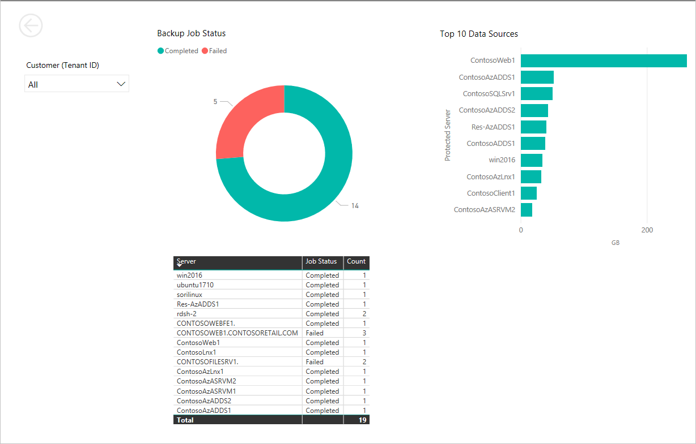

# Create a Power BI dashboard for cloud solutions providers using Log Analytics

CSP partners need to have a global view of the different customers and Azure subscriptions in different tenants that they manage. This provides them with better visibility of their customer base, save time when monitoring customer environments and gain insights into trends or abnormal patterns. [Azure Log Analytics](https://azure.microsoft.com/services/log-analytics) and [Power BI](http://powerbi.com) can be used together to achieve that.

This tutorial explains how to build this global view through a Power BI dashboard that pulls information from several different Log Analytics workspaces belonging to different Azure Active Directory tenants. 

> [!NOTE]
> Please review this article before to better understand the concept of using [Log Analytics features for Service Providers](https://docs.microsoft.com/azure/log-analytics/log-analytics-service-providers).

Log Analytics queries can be ran across workspaces under the same tenant (see [here](https://docs.microsoft.com/azure/log-analytics/log-analytics-cross-workspace-search)), but this method doesn't work if the workspaces are located in different tenants. To do this, you can aggregate data in these workspaces through Power BI.

This article provides a step-by-step guide on how to build such a dashboard, showing how this can be done using backup monitoring as an example. Similar steps can be followed to extend the dashboard with Update Management, Alerting and other views as needed. 

Here is a sample of the end result:




In this tutorial you will learn how to:
- Enable diagnostics for Recovery Services Vault.
- Export your Log Analytics queries to PowerBI.
- Build a Power BI report that aggregates data from different workspaces/tenants.

To complete this tutorial you must have two or more Log Analytics workspaces located in two or more Azure AD tenants. These workspaces should have some  logging information to build the first report. For this example, we have used Azure Backup diagnostic logs, but other logs can also be used. You also need to have PowerBI Desktop installed.

## Log in to Azure Management Portal 

Login in to the [Azure Management Portal](https://portal.azure.com) with CSP Admin Agent credentials.

## Enable diagnostics for Recovery Services Vault

Before starting, make sure that you have some activity in this Recovery Services Vault, for example some Virtual Machines being backed up against this vault.

Start by opeining your Recovery Services Vault:

1. In the Azure portal, click **All services**. In the list of resources, type **Recovery Services Vault**. As you begin typing, the list filters based on your input. Select **Recovery Services Vault**.
2. In the Recovery Services Vault subscriptions page, select the vault that you will work with
3. Select **Backup Reports** as shown in the picture.


4. Click on **Diagnostics Settings** in the right pane. You will see a lits of diagnostics settings already applied to this vault. This list might be empty.
5. Click on **Add diagnostic setting**.


6. Enter a **Name** for this setting, select **Send to Log Analytics** checkbox, choose a **Log Analytics** workspace (or create a new one) and check **AzureBackupReport** checkbox. Click **Save**.


After enabling diagnostics for your recovery service vault, logging data will start flowing into your Log Analytics workspace. These logs will be then available to be queried by the Log Analytics engine.

## Export your Log Analytics query to PowerBI

Now that we have some diagnostic data flowing into our Log Analytics workspace, we can perform queries against this data.

Go to your Log Analytics workspace:

1. In the Azure portal, click **All services** and select **Log Analytics**.
2. Select the **Log Search** tile.
3. Enter a query to see the status of Azure backup jobs.

```
let Events = AzureDiagnostics
| where Category == "AzureBackupReport" ;
Events
| where OperationName == "Job" and JobOperation_s == "Backup" 
| project ProtectedServerUniqueId_s, JobStatus_s, Resource, TenantId
| join kind=inner
(
    Events
    | where OperationName == "ProtectedServer"
    | where ProtectedServerFriendlyName_s != ""
    | distinct ProtectedServerUniqueId_s, ProtectedServerFriendlyName_s
    | project ProtectedServerUniqueId_s, ProtectedServerFriendlyName_s
)
on ProtectedServerUniqueId_s
| project ProtectedServerFriendlyName_s, JobStatus_s, Resource, TenantId
| extend Vault= Resource
| summarize count() by ProtectedServerFriendlyName_s, JobStatus_s, Vault, TenantId
```


In this query, we are just querying one workspace, but as explained [here](https://docs.microsoft.com/azure/log-analytics/log-analytics-cross-workspace-search), you can query across several workspaces within the same tenant if needed. The same query, spanning two workspaces would start as follows:

```
let Events = (union workspace("workspace1").AzureDiagnostics, workspace("workspace2").AzureDiagnostics)
...
```

In this example we see the workspace name to reference a workspace, but you can also specify its qualified name, workspace ID or Azure Resource ID.

4. Change the time scope to just the last day. Click **RUN** to verify that the query returns the desired data.

.

5. Now that we have a query with the info that we want, we can export it to PowerBI. To do this just click the **PowerBI** button at the top of the screen.


6. This will bring a pop-up to open or save a text file with the PowerBI query in it. **Save As** the file to your local drive and give it a name related to the tenant/workspace you're in.

Repeat steps 1 to 5 with another Log Analytics workspace located in a different Azure AD tenant. The query should be the same.

By the end of this section, you should have two Power BI queries saved to your local drive. Each of these queries get data from a separate workspace in a separate tenant.

## Build a Power BI report that aggregates data from different workspaces/tenants

You will now import the Log Analytics queries into PowerBI Desktop, shape the data and build a dashboard.

### Import query into Power BI

1. Open **Power BI Desktop**.
2. Click on **Get Data** then **Blank Query**.


3. From the top menu, click **Advanced Editor**.
4. Open one of the text files with the exported query from Log Analytics, copy all contents and paste them into the Advanced Editor.


5. Click **Done**. You should see a table with the same results you saw in Log Analytics.
6. Rename the query to reflect its contents and tenant where is coming from.

Repeat steps 1 to 6 with the other Log Analytics query coming from the other tenant.


### Aggregate queries in PowerBI

Now, you need to aggregate the data from both queries to build a consolidated view. For this, we will use some of the combine features in PowerBI.

1. Within PowerBI query editor, click on **Append Queries as New** under **Append Queries**.


2. In the Append dialog, select the queries to append and click **OK**.


3. Rename the query with a meaningful name. Click **Close & Apply** button in the left-top corner.

### Build Power BI report

Now that you have a query with the results that you need, you can build your Power BI report.

1. From the visualizations pane, select the **Donut Chart** icon. This will print a blank donut chart in your report view.
2. From the fields pane, expand your aggregated query name and check **count_** and **JobStatus_s** fields. You will now see the chart with the number of Completed/Failed backup jobs. You can customize colors, column names and other settings in the Visualizations pane.


3. Click on any blank part of the report and then, from the visualizations pane, select the **Table** icon.
4. From the fields pane, expand your aggregated query name and check **count_**, **JobStatus_s** and **ProtectedServerFriendlyName_s** fields. Customize the view as required.


### Publish Power BI report and schedule data refresh

Now that your report is built, you need to publish it to the PowerBI service so it can be viewed and shared with other team members.

1. From the dashboard screen in PowerBI Desktop, click on **Publish** in the menu bar.
2. Select a destination where the report will be published. When done, open the report clicking the link. You will be redirected to your browser.


From Power BI you can modify when the data shown in the reports is refreshed: 

3. Expand **My Workspace**
4. Go to **Datasets** and click on the three dots next to your report. Click on **Schedule Refresh**.


5. Configure it to your needs. Here's a sample refresh schedule.


## Next steps
- Review [Log Analytics documentation](https://docs.microsoft.com/azure/log-analytics/).
- Learn [how Azure CSP partners can escalate customer problems with Azure to Microsoft](create-azure-csp-support-request.md).
